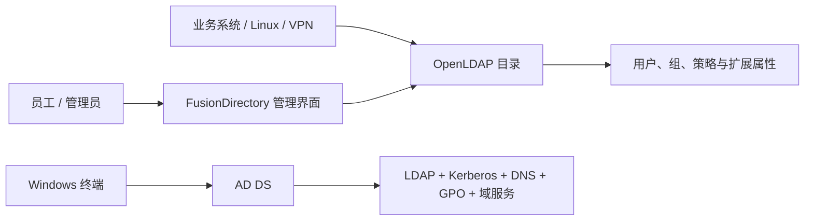
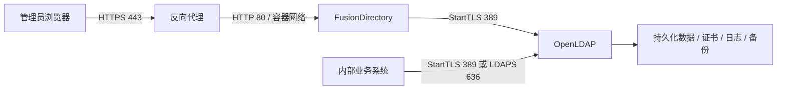

企业开始统一账号时，经常会先问：

“Microsoft Active Directory 收费，OpenLDAP 开源，那是不是直接用 OpenLDAP 就行？”

不能只按授权费用来选。

`Active Directory Domain Services`（下文简称 `AD DS`）包含 LDAP 目录，也整合了 Kerberos、DNS、计算机加入域、组策略和 Windows 权限体系。`OpenLDAP` 是一套开放、可扩展的 LDAP 目录服务，适合保存用户、组和应用属性，但不会自动提供完整的 Windows 域能力。

选型可以先按使用场景判断：

- 终端以 Windows 为主，依赖域登录、组策略、文件共享权限和微软生态时，优先选择 `AD DS`
- 目标是给 Linux、网络设备、VPN、Git、邮件和内部应用提供统一账号目录时，`OpenLDAP` 更轻、更开放
- 想使用 OpenLDAP，又不希望所有管理工作都靠命令行和手写 LDIF，可以组合 `OpenLDAP + FusionDirectory`
- 企业也可以采用混合模式：AD 负责 Windows 域，OpenLDAP 或其他 IAM 层负责面向应用的目录与身份同步

## LDAP、OpenLDAP 与 AD DS 的关系 {#ldapopenldap-和-ad-不是同一个概念}

`LDAP` 是访问目录服务的协议，不是某一款具体产品。

- `OpenLDAP` 是 LDAP 协议的开源实现，核心服务进程是 `slapd`
- `AD DS` 是 Microsoft Windows Server 的目录服务，支持 LDAP，但能力不止 LDAP
- `FusionDirectory` 是建立在 LDAP 目录之上的 Web 管理与身份管理层，本身不是 OpenLDAP 的替代品

可以把三者的关系简化成：



## AD DS 与 OpenLDAP 选型对比 {#microsoft-ad-与-openldap-怎么选}

### 平台能力与管理方式 {#总体对比}

| 维度 | Microsoft AD DS | OpenLDAP |
| --- | --- | --- |
| 软件与授权 | Windows Server 商业授权；实际采购还要结合服务器核心授权、用户或设备 CAL 等条款核算 | 软件可免费获得，使用 OpenLDAP Public License |
| 产品定位 | Windows 域与企业目录平台 | 通用 LDAP 目录服务 |
| Windows 终端管理 | 强，原生支持加域、组策略、Kerberos 和微软生态 | 不提供等价的原生 Windows 域与组策略体验 |
| Linux 与通用应用 | 可通过 LDAP、Kerberos 等方式接入 | 开放、轻量，适合 Linux 和支持 LDAP 的应用 |
| 管理界面 | MMC、Server Manager、PowerShell 等工具成熟 | 核心更偏命令行和配置；通常搭配管理界面 |
| Schema | 与微软生态深度整合，可扩展但变更需谨慎 | 可按业务扩展，灵活，但 Schema 设计需要经验 |
| 高可用 | 多域控复制、站点与服务体系成熟 | 支持复制，但拓扑、监控、故障切换需要自行设计 |
| 技术支持 | 微软及合作伙伴商业支持体系 | 社区支持为主，也可购买第三方服务 |
| 主要成本 | 授权、Windows Server、实施与运维 | 实施、运维、备份、安全与支持；开源不等于零成本 |

OpenLDAP 不收软件授权费，但不代表部署和维护没有成本。企业仍要承担：

- Schema 与目录树设计
- TLS 证书和密钥管理
- 备份、恢复与复制
- 升级和安全修复
- 应用接入、权限梳理与人员培训

选择 OpenLDAP 应该是因为它的协议开放、架构可控，而且适合跨平台场景，而不应只因为它免费。

### AD DS 适用场景 {#什么时候优先选择-ad-ds}

以下需求较多时，AD DS 通常更合适：

- 大量 Windows 电脑需要统一登录和退域、加域管理
- 依赖组策略下发安全基线、软件或系统设置
- 使用 Windows 文件服务器、IIS、SQL Server 等集成身份认证
- 已经大量使用 Microsoft 365、Entra ID 或其他微软管理体系
- 希望购买成熟的厂商支持和实施服务

### OpenLDAP 适用场景 {#什么时候优先选择-openldap}

OpenLDAP 更适合这些场景：

- 账号主要服务于 Linux、NAS、VPN、Wi-Fi、Git、邮件和内部系统
- 应用已经支持标准 LDAP，不需要 Windows 域能力
- 需要自定义目录属性或与内部平台深度集成
- 团队具备 Linux、PKI、容器与目录服务运维能力
- 希望降低对单一厂商生态的依赖

## FusionDirectory 的目录管理能力 {#为什么给-openldap-配-fusiondirectory}

OpenLDAP 的核心工具偏向命令行。平台工程师可以直接使用 `ldapadd`、`ldapmodify` 和 LDIF 文件，但行政、人事或一线 IT 很难用这些工具处理入职、调岗和离职。

FusionDirectory 为 OpenLDAP 增加了管理界面和权限控制：

- 用 Web 界面管理用户、组和组织结构
- 通过 ACL 和角色做管理权限委派
- 用模板减少重复录入和属性遗漏
- 通过插件扩展 SSH Key、sudo、邮件、密码策略和审计等能力
- 通过 REST Webservice 与 HR、工单或自动化平台集成
- 让账号生命周期管理从“改 LDAP 数据”变成可理解的业务操作

管理界面减少了手工操作，权限控制则让不同岗位能够在各自的授权范围内管理目录。

FusionDirectory 的插件必须与 OpenLDAP Schema 保持一致。如果 Web 端启用了某个插件，而 LDAP 端没有加载对应 Schema，创建或修改对象时可能出现 `objectClass` 或属性不存在等错误。

## OpenLDAP 与 FusionDirectory 部署 {#部署方案}

本文使用两个容器：

- `openldap`：提供 OpenLDAP 2.6，并预装 FusionDirectory 1.5 所需 Schema
- `fusiondirectory`：提供 FusionDirectory 1.5 Web 管理界面

这里使用 `nfrastack` 提供的第三方容器镜像，不是 OpenLDAP 或 FusionDirectory 的官方发行镜像。用于生产前，需要核对镜像来源、更新策略、Dockerfile、已知漏洞和维护情况，并固定经过验证的版本或镜像摘要。

### 架构与访问路径



生产环境建议由反向代理统一终止 HTTPS，FusionDirectory 的 `80` 端口只在内网或容器网络中开放。LDAP 客户端优先使用 `389 + StartTLS` 或 `636 + LDAPS`，不要通过未加密的简单绑定传输密码。

### 资源需求

LDAP 的资源需求取决于用户数量、属性规模、查询频率、索引、审计日志和复制拓扑。下表可作为初始配置，不能代替上线前的压测：

| 场景 | vCPU | 内存 | 磁盘 | 说明 |
| --- | ---: | ---: | ---: | --- |
| 测试 / 50 人以内 | 2 | 2 GB | 20 GB | OpenLDAP 与 FusionDirectory 同机，适合功能验证 |
| 小型生产 / 500 人以内 | 2 到 4 | 4 GB | 40 到 80 GB SSD | 建议独立备份，监控连接数、延迟和磁盘增长 |
| 中型生产 / 数千账号 | 4 到 8 | 8 GB 起 | 100 GB 起 SSD | 按查询量压测，考虑读副本、异机备份和故障切换 |

除容量外，还要预留：

- 日志轮转和备份空间
- TLS 握手与备份压缩所需 CPU
- 容器升级时的临时磁盘空间
- 至少一份不在本机的加密备份

生产环境不建议只运行单节点。至少准备一个恢复节点或第二个 LDAP 节点，并实际演练恢复流程。只看到备份文件存在，无法证明它可以恢复。

### 目录与网络准备

本文把容器编排文件统一放在 `/usr/local/src/fusiondirectory/`：

```text
/usr/local/src/fusiondirectory/
├── compose.yml
└── .env
```

其中：

- `compose.yml` 保存 OpenLDAP 与 FusionDirectory 的容器编排配置
- `.env` 保存部署所需密码，权限设为 `600`，并且不能提交到 Git
- LDAP 数据、证书和日志仍持久化到 `/containers/fusiondirectory/`

先创建运行目录、持久化目录和外部网络：

```bash
sudo install -d -m 750 \
  /usr/local/src/fusiondirectory \
  /containers/fusiondirectory/ldap/data \
  /containers/fusiondirectory/ldap/certs \
  /containers/fusiondirectory/ldap/logs \
  /containers/fusiondirectory/fd/logs

sudo chown "$(id -un):$(id -gn)" /usr/local/src/fusiondirectory

docker network create ldap
```

把证书文件放到：

```text
/containers/fusiondirectory/ldap/certs/cert.pem
/containers/fusiondirectory/ldap/certs/key.pem
```

证书的 SAN 必须包含 LDAP 客户端实际连接的主机名，例如 `ldap.example.com`。示例中的域名、Base DN、组织名称、证书路径和宿主机 IP 都需要替换成企业自己的值。

### 生成密码文件

进入容器运行目录，在 `compose.yml` 同级生成 `.env`：

```bash
cd /usr/local/src/fusiondirectory

cat > .env <<EOF
LDAP_ADMIN_PASS=$(openssl rand -hex 32)
LDAP_CONFIG_PASS=$(openssl rand -hex 32)
FD_ADMIN_PASS=$(openssl rand -hex 32)
EOF

chmod 600 .env
```

`.env` 包含目录最高权限密码，必须加入 `.gitignore`，不要提交到 Git。更成熟的生产环境应改用 Docker Secrets、Vault 或企业密钥管理系统。

### 编写 Docker Compose 配置 {#docker-compose}

将下面配置保存为 `/usr/local/src/fusiondirectory/compose.yml`。这是一套单机部署基线，示例将 `example.com` 对应到 `dc=example,dc=com`；两者必须同步修改。

```yaml
services:
  openldap:
    image: docker.io/nfrastack/openldap-fusiondirectory:2.6-1.5-8.0.2
    container_name: openldap
    hostname: ldap.example.com
    restart: unless-stopped
    stop_grace_period: 60s

    volumes:
      - /containers/fusiondirectory/ldap/data:/data
      - /containers/fusiondirectory/ldap/certs:/certs
      - /containers/fusiondirectory/ldap/logs:/logs

    environment:
      TIMEZONE: Asia/Shanghai
      HOSTNAME: ldap.example.com
      DOMAIN: example.com
      BASE_DN: dc=example,dc=com
      ORGANIZATION: Example Organization

      ADMIN_PASS: ${LDAP_ADMIN_PASS:?请设置 LDAP 管理员密码}
      CONFIG_PASS: ${LDAP_CONFIG_PASS:?请设置 LDAP 配置管理员密码}

      LOG_LEVEL: "256"
      LOG_TYPE: FILE
      LOG_PATH: /logs/
      LOG_FILE: openldap.log

      ENABLE_TLS: "TRUE"
      TLS_CREATE_SELFSIGNED: "FALSE"
      TLS_CERT_FILE: cert.pem
      TLS_CERT_PATH: /certs/
      TLS_KEY_FILE: key.pem
      TLS_KEY_PATH: /certs/
      TLS_CA_CERT_PATH: /etc/ssl/certs
      TLS_CA_CERT_FILE: ca-certificates.crt
      TLS_CIPHER_SUITE: "DEFAULT"
      TLS_VERIFY_CLIENT: never
      TLS_ENABLE_DH_PARAM: "TRUE"
      TLS_DH_PARAM_PATH: /certs
      TLS_DH_PARAM_FILE: dhparam.pem
      TLS_DH_PARAM_KEYSIZE: "2048"
      TLS_RESET_PERMISSIONS: "TRUE"

      # 首次部署先保留 FALSE；确认所有客户端都使用 TLS 后再强制开启。
      TLS_ENFORCE: "FALSE"

      # 每天 04:00 备份，保留 7 天。
      ENABLE_BACKUP: "TRUE"
      BACKUP_BEGIN: "0400"
      BACKUP_INTERVAL: "1440"
      BACKUP_RETENTION: "10080"
      BACKUP_PATH: /data/backup
      BACKUP_COMPRESSION: ZSTD
      BACKUP_COMPRESSION_LEVEL: "8"
      BACKUP_ENABLE_CHECKSUM: "TRUE"

      ULIMIT_N: "65536"
      FUSIONDIRECTORY_ADMIN_USER: fd-admin
      FUSIONDIRECTORY_ADMIN_PASS: ${FD_ADMIN_PASS:?请设置 FusionDirectory 管理员密码}

      PLUGIN_AUDIT: "TRUE"
      PLUGIN_PERSONAL: "TRUE"
      PLUGIN_PPOLICY: "TRUE"
      PLUGIN_SSH: "TRUE"
      PLUGIN_SUDO: "TRUE"
      PLUGIN_MAIL: "TRUE"

    ulimits:
      nofile:
        soft: 65536
        hard: 65536
    pids_limit: 256

    healthcheck:
      test:
        - CMD-SHELL
        - >-
          ldapsearch -Q -Y EXTERNAL -H ldapi:/// -b "" -s base namingContexts
          >/dev/null 2>&1
      interval: 30s
      timeout: 10s
      start_period: 90s
      retries: 10

    logging:
      driver: json-file
      options:
        max-size: "10m"
        max-file: "5"

    networks:
      ldap:
        aliases:
          - ldap.example.com

    # 替换为宿主机的内网 IP，避免监听所有网卡。
    ports:
      - "10.0.0.10:389:389"
      - "10.0.0.10:636:636"

  fusiondirectory:
    image: docker.io/nfrastack/fusiondirectory:1.5-3.0.0
    container_name: fusiondirectory
    restart: unless-stopped
    stop_grace_period: 30s

    depends_on:
      openldap:
        condition: service_healthy

    volumes:
      - /containers/fusiondirectory/fd/logs:/logs

    environment:
      TIMEZONE: Asia/Shanghai
      FUSIONDIRECTORY_LOG_TYPE: FILE
      FUSIONDIRECTORY_LOG_PATH: /logs/fusiondirectory/
      FUSIONDIRECTORY_LOG_FILE: fusiondirectory.log

      LDAP_DEFAULT: Production
      LDAP01_NAME: Production
      LDAP01_HOST: ldap.example.com
      LDAP01_PORT: "389"
      LDAP01_TLS: "TRUE"
      LDAP01_SSL: "FALSE"
      LDAP01_BASE_DN: dc=example,dc=com
      LDAP01_ADMIN_DN: cn=admin,dc=example,dc=com
      LDAP01_ADMIN_PASS: ${LDAP_ADMIN_PASS:?请设置 LDAP 管理员密码}

      # 必须与 LDAP 端加载的 Schema 对应。
      PLUGIN_AUDIT: "TRUE"
      PLUGIN_PERSONAL: "TRUE"
      PLUGIN_PPOLICY: "TRUE"
      PLUGIN_SSH: "TRUE"
      PLUGIN_SUDO: "TRUE"
      PLUGIN_POSIX: "TRUE"
      PLUGIN_MAIL: "TRUE"

    ulimits:
      nofile:
        soft: 32768
        hard: 32768
    pids_limit: 512

    healthcheck:
      test:
        - CMD-SHELL
        - curl -sS -o /dev/null http://127.0.0.1/ || exit 1
      interval: 30s
      timeout: 10s
      retries: 5
      start_period: 60s

    logging:
      driver: json-file
      options:
        max-size: "10m"
        max-file: "5"

    networks:
      - ldap

    # 仅供反向代理或管理内网访问。
    ports:
      - "10.0.0.10:8080:80"

networks:
  ldap:
    name: ldap
    external: true
```

如果 FusionDirectory 只由同一 Docker 网络中的反向代理访问，可以删除它的 `ports`，避免宿主机直接暴露管理界面。

### 启动与检查

进入运行目录，先验证 Compose 展开结果，再启动服务：

```bash
cd /usr/local/src/fusiondirectory

docker compose config
docker compose pull
docker compose up -d
docker compose ps
```

查看启动日志：

```bash
docker compose logs --tail=200 openldap
docker compose logs --tail=200 fusiondirectory
```

从容器内部检查目录根信息：

```bash
docker exec openldap \
  ldapsearch -Q -Y EXTERNAL -H ldapi:/// -b "" -s base namingContexts
```

从内网客户端验证 StartTLS：

```bash
ldapsearch -x -ZZ \
  -H ldap://ldap.example.com:389 \
  -D "cn=admin,dc=example,dc=com" -W \
  -b "dc=example,dc=com" -s base
```

确认所有客户端都能通过 StartTLS 或 LDAPS 连接后，再把 `TLS_ENFORCE` 改为 `TRUE` 并重建容器。

## 端口开放与访问控制 {#端口应该怎么开放}

LDAP 不应该直接暴露到公网。防火墙规则应按“来源系统 + 目标端口”建立白名单，而不是向整个办公网无差别开放。

| 端口 | 协议与用途 | 建议 |
| ---: | --- | --- |
| `389/TCP` | LDAP；也可通过 StartTLS 升级为加密连接 | 仅向需要查询或认证的内网应用开放；要求 StartTLS |
| `636/TCP` | LDAPS，即从连接开始使用 TLS | 仅向明确使用 LDAPS 的内网应用开放 |
| `80/TCP` | FusionDirectory 容器内 HTTP | 只给反向代理或管理网访问，不开放公网 |
| `443/TCP` | 反向代理对外提供 FusionDirectory HTTPS | 只向管理网、VPN 或堡垒机出口开放 |

不必让所有客户端同时使用 `389` 和 `636`。根据现有应用的兼容性选择一种主要方式：

- 新接入优先考虑 `389 + StartTLS`
- 只支持 LDAPS 的旧应用使用 `636`
- 禁止在 `389` 上进行未加密的简单绑定

如果以后增加多主复制、监控或备份节点，还要为对应节点单独增加最小范围的访问规则，不能沿用“任意来源可访问”的规则。

## 上线后的管理重点

### 目录设计与账号导入 {#1-先设计目录再批量导入账号}

至少先确定：

- Base DN，例如 `dc=example,dc=com`
- 人员、组、服务账号和设备放在哪些 OU
- `uid`、邮箱、工号等属性由哪个系统负责
- 删除、禁用和归档分别如何处理
- 哪些属性允许 HR、IT 或业务管理员修改

目录树一旦被大量应用依赖，再调整 DN 和对象结构的成本会很高。

### 管理账号与应用账号隔离 {#2-管理账号与应用账号分离}

不要让业务系统使用 `cn=admin` 查询目录。应为每个系统创建独立服务账号，并通过 ACL 只授予必要的搜索范围和属性读取权限。

建议至少区分：

- LDAP 配置管理员
- FusionDirectory 管理员
- 只读查询账号
- 各业务系统的独立服务账号
- 备份与监控账号

### 密码策略配置与验证 {#3-密码策略不是一个复选框}

启用 `ppolicy` 插件后，还要明确：

- 密码最小长度与复杂度
- 失败锁定阈值和解锁方式
- 密码有效期是否符合实际风险
- 初始密码如何安全交付
- 服务账号是否使用独立策略

盲目设置频繁过期，往往只会让员工使用可预测密码。策略应结合 MFA、访问来源控制和异常登录监控一起设计。

### 备份与恢复验证 {#4-备份必须包含恢复验证}

至少要备份：

- LDAP 数据与配置
- FusionDirectory 相关 Schema 和插件清单
- TLS 证书与私钥；私钥备份要单独加密和控权
- Compose 文件，但不把明文密码提交到代码仓库
- 恢复步骤、镜像版本和验证命令

建议每季度做一次隔离环境恢复演练，验证用户、组、ACL、密码策略和应用查询是否完整。

### 升级前验证 Schema 与插件 {#5-升级前先验证-schema-与插件}

不要直接在生产环境使用浮动标签。升级时应：

1. 备份 LDAP 数据和配置
2. 在测试环境恢复生产数据副本
3. 验证镜像、OpenLDAP、FusionDirectory 与插件版本兼容性
4. 检查 Schema 变更和回滚方法
5. 再安排生产变更窗口

## 方案能力边界 {#这套方案不解决什么}

`OpenLDAP + FusionDirectory` 可以建立好用的企业目录和管理入口，但它不会自动解决所有 IAM 问题：

- 不等于 Windows 域和组策略
- 不自动提供 SaaS 单点登录；通常还需要 Keycloak、Authentik、LemonLDAP::NG 等身份提供方
- 不自动完成 HR 到各业务系统的全生命周期同步
- 不代替 MFA、零信任接入和特权账号管理
- 单节点部署不等于高可用

规划时应把这些能力交给合适的系统，避免上线后不断给目录服务追加它不擅长的职责。

## 总结

企业目录不能只按“开源还是收费”来选，还要看它需要解决哪些身份管理问题。

- `AD DS` 的优势是完整的 Windows 域能力、成熟工具和微软生态整合
- `OpenLDAP` 的优势是开放、轻量、跨平台和可控
- `FusionDirectory` 给 OpenLDAP 增加了可委派、可扩展的 Web 管理与身份生命周期入口

如果企业需要一套供 Linux、网络设备和内部应用共同使用的账号目录，并且团队能够承担目录设计、TLS、备份与升级工作，可以采用 `OpenLDAP + FusionDirectory`。

上线后还要持续维护权限边界和账号生命周期，检查审计记录，并定期验证备份能否恢复。

## 参考资料

- [Microsoft Learn：安装 Active Directory Domain Services](https://learn.microsoft.com/en-us/windows-server/identity/ad-ds/deploy/install-active-directory-domain-services--level-100-)
- [Microsoft Licensing：Base and Additive CALs licensing guidance](https://www.microsoft.com/licensing/docs/documents/download/Base_and%20_Additive_CALs_licensing_guidance.pdf)
- [OpenLDAP 官方网站](https://www.openldap.org/)
- [OpenLDAP 2.6 Administrator's Guide](https://www.openldap.org/doc/admin26/)
- [OpenLDAP Public License](https://openldap.org/software/release/license.html)
- [FusionDirectory 官方网站](https://www.fusiondirectory.org/en/)
- [FusionDirectory 官方文档入口](https://www.fusiondirectory.org/en/documentation/)
- [FusionDirectory REST API](https://rest-api.fusiondirectory.org/)
