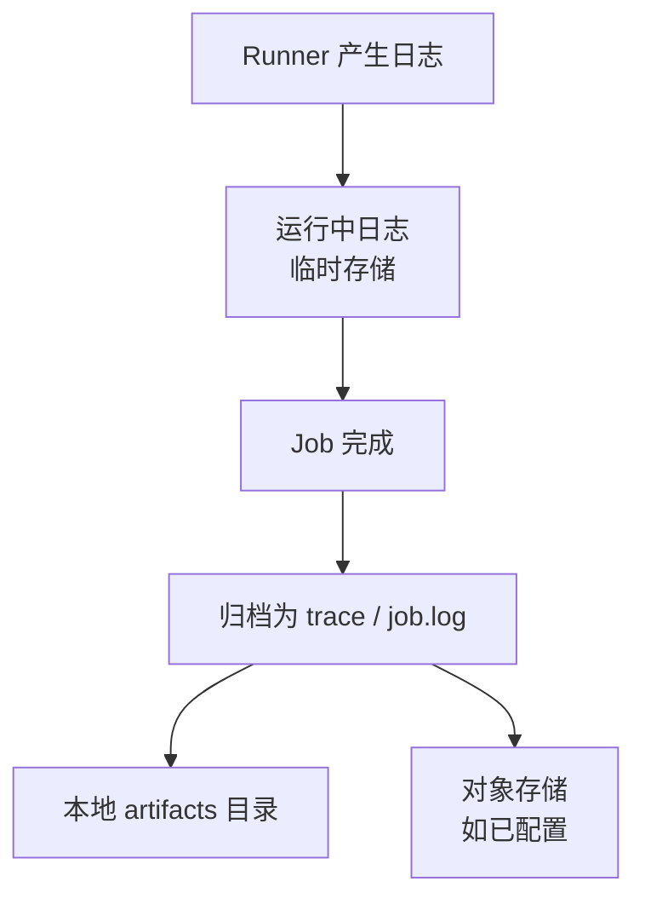
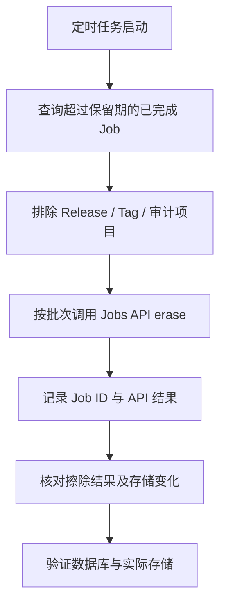

GitLab 长期运行后，`gitlab-rails/shared/artifacts` 往往会成为存储大户。看到目录名中的 `artifacts`，人们很容易把其中的文件都理解为 `artifacts.zip`，然后只清理可下载的构建产物。

但在 CI 执行频繁、日志输出较多的项目中，真正占用空间的可能是历史 Job Log。Job 完成后，日志会以 `trace` 类型的 `Ci::JobArtifact` 归档为 `job.log`，和构建产物共用 Artifact 存储。

本文面向 GitLab Self-Managed 管理员，以一个项目的存储统计为例，说明如何定位占用、清理历史数据，并设置后续保留策略：

- 找出 Artifact 空间占用最大的项目；
- 区分 `archive`、`metadata` 和 `trace`；
- 统计不同保留周期下的潜在可释放空间；
- 清理过期构建产物和历史 Job Log；
- 配置 Web UI 与 `.gitlab-ci.yml` 中的自动过期策略；
- 验证数据库、后台任务和磁盘空间是否真正下降。

> 清理会永久删除 CI 历史数据，应先备份并确认需要保留的任务。本文于 2026-10-09 核对 GitLab 官方文档；案例未记录具体 GitLab 版本，Rails 内部类和管理界面应以实际部署版本为准。先在单个非关键项目验证，再扩大范围。

## Artifact 目录与 Job Log 的存储关系 {#先理解artifact-目录里存了什么}

Job 执行过程中，Runner 会持续上传日志。Job 完成后，日志被归档到 Artifact 存储中；如果启用了对象存储，还会进一步上传到对象存储。

常见的 `Ci::JobArtifact` 类型包括：

| 类型 | 常见文件 | 用途 | 删除后的影响 |
| --- | --- | --- | --- |
| `archive` | `artifacts.zip` | 用户定义的构建产物 | 无法再下载构建产物 |
| `metadata` | `metadata.gz` | Artifact 文件元数据 | Artifact 浏览等功能可能受影响 |
| `trace` | `job.log` | CI Job 执行日志 | Job 页面不再显示完整日志 |
| 报告类 Artifact | JUnit、Code Quality 等 | 测试、安全和质量报告 | 对应报告页面可能失去数据源 |

`trace` 就是归档后的 Job Log，常见文件名为 `job.log`。因此，清理构建产物之前，应先确认占用来自哪一种类型。

### Job Log 的存储过程



Linux Package 安装中，已归档日志通常位于：

```text
/var/opt/gitlab/gitlab-rails/shared/artifacts/<散列路径>/<日期>/<job_id>/<artifact_id>/job.log
```

Docker 部署在容器内仍使用 `/var/opt/gitlab`，宿主机路径则取决于 Volume 映射。Helm 或对象存储场景不能只靠本机 `du` 判断完整占用。

## 清理前的准备

### 确认部署方式和存储后端

先确认以下信息：

- GitLab 版本；
- Linux Package、Docker 还是 Helm 部署；
- Artifacts 存储在本地文件系统、NFS 还是对象存储；
- Sidekiq 是否正常；
- 是否有 Release、合规或审计数据必须长期保留。

### 制定保留周期

保留周期不宜只按“文件有多旧”决定。下面是保留策略示例，不是 GitLab 的默认配置：

| 数据 | 建议保留周期 |
| --- | ---: |
| Feature 分支构建产物 | 7～30 天 |
| 主分支构建产物 | 30～90 天 |
| 普通 CI Job Log | 3～12 个月 |
| Release Pipeline 日志 | 按审计要求保留 |
| Release 制品 | 长期保存或转移到制品库 |

### 备份并选择试点项目

在正式删除前：

1. 完成 GitLab 备份；
2. 记录清理前的数据库统计和磁盘占用；
3. 选择一个非关键项目试运行；
4. 确认页面、API、Sidekiq 和物理文件的变化；
5. 再按空间收益从大到小扩展到其他项目。

## 定位 CI 存储占用

### 检查磁盘实际占用

Linux Package 默认路径：

```bash
sudo du -sh /var/opt/gitlab/gitlab-rails/shared/artifacts
sudo du -h --max-depth=1 /var/opt/gitlab/gitlab-rails/shared/artifacts | sort -h
```

Docker 部署需要在宿主机检查实际挂载目录。例如宿主机把 `/srv/gitlab` 挂载到容器的 `/var/opt/gitlab`：

```bash
sudo du -sh /srv/gitlab/gitlab-rails/shared/artifacts
```

不要直接照抄示例路径，应先通过容器配置确认真实映射：

```bash
docker inspect gitlab --format '{{json .Mounts}}'
```

### 进入 Rails Console

Linux Package：

```bash
sudo gitlab-rails console
```

Docker：

```bash
docker exec -it gitlab gitlab-rails console
```

进入后会看到 `irb` 提示符。后文 Ruby 代码均在 Rails Console 中执行。

### 找出 Artifact 占用最大的项目

`ProjectStatistics.build_artifacts_size` 适合先做全局筛选：

```ruby
include ActionView::Helpers::NumberHelper

ProjectStatistics
  .where("build_artifacts_size > 0")
  .order(build_artifacts_size: :desc)
  .each do |statistics|
    puts "%10s  %s" % [
      number_to_human_size(statistics.build_artifacts_size),
      statistics.project.full_path
    ]
  end
```

示例输出：

```text
 83.1 GiB  example-group/platform/project-alpha
 26.3 GiB  example-group/platform/project-beta
 15.5 GiB  example-group/services/project-gamma
```

该字段适合寻找重点项目，但不能直接回答“哪些文件可以安全删除”。接下来还要拆分 Artifact 类型和时间范围。

### 检查单个项目总占用

```ruby
project = Project.find_by_full_path(
  'example-group/platform/project-alpha'
)

raise 'Project not found' unless project

artifacts = Ci::JobArtifact.where(project_id: project.id)

puts project.full_path
puts "#{(artifacts.sum(:size).to_f / 1024**3).round(2)} GiB"
```

案例项目的总占用约为：

```text
83.1 GiB
```

### 按类型分析空间

```ruby
artifacts = Ci::JobArtifact.where(project_id: project.id)
file_types = Ci::JobArtifact.file_types.invert

artifacts
  .group(:file_type)
  .sum(:size)
  .sort_by { |_, size| -size }
  .each do |type, size|
    puts "%-30s %10.2f GiB" % [
      file_types[type] || type,
      size.to_f / 1024**3
    ]
  end
```

案例输出：

```text
trace                               82.97 GiB
archive                              0.10 GiB
metadata                             0.00 GiB
```

此时问题已经明确：83.1 GiB 中几乎全部是 `trace/job.log`，普通构建产物只有约 0.10 GiB。

### 按时间范围统计

先固定本次统计的截止时间，并保留到清理后的复查。以下按 Artifact 的 `created_at` 估算空间。各时间范围互相包含，不能相加；后续清理按 Job 的 `finished_at` 筛选，两种口径不完全相同。

```ruby
include ActionView::Helpers::NumberHelper

artifacts = Ci::JobArtifact.where(project_id: project.id)

cutoff = 1.year.ago
puts "Cutoff: #{cutoff.iso8601}"
puts "Total:     #{number_to_human_size(artifacts.sum(:size))}"
puts "> 1 year:  #{number_to_human_size(artifacts.where('created_at < ?', cutoff).sum(:size))}"
puts "> 6 month: #{number_to_human_size(artifacts.where('created_at < ?', 6.months.ago).sum(:size))}"
puts "> 3 month: #{number_to_human_size(artifacts.where('created_at < ?', 3.months.ago).sum(:size))}"
puts "> 1 month: #{number_to_human_size(artifacts.where('created_at < ?', 1.month.ago).sum(:size))}"
```

案例数据：

```text
Total:     83.1 GiB
> 1 year:  53.3 GiB
> 6 month: 67.4 GiB
> 3 month: 74.2 GiB
> 1 month: 80.1 GiB
```

### 精确统计一年以前的 Trace

沿用上一步的 `cutoff`，只统计 Trace：

```ruby
old_traces = Ci::JobArtifact
  .where(project_id: project.id)
  .where(file_type: Ci::JobArtifact.file_types[:trace])
  .where('created_at < ?', cutoff)

puts "Count: #{old_traces.count}"
puts "Size:  #{(old_traces.sum(:size).to_f / 1024**3).round(2)} GiB"
```

结果约为：

```text
Size: 53.34 GiB
```

53.34 GiB 是按日志创建时间统计的候选空间，还没有扣除 Release、审计任务等保留项，也不是实测释放量。

### 生成全局综合排行榜

下面沿用 `cutoff`，同时列出总量、Trace、Archive 和一年以前的 Trace，按旧 Trace 占用降序排列。全实例聚合可能给数据库带来较大负载，宜在低峰期执行。

```ruby
include ActionView::Helpers::NumberHelper

total = Ci::JobArtifact.group(:project_id).sum(:size)

trace = Ci::JobArtifact
  .where(file_type: Ci::JobArtifact.file_types[:trace])
  .group(:project_id)
  .sum(:size)

archive = Ci::JobArtifact
  .where(file_type: Ci::JobArtifact.file_types[:archive])
  .group(:project_id)
  .sum(:size)

old_trace = Ci::JobArtifact
  .where(file_type: Ci::JobArtifact.file_types[:trace])
  .where('created_at < ?', cutoff)
  .group(:project_id)
  .sum(:size)

projects = Project.where(id: total.keys).index_by(&:id)

puts "%10s %10s %10s %10s  %s" % [
  'TOTAL', 'TRACE', 'ARCHIVE', '>1Y TRACE', 'PROJECT'
]
puts '-' * 120

total.sort_by { |project_id, _| -(old_trace[project_id] || 0) }.each do |project_id, size|
  ranked_project = projects[project_id]
  next unless ranked_project

  puts "%10s %10s %10s %10s  %s" % [
    number_to_human_size(size),
    number_to_human_size(trace[project_id] || 0),
    number_to_human_size(archive[project_id] || 0),
    number_to_human_size(old_trace[project_id] || 0),
    ranked_project.full_path
  ]
end
```

按照 `>1Y TRACE` 从大到小制定计划，比只看总 Artifact 更接近实际清理收益。

## 清理过期构建产物

### Artifact 自动过期的工作方式

构建产物可以在 `.gitlab-ci.yml` 中设置 `artifacts:expire_in`。到期后，GitLab 的后台任务会删除符合条件的 Artifact。数据库状态发生变化和文件被物理删除之间可能存在延迟。

需要注意：

- 过期时间主要治理构建产物，不是 Job Log 的通用保留策略；
- 最新流水线相关 Artifacts 可能受保留设置保护，具体范围取决于版本；
- 修改实例默认值只影响新产生的 Artifacts；
- 用户手动选择保留的 Artifact 需要单独评估。

### 清理指定范围的旧构建产物

下面是按 Job 完成时间主动删除旧产物，不是等待 `expire_in` 到期。即使只处理一个项目，也会删除用户手动选择 **Keep** 的产物；不能依赖保留设置替你排除重要任务。删除方式参考 [GitLab 管理员排障文档](https://docs.gitlab.com/administration/cicd/job_artifacts_troubleshooting/)。

先列出候选任务，只读检查：

```ruby
project = Project.find_by_full_path('example-group/platform/project-alpha')
raise 'Project not found' unless project

# 沿用前文记录的 cutoff；单独执行时先固定本次清理截止时间
candidates = project.builds.with_downloadable_artifacts
  .where('finished_at < ?', cutoff)

puts "Cutoff: #{cutoff.iso8601}; candidates: #{candidates.count}"
candidates.order(:id).limit(20).pluck(:id, :name, :ref, :finished_at).each { |row| p row }
```

以上仅显示前 20 条，不代表完整清单。核对待处理 Job 的产物用途后，将选定的 ID 填入下面的数组；先处理少量任务。示例保留空数组，避免直接复制就开始删除。

```ruby
artifact_job_ids = [] # 填入已核对、允许删除产物的 Job ID
raise 'No jobs selected' if artifact_job_ids.empty?

candidates.where(id: artifact_job_ids).each_batch do |batch|
  batch.each do |build|
    Ci::JobArtifacts::DeleteService.new(build).execute
  end
  batch.update_all(artifacts_expire_at: Time.current)
end
```

这段代码处理可下载产物，不能代替下一节的 Job Log 擦除。

### 删除后空间未释放的原因 {#为什么删除成功后空间几乎没变}

案例中清理旧的可下载产物后，按同一截止时间查询：

```ruby
project.builds
  .with_downloadable_artifacts
  .where('finished_at < ?', cutoff)
  .count
```

返回：

```text
0
```

但项目总占用仍接近 83.1 GiB。原因在于整个项目的 `archive` 原本就只有约 0.10 GiB，主要占用来自 82.97 GiB 的 `trace`。限定 ID 清理时，其余未选中的旧产物仍会保留，查询结果不一定为 0。

```text
with_downloadable_artifacts = 0
```

不等于：

```text
trace = 0
```

## 清理历史 Job Log / Trace

### 擦除 Job 的影响

本文使用的 **Erase** 操作会清除 Job Log 和该 Job 的产物，并把 Job 标记为已擦除；Job 记录本身仍然存在。它不是只删一个 `job.log`，也不是删除整条 Pipeline。可对照 [Jobs API 的擦除接口及返回示例](https://docs.gitlab.com/api/jobs/#erase-a-job)。

执行前应检查同一 Job 是否还包含需要保留的制品或报告，并排除 Release、合规和审计任务。

### 使用 BuildEraseService 清理单个项目

先明确项目、操作者和时间阈值：

```ruby
project = Project.find_by_full_path(
  'example-group/platform/project-alpha'
)
admin_user = User.find_by(username: 'root')

raise 'Project not found' unless project
raise 'Admin user not found' unless admin_user&.admin?

# 沿用前文记录的 cutoff；单独执行时先固定本次清理截止时间
log_candidates = project.builds.where('finished_at < ?', cutoff)
puts "Cutoff: #{cutoff.iso8601}; candidates: #{log_candidates.count}"
log_candidates.order(:id).limit(20).pluck(:id, :name, :ref, :finished_at).each { |row| p row }
```

上面只展示前 20 条供检查。根据项目的保留要求逐一核对，将本批允许同时擦除日志和产物的 Job ID 填入数组。代码不会自动识别 Release 或审计任务：

```ruby
log_job_ids = [] # 填入已核对、允许擦除的 Job ID
raise 'No jobs selected' if log_job_ids.empty?

log_candidates.where(id: log_job_ids)
  .each_batch do |batch|
    batch.each do |build|
      print "Ci::Build ID #{build.id}... "

      if build.erasable?
        Ci::BuildEraseService.new(build, admin_user).execute
        raise "Erase not confirmed: #{build.id}" unless build.reload.erased_at
        puts 'Erased'
      else
        puts 'Skipped (Nothing to erase or not erasable)'
      end
    end
  end
```

执行过程中可能看到：

```text
Ci::Build ID 123456... Erased
Ci::Build ID 123457... Erased
Ci::Build ID 123458... Skipped (Nothing to erase or not erasable)
```

`Skipped` 表示未执行擦除，应结合该 Job 的状态检查。脚本在未确认 `erased_at` 时停止；已完成的删除不会回滚。记录成功、跳过和失败的 ID，作为后续验证依据。

### 使用 Jobs API 擦除 Job

相较于直接依赖 Rails 内部类，Jobs API 更适合制作可审计的外部定时任务。擦除单个 Job 的接口为：

```text
POST /projects/:id/jobs/:job_id/erase
```

示例（先在运行环境中设置有相应权限的 `GITLAB_TOKEN`，并替换项目和 Job ID）：

```bash
curl --fail-with-body --show-error --request POST \
  --header "PRIVATE-TOKEN: ${GITLAB_TOKEN:?Set GITLAB_TOKEN first}" \
  --url "https://gitlab.example.com/api/v4/projects/<project-id>/jobs/<job-id>/erase"
```

该接口不能擦除已归档（archived）的 Job；这与日志文件已归档为 `trace` 是不同概念。遇到此限制，应对照部署版本的管理员清理文档处理。

自动化脚本应分页列出候选 Job，再逐个擦除，并实现以下控制：

- 只处理超过保留期且已经结束的 Job；
- 按项目、分支、标签或 Job 名称排除 Release 数据；
- 限制每批数量和请求速率；
- 记录项目 ID、Job ID、执行时间和 API 结果；
- 检查 HTTP 状态和返回的 `erased_at`；权限、归档或状态错误应停止重试并排查，临时错误才有限重试。

### 直接删除文件的风险 {#不建议把直接删文件作为常规方案}

[GitLab 日志管理文档](https://docs.gitlab.com/administration/cicd/job_logs/#how-to-remove-job-logs)提供了直接删除旧日志文件的方法，但它可能留下数据库引用。文件修改时间也不等于 Job 完成时间，不能直接套用前文的统计结果。

如果需要评估文件级清理，先只列出文件：

```bash
sudo find /var/opt/gitlab/gitlab-rails/shared/artifacts \
  -type f -name 'job.log' -mtime +60 -print
```

常规清理优先使用过期机制、Jobs API 或对应版本的管理员清理方法。文件级删除仅用于已评估的应急场景，之后还要检查文件完整性并处理缺失引用。不要删除整个 `artifacts` 目录，其中还有有效的构建产物、报告和日志。

## 通过 Web UI 配置 Artifact 自动过期

### 设置实例默认过期时间

管理员进入：

```text
Admin
└── Settings
    └── CI/CD
        └── Continuous Integration and Deployment
            └── Default artifacts expiration
```

输入如 `30 days`、`90 days` 等 GitLab 支持的时长，然后保存。

这个设置需要注意三点：

1. 默认值通常为 30 天；
2. Job 中显式设置的 `artifacts:expire_in` 可以覆盖实例默认值；
3. 修改只应用于新生成的 Artifact，已有 Artifact 会保留原来的过期时间。

因此，在磁盘已经告急时，仅修改默认过期时间并不能立刻清理历史数据。

### 最新成功流水线产物的保留设置 {#决定是否保留最新成功流水线产物}

在同一管理区域可以看到：

```text
Keep the latest artifacts for all jobs
in the latest successful pipelines
```

该选项默认启用。当前官方文档说明，每个 Git ref 会保留最新一条流水线的产物，以及最近一次成功流水线的产物（如果两者不同），这些产物不受 `expire_in` 限制。旧版本的行为可能不同，不能只凭设置名称判断保留范围。

如果希望这些 Artifact 也按过期时间清理，可以在完成业务评估后取消勾选。实例级关闭后，项目不能单独重新开启。关闭也不会立即释放旧产物；对应 ref 还需运行新的流水线，原先保留的产物才能进入可过期状态。具体条件见 [GitLab 产物保留说明](https://docs.gitlab.com/ci/jobs/job_artifacts/#keep-artifacts-from-most-recent-successful-jobs)。

### 限制单个 Artifact 大小

管理员进入：

```text
Admin
└── Settings
    └── CI/CD
        └── Continuous Integration and Deployment
            └── Maximum artifacts size (MB)
```

该值限制单个 Job 最终上传的 Artifact 归档文件大小。它可以阻止新增超大文件，但不会删除历史数据，也不限制整个项目累计占用。

项目设置可覆盖组和实例的大小限制；报告类 Artifact 还可能受类型上限约束，多个限制适用时取较小值。详见 [Maximum artifacts size](https://docs.gitlab.com/administration/cicd/limits/#maximum-artifacts-size)。

### 在项目中设置保留最新产物

项目维护者可以进入：

```text
Project
└── Settings
    └── CI/CD
        └── Artifacts
            └── Keep artifacts from most recent successful jobs
```

具体名称可能随版本略有变化。实例管理员的全局开关具有更高优先级。

### 在 `.gitlab-ci.yml` 中设置精确周期

下面按普通分支、默认分支和标签设置不同周期。示例假设仓库有 `build.sh`，输出位于 `dist/`；仅覆盖分支和标签流水线，合并请求流水线需另行配置。`rules` 决定运行范围，Job 名称本身不会限制分支：

```yaml
build-feature:
  stage: build
  script:
    - ./build.sh
  artifacts:
    paths:
      - dist/
    expire_in: 7 days
  rules:
    - if: '$CI_COMMIT_BRANCH && $CI_COMMIT_BRANCH != $CI_DEFAULT_BRANCH'

build-main:
  stage: build
  script:
    - ./build.sh
  artifacts:
    paths:
      - dist/
    expire_in: 30 days
  rules:
    - if: '$CI_COMMIT_BRANCH == $CI_DEFAULT_BRANCH'

build-release:
  stage: build
  script:
    - ./build.sh
  artifacts:
    paths:
      - dist/
    expire_in: 1 year
  rules:
    - if: '$CI_COMMIT_TAG'
```

如果 Release 制品需要长期保存，更稳妥的做法是发布到 Package Registry、容器镜像仓库或专用制品库，而不是永久占用 Pipeline Artifact 存储。

## Web UI 的 Job Log 过期配置限制 {#web-ui-对-job-log-自动过期的能力边界}

`Default artifacts expiration` 不控制 Job Log 的保留周期。根据本次核对的 [Job logs 官方文档](https://docs.gitlab.com/administration/cicd/job_logs/#how-to-remove-job-logs)，GitLab Self-Managed 没有一个通用的管理员 Web UI 选项，可以设置“所有 Job Log 超过 N 天后自动擦除”。Job Log 默认不会因为 Artifact 的默认过期时间而自动消失。

要实现历史 Job Log 自动清理，需要使用：

- 外部调度系统定期调用 Jobs API；
- 经过验证的 Rails Console 运维脚本；
- 与当前 GitLab 版本匹配的官方管理任务；
- 对象存储场景下经过完整性评估的存储治理方案。

### Incremental logging 的作用与保留周期 {#incremental-logging-解决的不是保留周期}

GitLab 较新版本在以下位置提供 Incremental logging：

```text
Admin > Settings > CI/CD > Job logs
```

它需要先配置 CI/CD Artifacts、Logs 和 Builds 的对象存储。启用后，日志块先缓存在 Redis，再写入持久存储；Job 完成后由 Sidekiq 归档到对象存储并清理临时数据。它能降低日志对本地磁盘的依赖。启用前需核对对象存储配置；当前文档还明确指出不支持 Redis Cluster。详见 [Incremental logging](https://docs.gitlab.com/administration/cicd/job_logs/#incremental-logging)。

但它改变的是日志写入和存储路径，不会自动实现“超过 180 天删除 Job Log”。保留周期仍需单独治理。

## 建立 Job Log 定期清理机制

一个稳妥的自动化流程应当是：



建议按项目逐步启用，而不是直接对全实例运行：

1. 先输出候选清单和预计释放空间，不删除；
2. 人工确认项目白名单和排除规则；
3. 每批只处理有限数量的 Job；
4. 观察 Sidekiq 队列和存储变化；
5. 稳定运行后再交给 Cron、系统调度器或运维平台。

## 验证数据库记录与物理空间 {#验证数据是否真正删除}

### 验证旧 Trace 记录

清理后沿用清理前保存的 `cutoff`，不要重新计算“一年前”：

```ruby
old_traces = Ci::JobArtifact
  .where(project_id: project.id)
  .where(file_type: Ci::JobArtifact.file_types[:trace])
  .where('created_at < ?', cutoff)

puts "Count: #{old_traces.count}"
puts "Size:  #{(old_traces.sum(:size).to_f / 1024**3).round(2)} GiB"
```

这个统计用于比较同一时间范围的剩余量，不要求归零：未选中的任务、保留项和跳过项都可能留下 Trace。还应按本批 `log_job_ids` 核对 Job 状态，并检查成功擦除的 Job 页面。统计按 Artifact 创建时间筛选，清理按 Job 完成时间筛选，差异不能直接判定为失败；不要为“清零”直接删除数据库记录。

### 检查待删除对象

普通 Artifact 删除可能先将记录转为 `Ci::DeletedObject`，再由后台任务删除文件。官方排障文档同时说明，Job 擦除中的产物删除是同步执行的，因此不能把所有空间变化都解释为“等待 Sidekiq”。

需要排查异步删除时，可以查看：

```ruby
puts "Deleted objects: #{Ci::DeletedObject.count}"
puts "Ready: #{Ci::DeletedObject.where('pick_up_at < ?', Time.current).count}"
```

这些是全实例统计，不代表当前项目的待删除量。数量大只能说明有积压，不能证明任务正在推进；应观察数量变化、Sidekiq 的重试与失败记录。删除的两阶段机制见 [官方排障说明](https://docs.gitlab.com/administration/cicd/job_artifacts_troubleshooting/)。

### 验证物理空间

完成删除后检查实际存储；涉及异步删除时，需等待相应后台任务处理：

```bash
sudo du -sh /var/opt/gitlab/gitlab-rails/shared/artifacts
```

对象存储场景应查看 Bucket 的实际容量、对象数量和生命周期任务，不能用本机 `du` 代替。

### 数据库记录减少但 `du` 不变的排查 {#数据库下降但-du-不变怎么办}

按以下顺序排查：

1. `Ci::DeletedObject` 是否仍有大量待处理记录；
2. Sidekiq 删除任务是否堆积、重试或失败；
3. 检查的是否为真实 Volume 路径；
4. Artifact 是否实际存放在对象存储；
5. 是否存在数据库未引用的孤立文件。

如果 `du` 已下降但 `df` 显示可用空间没有增加，再检查已删除但仍被进程打开的文件；这类文件不会继续计入原目录的 `du`。

Rails 查询代表 GitLab 当前记录的逻辑占用，`du` 或对象存储统计才代表物理占用。两者下降的时间点不一定一致。

## 常见误区

### 误区：删除 Artifact 等于删除 Job Log {#artifact-删除成功job-log-就已删除}

`with_downloadable_artifacts` 主要针对可下载构建产物，不能证明 `trace` 已经不存在。

### 误区：默认过期时间追溯清理已有产物 {#修改默认过期时间会追溯清理已有-artifact}

管理员 Web UI 中的新默认值只影响之后创建的 Artifact。

### 误区：Incremental logging 自动删除旧日志 {#incremental-logging-会自动删除旧日志}

它改变日志的缓存、传输和存储方式，不是日志保留策略。

### 误区：`build_artifacts_size` 等于可立即释放空间 {#build_artifacts_size-就是能立即释放的磁盘空间}

它适合排序，但实际释放量还受 Artifact 类型、保留设置、对象存储和后台物理删除进度影响。

### 误区：直接删除 artifacts 目录即可清理 {#目录太大直接删除-artifacts-目录最快}

这会造成数据库与文件系统严重不一致，还可能删除仍在使用的构建产物和报告。除非正在执行官方明确说明的灾难恢复流程，否则不要这样做。

## 案例复盘：清理结果与保留策略 {#本次案例复盘}

案例项目：

```text
example-group/platform/project-alpha
```

清理前统计：

```text
Total:       83.1 GiB
trace:       82.97 GiB
archive:      0.10 GiB
metadata:     ~0 GiB
> 1Y trace:  53.34 GiB
```

最初使用 `Ci::JobArtifacts::DeleteService` 后，旧的 downloadable artifacts 已经清除，但总占用几乎没有变化。原因是这个项目的空间并不主要来自 `artifacts.zip`，而是长期累积的 `trace/job.log`。

这个案例说明，清理前需要先区分产物类型：

```text
按项目和 Artifact 类型分析空间
        ↓
制定 Artifact 与 Job Log 两套保留策略
        ↓
Web UI + .gitlab-ci.yml 管理新增 Artifact
        ↓
BuildEraseService 或 Jobs API 清理历史 Job Log
        ↓
按所用删除方式核对结果与后台任务
        ↓
同时验证数据库和实际存储
```

按清理前的统计，一年前的 Trace 合计约 53.34 GiB；最终释放量还需扣除保留项，并用清理后的实际存储数据确认。对于整个 GitLab 实例，应先生成 `TOTAL / TRACE / ARCHIVE / >1Y TRACE` 排行榜，再从收益最大的项目开始分批处理。

后续维护中，构建产物依靠默认过期时间和仓库配置控制新增占用；Job Log 由定时任务按保留清单清理。每次都保留候选清单、执行结果和前后统计，方便复查。

## 参考资料

- [GitLab CI/CD settings](https://docs.gitlab.com/administration/settings/continuous_integration/)
- [GitLab Job logs](https://docs.gitlab.com/administration/cicd/job_logs/)
- [GitLab Automate storage management](https://docs.gitlab.com/user/storage_management_automation/)
- [GitLab Job artifact troubleshooting for administrators](https://docs.gitlab.com/administration/cicd/job_artifacts_troubleshooting/)
- [GitLab Jobs API](https://docs.gitlab.com/api/jobs/)
