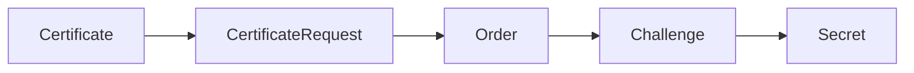

开源仓库：



## cert-manager 到底帮我们做了什么

当你在集群里创建一个 `Certificate` 资源后，`cert-manager` 会自动完成一整套证书申请动作：

1. 在集群里生成私钥
2. 通过 `Issuer` 或 `ClusterIssuer` 向 CA 发起申请
3. 完成域名所有权验证
4. 将证书和私钥写入 `Secret`
5. 在证书到期前自动续期

如果把它类比成流程审批，大概是这样：

- `Certificate`：你的申请表
- `CertificateRequest`：内部审批单
- `Order`：ACME 订单
- `Challenge`：CA 给你的验证题



## 先安装 cert-manager

安装命令：

```bash
kubectl apply -f https://github.com/cert-manager/cert-manager/releases/download/v1.19.2/cert-manager.yaml
```

安装后先确认组件都正常：

```bash
kubectl get pods -n cert-manager
```

示例输出：

```bash
NAME                                       READY   STATUS    RESTARTS   AGE
cert-manager-7b8b89f89d-tt7ng              1/1     Running   0          3h21m
cert-manager-cainjector-7f9fdd5dd5-44drh   1/1     Running   0          3h21m
cert-manager-webhook-769f6b94cb-cdkbk      1/1     Running   0          3h21m
```

看到三大件都 `Running`，说明它已经不是“理论上装好了”，而是真的在干活。

## 选择验证方式：HTTP-01 还是 DNS-01

常见 ACME 验证方式有两种：

- `HTTP-01`：适合入口流量已经通了的 Web 服务
- `DNS-01`：适合做泛域名证书，或者不想依赖入口路径

本文演示 `Cloudflare DNS-01`，因为这套组合非常适合云原生场景，尤其是：[^cm-dns01]

- 有 Cloudflare DNS 托管
- 需要签发多个子域名
- 后续想配合 Ingress / Gateway 自动续期

## 用 Cloudflare 配置 ClusterIssuer

### 第一步：创建 Cloudflare 凭据 Secret

先准备 `secret.yaml`：

```yaml
apiVersion: v1
kind: Secret
metadata:
  name: cloudflare-api-key-secret
  namespace: cert-manager
type: Opaque
stringData:
  api-key: {your-api-key}
```

应用：

```bash
kubectl apply -f secret.yaml
```

### 第二步：创建 ClusterIssuer

```yaml
apiVersion: cert-manager.io/v1
kind: ClusterIssuer
metadata:
  name: letsencrypt-cloudflare
spec:
  acme:
    email: {your-email}
    server: https://acme-v02.api.letsencrypt.org/directory
    privateKeySecretRef:
      name: letsencrypt-cloudflare-account-key
    solvers:
      - dns01:
          cloudflare:
            email: {your-email}
            apiKeySecretRef:
              name: cloudflare-api-key-secret
              key: api-key
```

应用：

```bash
kubectl apply -f cluster-issuer.yaml
```

### 第三步：检查 Issuer 状态

```bash
kubectl get secrets -n cert-manager
kubectl get clusterissuers.cert-manager.io
```

示例：

```bash
NAME                                 TYPE     DATA   AGE
cert-manager-webhook-ca              Opaque   3      3h29m
cloudflare-api-key-secret            Opaque   1      3h8m
letsencrypt-cloudflare-account-key   Opaque   1      3h1m

NAME                     READY   AGE
letsencrypt-cloudflare   True    158m
```

看到 `READY=True`，说明这一层已经通了。

## 申请一张业务证书

例如为 `gitlab.artoio.com` 创建证书：

```yaml
apiVersion: cert-manager.io/v1
kind: Certificate
metadata:
  name: gitlab-cert
  namespace: istio-system
spec:
  secretName: gitlab-tls-secret
  issuerRef:
    name: letsencrypt-cloudflare
    kind: ClusterIssuer
  dnsNames:
    - gitlab.artoio.com
```

应用：

```bash
kubectl apply -f certificate.yaml
```

然后验证：

```bash
kubectl get certificate -n istio-system
kubectl get certificaterequests.cert-manager.io -n istio-system
kubectl get orders.acme.cert-manager.io -n istio-system
kubectl logs -f -n cert-manager -l app.kubernetes.io/name=cert-manager
```

示例状态：

```bash
NAME          READY   SECRET              AGE
gitlab-cert   True    gitlab-tls-secret   159m

NAME            APPROVED   DENIED   READY   ISSUER                   REQUESTER                                         AGE
gitlab-cert-1   True                True    letsencrypt-cloudflare   system:serviceaccount:cert-manager:cert-manager   160m

NAME                      STATE   AGE
gitlab-cert-1-298491017   valid   161m
```

## 排障顺序很重要

证书不下来时，别上来就怀疑宇宙。按这条链路查最快：

1. 先看 `Certificate`
2. 再看 `CertificateRequest`
3. 然后看 `Order`
4. 最后看 `Challenge`

对应命令：

```bash
kubectl get certificate
kubectl describe certificate <name>

kubectl get certificaterequest
kubectl describe certificaterequest <name>

kubectl get orders.acme.cert-manager.io
kubectl describe order <name>

kubectl get challenges.acme.cert-manager.io
kubectl describe challenge <name>
```

其中最容易暴露真实报错的，往往是 `Challenge`。很多时候问题并不是 cert-manager 本身坏了，而是：

- DNS 记录没生效
- Cloudflare 权限不够
- 域名填错
- Namespace / Secret 名字对不上

## 结语

`cert-manager` 很适合做 Kubernetes 集群里的证书自动化中枢。你只需要把 `Issuer` 配好，后面的申请、签发、写入 `Secret`、续期，基本都可以交给它。

如果说手工证书管理像“每 90 天提醒自己别忘了换锁芯”，那 `cert-manager` 更像是给门锁装上了自动保养系统。


[^cm-dns01]: cert-manager 官方文档对 Cloudflare DNS-01 的 Secret、Issuer 与权限要求有更完整说明，实际生产环境建议优先参考官方配置示例。

## 参考资料

- [cert-manager 官方文档](https://cert-manager.io/docs/)
- [cert-manager GitHub 仓库](https://github.com/cert-manager/cert-manager)
- [Cloudflare DNS-01 配置文档](https://cert-manager.io/docs/configuration/acme/dns01/cloudflare/)
