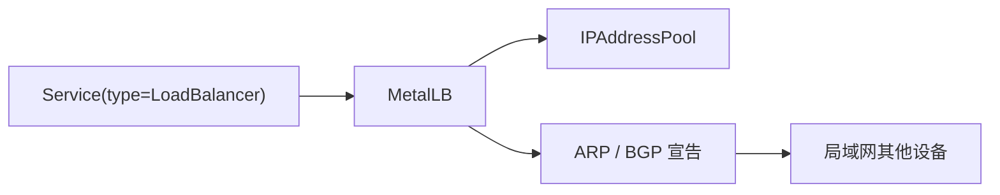

开源仓库：



## 为什么需要 MetalLB

在公有云上创建一个 `type: LoadBalancer` 的 Service，云平台通常会自动分配公网或内网 IP。  
但在裸金属环境里，Kubernetes 不会凭空变出一个负载均衡器，于是就会出现经典场面：

- Service 建好了
- Pod 也跑起来了
- `EXTERNAL-IP` 却一直是 `<pending>`[^metallb-pending]

这时候 `MetalLB` 就登场了。

它主要做两件事：

1. 从你定义的地址池里分配一个可用 IP
2. 用 ARP 或 BGP 告诉局域网其他设备：“这个 IP 现在归我家集群管了”



## 先安装 MetalLB

```bash
kubectl apply -f https://raw.githubusercontent.com/metallb/metallb/v0.15.3/config/manifests/metallb-native.yaml
```

安装完成后验证：

```bash
kubectl get pods -n metallb-system
```

示例：

```bash
NAME                         READY   STATUS    RESTARTS   AGE
controller-9c6cff498-bg8fz   1/1     Running   0          14h
speaker-5v59w                1/1     Running   0          14h
speaker-92fdj                1/1     Running   0          14h
speaker-mw7jk                1/1     Running   0          14h
speaker-mzm6j                1/1     Running   0          14h
speaker-nbvwc                1/1     Running   0          14h
speaker-qtpgk                1/1     Running   0          14h
```

看到 `controller` 和 `speaker` 都起来了，才算真正进入下一步。

## 配置地址池

这里演示最常见、也最好理解的 `L2` 模式。

创建 `metallb-config.yaml`：

```yaml
apiVersion: metallb.io/v1beta1
kind: IPAddressPool
metadata:
  name: istio-pool
  namespace: metallb-system
spec:
  addresses:
    - 10.64.69.151-10.64.69.200
---
apiVersion: metallb.io/v1beta1
kind: L2Advertisement
metadata:
  name: istio-advert
  namespace: metallb-system
spec:
  ipAddressPools:
    - istio-pool
```

应用：

```bash
kubectl apply -f metallb-config.yaml
```

## 验证地址池是否生效

```bash
kubectl get ipaddresspools.metallb.io -n metallb-system
kubectl get l2advertisements.metallb.io -n metallb-system
```

示例：

```bash
NAME         AUTO ASSIGN   AVOID BUGGY IPS   ADDRESSES
istio-pool   true          false             ["10.64.69.151-10.64.69.200"]

NAME           IPADDRESSPOOLS   IPADDRESSPOOL SELECTORS   INTERFACES
istio-advert   ["istio-pool"]
```

这一步如果没问题，就说明 IP 池和宣告策略已经挂好了。

## 检查 EXTERNAL-IP

```bash
kubectl get svc -n istio-system
```

示例：

```bash
NAME                    TYPE           CLUSTER-IP     EXTERNAL-IP    PORT(S)                                      AGE
istio-ingressgateway    LoadBalancer   10.97.215.9    10.64.69.151   15021:31696/TCP,80:32060/TCP,443:31509/TCP   14h
istiod                  ClusterIP      10.101.77.37   <none>         15010/TCP,15012/TCP,443/TCP,15014/TCP        14h
knative-local-gateway   ClusterIP      10.98.2.124    <none>         80/TCP,443/TCP                               14h
```

只要你看到 `LoadBalancer` 类型的服务成功拿到了 `EXTERNAL-IP`，这套配置基本就已经跑通了。

## L2 模式适合什么场景

`L2` 模式的优点是简单，特别适合：

- 家庭实验室
- 小型机房
- 没有 BGP 条件的裸机集群

它的核心思路很朴素：

- 分配一个内网 IP
- 通过二层广播告诉交换网络“这个 IP 现在挂在哪个节点”

如果你的网络规模更大、路由控制更细，后面也可以考虑 BGP 模式。但对多数入门场景来说，L2 已经很好用了。

## 结语

`MetalLB` 让裸金属 Kubernetes 集群可以正常使用 `LoadBalancer`。  
引入它之后，`EXTERNAL-IP` 分配和集群入口管理都会更清晰。


[^metallb-pending]: 在裸金属环境里，Kubernetes 默认不会像云厂商那样自动创建外部负载均衡器，因此需要 MetalLB 一类组件补足这部分能力。

## 参考资料

- [MetalLB 官方文档](https://metallb.io/)
- [Kubernetes Service 文档](https://kubernetes.io/docs/concepts/services-networking/service/)
- [MetalLB GitHub 仓库](https://github.com/metallb/metallb)
