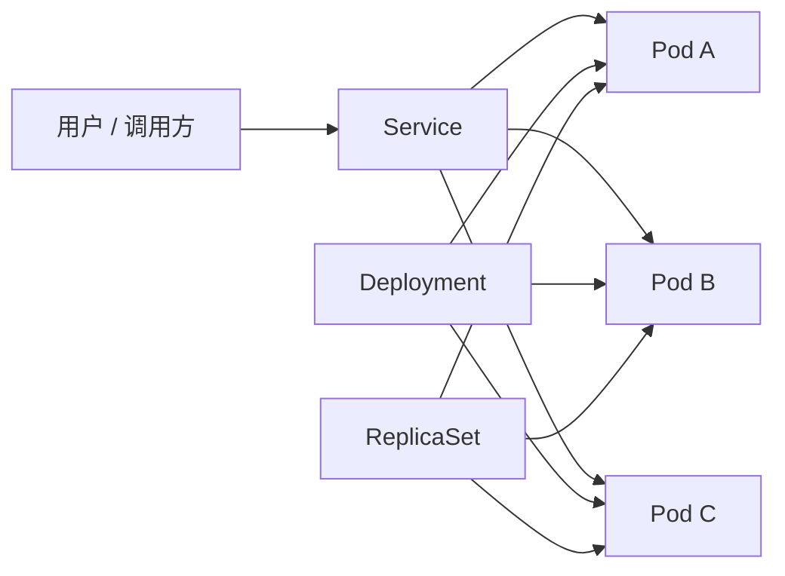

很多人第一次接触 `Kubernetes` 时，体验都差不多：

- 术语很多
- 资源对象很多
- YAML 很多
- 看完一圈之后，脑子里只剩一句：“所以这个 Pod 到底归谁管？”

这篇文章不打算把 Kubernetes 讲成一本砖头书，而是先把最核心的三件事讲明白：

1. `Pod` 是最小运行单元。
2. `Deployment` 负责管理 Pod 的副本与更新。
3. `Service` 负责把“不稳定的 Pod”变成“稳定可访问的服务入口”。

## 总体图



如果把它类比成一家公司：

- `Pod` 像真正干活的员工
- `Deployment` 像部门经理
- `Service` 像对外公布的总机号码

员工会换，经理会补人，但总机号码最好别天天改，不然调用方会疯。

## Pod：Kubernetes 里真正跑应用的地方

`Pod` 是 Kubernetes 调度的最小单位。一个 Pod 里通常会有：

- 一个主容器
- 零个或多个辅助容器
- 一组共享的网络命名空间
- 一块共享存储

最常见的情况，是一个 Pod 跑一个应用容器。

### 一个最小 Pod 示例

```yaml
apiVersion: v1
kind: Pod
metadata:
  name: nginx-demo
  labels:
    app: nginx-demo
spec:
  containers:
    - name: nginx
      image: nginx:1.27
      ports:
        - containerPort: 80
```

创建方式：

```bash
kubectl apply -f pod.yaml
kubectl get pods -o wide
```

但运维场景里，通常不建议长期直接管理裸 Pod。原因很现实：

- Pod 挂了不会自动按业务意图补齐
- 更新不方便
- 扩缩容更不方便

裸 Pod 更像“手工启动一个进程”，适合测试，不太适合正式服务。

## Deployment：真正适合跑业务的控制器

`Deployment` 的价值，在于它不是“创建一个 Pod”，而是“声明你希望有多少个 Pod 按照什么模板一直活着”。

这件事非常关键，因为 Kubernetes 的核心思路不是命令式，而是声明式：

“我不关心你怎么做，我只关心最后保持成这个状态。”

### 一个 Deployment 示例

```yaml
apiVersion: apps/v1
kind: Deployment
metadata:
  name: nginx-web
spec:
  replicas: 3
  selector:
    matchLabels:
      app: nginx-web
  template:
    metadata:
      labels:
        app: nginx-web
    spec:
      containers:
        - name: nginx
          image: nginx:1.27
          ports:
            - containerPort: 80
```

应用后可以看到：

```bash
kubectl apply -f deployment.yaml
kubectl get deployment
kubectl get rs
kubectl get pods
```

这里有个很容易忽略的点：

- `Deployment` 不直接管 Pod
- `Deployment` 管 `ReplicaSet`
- `ReplicaSet` 再去维持 Pod 数量

也就是说，`Deployment -> ReplicaSet -> Pod` 才是完整链路。

## Service：稳定访问入口

Pod 的 IP 是会变的。  
今天是 `10.244.1.15`，明天重建后就可能变成 `10.244.2.31`。  
如果业务方每次都追着 Pod IP 跑，那整个平台很快会变成“分布式捉迷藏”。

这就是 `Service` 存在的意义：提供一个稳定的访问入口，再把流量转发给后端符合标签选择器的 Pod。

### ClusterIP 示例

```yaml
apiVersion: v1
kind: Service
metadata:
  name: nginx-web
spec:
  selector:
    app: nginx-web
  ports:
    - port: 80
      targetPort: 80
  type: ClusterIP
```

查看：

```bash
kubectl get svc
kubectl describe svc nginx-web
```

### Service 常见类型

| 类型 | 说明 | 适合场景 |
| --- | --- | --- |
| `ClusterIP` | 集群内部访问 | 微服务间调用 |
| `NodePort` | 在每个节点暴露端口 | 测试环境、简单暴露 |
| `LoadBalancer` | 对接云厂商负载均衡 | 公网服务 |
| `ExternalName` | 映射外部 DNS 名称 | 引用外部服务 |

## 一次完整工作流示例

最常见的一套最小上线流程，通常是：

1. 写 Deployment
2. 写 Service
3. `kubectl apply`
4. 检查 Pod、Service、事件、日志

```bash
kubectl apply -f deployment.yaml
kubectl apply -f service.yaml

kubectl get pods
kubectl get svc
kubectl describe deployment nginx-web
kubectl logs deploy/nginx-web
```

## 常见排查顺序

很多时候服务“不通”，问题并不在 Kubernetes 本身，而在对象之间某个环节没对齐。

我更推荐用下面这个顺序排查：

### 1. 先看 Deployment

```bash
kubectl get deploy
kubectl describe deploy nginx-web
```

重点看：

- 副本数是否满足
- 镜像是否拉取成功
- 是否有滚动更新失败

### 2. 再看 Pod

```bash
kubectl get pods -o wide
kubectl describe pod <pod-name>
kubectl logs <pod-name>
```

重点看：

- Pod 状态是不是 `Running`
- 是否 `CrashLoopBackOff`
- Readiness/Liveness 探针是否异常

### 3. 再看 Service

```bash
kubectl get svc
kubectl describe svc nginx-web
kubectl get endpoints
```

重点看：

- `selector` 是否匹配到了正确的 Pod
- `endpoints` 是否为空

如果 `Service` 存在，但 `Endpoints` 是空的，十有八九是标签没对上。  
这类问题不复杂，但非常擅长浪费下午。

## 常见错误示例

比如 Deployment 的标签是：

```yaml
labels:
  app: nginx-web
```

但 Service 的选择器写成：

```yaml
selector:
  app: nginx
```

那结果就是：

- Deployment 正常
- Pod 正常
- Service 也正常
- 但 Service 根本找不到后端 Pod

这就是 Kubernetes 很典型的一种体验：  
所有东西都“看起来活着”，但业务就是不通。

## 三个核心对象对比

| 对象 | 主要职责 | 是否直接提供访问入口 | 是否负责副本管理 |
| --- | --- | --- | --- |
| `Pod` | 运行容器 | 否 | 否 |
| `Deployment` | 管理副本与发布 | 否 | 是 |
| `Service` | 提供稳定访问入口 | 是 | 否 |

## 务实结论

如果你刚开始接触 Kubernetes，先别急着背所有资源对象。  
先把下面这句记住，就已经赢过不少“YAML 写了很多但脑图还没连起来”的阶段了：

`Deployment` 负责“让应用一直在”，`Service` 负责“让别人稳定找到它”，`Pod` 负责“真正干活”。

后面再往上加：

- `Ingress`
- `ConfigMap`
- `Secret`
- `StatefulSet`
- `DaemonSet`

整个体系就会顺起来很多。


## 参考资料

- [Kubernetes 官方文档](https://kubernetes.io/docs/home/)
- [Pod 概念文档](https://kubernetes.io/docs/concepts/workloads/pods/)
- [Deployment 概念文档](https://kubernetes.io/docs/concepts/workloads/controllers/deployment/)
- [Service 概念文档](https://kubernetes.io/docs/concepts/services-networking/service/)
