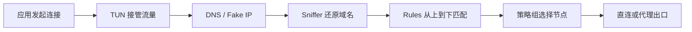

Mihomo 是代理内核，接管流量、解析 DNS、匹配规则并选择出口。Clash Party 是套在 Mihomo 外面的图形客户端，用来管理订阅、切换配置、查看日志和操作策略组。

开启 TUN 后，DNS、嗅探和分流规则会互相影响。本文以一份桌面端配置为例，说明各部分的作用及配合方式。

> 本文中的服务器、端口和密码均为占位符。不要把包含真实节点凭据的配置文件提交到公开仓库。

## Clash Party 配置导入与系统代理 {#基础使用}

### Mihomo 与 Clash Party 的职责 {#工作原理}

开启 TUN 后，一次连接大致经过下面几个阶段：



配置内网绕过时，下面三个字段很容易被当成一回事：

- `route-exclude-address`：让指定 IP 段不进入 TUN 路由。
- `rules` 中的 `DIRECT` 或自定义的 `直连` 节点：流量进入 Mihomo，但最终由本机直接访问目标。
- `fake-ip-filter`：域名仍可由 Mihomo 处理，但 DNS 返回真实 IP，而不是 Fake IP。

它们处理的是不同环节。访问公司内网时，通常要同时配置 DNS 策略、Fake IP 排除、TUN 路由排除和直连规则。只改其中一处，经常会出现域名能解析但网页打不开，或者 IP 能访问而域名不能访问的情况。

### 导入配置

先从 [Clash Party 官方仓库](https://github.com/mihomo-party-org/clash-party) 的 Releases 页面下载对应系统和架构的版本。安装完成后，可以添加订阅 URL，也可以直接导入本地 YAML 文件。

导入后把它设为当前配置，再选择系统代理或 TUN 模式：

- 系统代理只接管遵守操作系统代理设置的应用。
- TUN 会通过虚拟网卡接管更多 TCP、UDP 流量，游戏、命令行工具和不读取系统代理的应用通常需要它。

#### 系统代理绕过

Clash Party 的 `系统代理` 页面里有一项 `代理绕过`。它不是 Mihomo 配置文件中的 `rules`，而是操作系统代理设置的例外列表。开启系统代理后，Clash Party 会把本地代理地址和这份绕过列表写入 PC 的网络代理选项；关闭系统代理时，则撤销相应设置。

例如，希望浏览器访问本机服务、局域网设备和公司内部域名时不经过系统代理，可以在 `代理绕过` 中加入：

```text
localhost
127.0.0.1
10.*
192.168.*
*.corp.example.com
<local>
```

这里最容易写错的是通配符。Mihomo 和 PC 系统代理使用的不是同一套语法：

| 写法 | 应该写在哪里 | 含义 |
| --- | --- | --- |
| `+.corp.example.com` | Mihomo 的 `fake-ip-filter`、`nameserver-policy` 等支持域名通配的配置项 | 匹配 `corp.example.com` 及其子域名 |
| `*.corp.example.com` | Clash Party 的 `系统代理 → 代理绕过` | 使用 `*` 匹配该域名下的主机，并写入 Windows 或 macOS 的系统代理例外列表 |
| `corp.example.com` | 两边都可以使用 | 只需要处理明确域名时，直接写完整域名最稳妥 |

也就是说，下面的写法属于 Mihomo 配置：

```yaml
dns:
  fake-ip-filter:
    - "+.corp.example.com"
  nameserver-policy:
    "+.corp.example.com":
      - 10.64.46.101
```

而 Clash Party 的系统代理绕过要写成：

```text
*.corp.example.com
```

不要把 `+.corp.example.com` 填进 Windows 或 macOS 的系统代理例外列表。Windows 和 macOS 的这类设置使用 `*` 作为通配符，不认识 Mihomo 的 `+` 写法。反过来，为了让 Mihomo 同时处理根域名和子域名，配置文件中应优先使用 `+.corp.example.com`，不要因为系统代理里写了 `*` 就原样复制过去。

保存并开启系统代理后，可以在系统里看到相应变化：

- Windows 会把这些内容应用到系统代理的例外地址列表，使用系统代理的浏览器和应用会读取这份设置。
- macOS 会把这些内容应用到当前网络服务的 `代理` 设置中，也就是“不使用代理的主机与域名”列表。
- Linux 桌面环境若使用 GNOME 或 KDE，Clash Party 会尝试修改对应的系统代理设置。

以 `192.168.1.20` 为例。加入 `192.168.*` 后，浏览器访问这个地址时不会把请求发给 Mihomo 的 `mixed-port`，而是直接从系统网络访问。`*.corp.example.com` 的作用类似，它让遵守系统代理的程序直接连接该域名。

这里有两个限制。第一，只有遵守系统代理设置的应用才会使用这份列表；忽略系统代理的程序不会受影响。第二，开启 TUN 后，绕过系统代理不代表绕过 TUN，因为连接仍可能被虚拟网卡接管。TUN 场景还要配置 `route-exclude-address`、DNS 和直连规则，后文会给出完整示例。

Windows 的系统代理列表通常使用分号分隔，macOS 的系统设置使用逗号分隔。通过 Clash Party 界面添加时，让客户端负责写入对应格式即可。保存后再到系统网络设置中检查一次，尤其要确认 `+` 没有被误填进系统代理例外列表。

每次修改后都要重新加载配置，然后打开 `日志` 和 `连接` 页面。重点看日志里的 `match`、策略组名称和最终节点，它们比反复刷新网页更能说明规则有没有生效。

## Mihomo 配置项说明 {#配置详解}

### 配置结构

常用配置大致分成下面几块：

```yaml
mixed-port: 7890
mode: rule

proxies: []
proxy-groups: []

dns: {}
tun: {}
sniffer: {}

rules: []
rule-providers: {}
```

YAML 对缩进敏感，统一使用空格，不要混用 Tab。列表中的名称也必须完全一致，例如规则写了 `Github`，就必须存在同名策略组。

### 运行参数与代理节点 {#基础配置}

#### 运行参数

```yaml
mixed-port: 7890
ipv6: false
allow-lan: false
mode: rule
unified-delay: false
tcp-concurrent: true
find-process-mode: strict
global-client-fingerprint: chrome

profile:
  store-selected: true
  store-fake-ip: true
```

- `mixed-port`：同时接受 HTTP 和 SOCKS5 代理连接。
- `mode: rule`：按 `rules` 分流。若切到 `global`，规则不会决定出口。
- `allow-lan`：是否允许局域网设备连接本机代理。没有共享需求时建议设为 `false`。
- `tcp-concurrent`：对同一目标并发尝试多个解析地址，通常可改善连接速度。
- `store-selected`：记住策略组的手动选择。
- `store-fake-ip`：持久化 Fake IP 映射，减少内核重启后连接映射变化。

如果要启用 API 控制器，不要在没有认证的情况下监听所有网卡：

```yaml
external-controller: 127.0.0.1:9090
secret: "请替换为足够长的随机字符串"
```

需要从其他设备管理时，再改成 `0.0.0.0:9090`，同时设置 `secret` 并限制防火墙访问范围。

#### Trojan 节点配置 {#trojan-节点}

```yaml
proxies:
  - name: tencent-hk-01
    type: trojan
    server: proxy.example.com
    port: 443
    password: "替换为真实密码"
    sni: proxy.example.com
    alpn:
      - h2
      - http/1.1

  - name: 直连
    type: direct
    udp: true
```

`server` 是节点地址，`sni` 是 TLS 握手使用的服务器名称，两者不一定相同。配置来自服务提供方时，应原样填写，不要凭经验猜测。

### 代理策略组 {#策略组}

规则最好指向策略组，而不是绑死某个节点。这样换地区或节点时，只需在 Clash Party 里改一次选择。

```yaml
proxy-groups:
  - name: 默认
    type: select
    proxies:
      - 自动选择
      - 直连
      - 香港
      - 日本
      - 新加坡
      - 美国
      - 全部节点

  - name: Google
    type: select
    proxies: [默认, 香港, 日本, 新加坡, 美国, 自动选择, 直连]

  - name: 国内
    type: select
    proxies: [直连, 默认]

  - name: 其他
    type: select
    proxies: [默认, 自动选择, 直连]

  - name: 香港
    type: select
    include-all: true
    exclude-type: direct
    filter: "(?i)港|hk|hongkong|hong kong"

  - name: 全部节点
    type: select
    include-all: true
    exclude-type: direct

  - name: 自动选择
    type: url-test
    include-all: true
    exclude-type: direct
    url: https://www.gstatic.com/generate_204
    interval: 300
    tolerance: 50
```

- `select`：由用户手动选择其中一个出口。
- `url-test`：定期测速，自动使用延迟较低的节点。
- `include-all`：纳入所有代理节点和代理提供者中的节点。
- `filter`：按节点名称筛选，适合自动建立地区组。
- `exclude-type: direct`：避免把直连节点混入地区组或测速组。

`tolerance` 不要设得太小。节点只差几毫秒时，频繁切换带来的抖动可能比这点延迟差异更明显。

### TUN 虚拟网卡配置 {#tun}

桌面端可以从这份配置开始：

```yaml
tun:
  enable: true
  stack: mixed
  auto-route: true
  auto-detect-interface: true
  mtu: 1280
  strict-route: true
  endpoint-independent-nat: true
  dns-hijack:
    - any:53
    - tcp://any:53

  route-exclude-address:
    - 192.168.0.0/16
    - 10.0.0.0/8
    - 172.16.0.0/12
    - fc00::/7
```

- `stack: mixed`：TCP 使用系统栈，UDP 使用 gVisor，是较通用的选择；遇到兼容问题可尝试 `system` 或 `gvisor`。
- `auto-route`：自动添加路由，让系统流量进入 TUN。
- `auto-detect-interface`：自动识别真实出口网卡，减少流量回环。
- `strict-route`：收紧路由行为，降低 DNS 泄漏和错误绕行概率，但可能与复杂 VPN、虚拟网卡环境冲突。
- `dns-hijack`：接管发往 53 端口的 UDP/TCP DNS 请求。
- `route-exclude-address`：让指定网段不经过 TUN，常用于局域网和公司内网。

`auto-redirect` 只对 Linux 有效，而且依赖 `auto-route`。共用一份跨平台配置时，不要默认打开它：

```yaml
# 仅 Linux 按需启用
tun:
  auto-route: true
  auto-redirect: true
```

macOS 通常也不必手动指定 `device: utun1280`。固定编号可能撞上已有 VPN 创建的 utun 网卡，交给内核自动创建即可。

#### 内网绕过

假设公司内网使用 `10.0.0.0/8`，内部域名是 `corp.example.com`，配置要覆盖三处：

```yaml
tun:
  route-exclude-address:
    - 10.0.0.0/8

dns:
  fake-ip-filter:
    - "+.corp.example.com"
  nameserver-policy:
    "+.corp.example.com":
      - 10.64.46.101

rules:
  - DOMAIN-SUFFIX,corp.example.com,直连
  - IP-CIDR,10.0.0.0/8,直连,no-resolve
```

`route-exclude-address` 让内网 IP 绕开 TUN；`fake-ip-filter` 和 `nameserver-policy` 让内部 DNS 返回真实地址；最后两条规则把连接送到直连出口。

如果公司 VPN 依赖特殊路由或 DNS，直接排除整个 `10.0.0.0/8` 可能太宽。知道实际网段时，只排除用到的部分更合适。

### DNS 解析配置 {#dns}

下面这份配置偏向中国大陆网络环境：

```yaml
dns:
  enable: true
  ipv6: false
  cache-algorithm: arc
  enhanced-mode: fake-ip
  fake-ip-range: 198.18.0.1/16
  fake-ip-filter-mode: blacklist

  fake-ip-filter:
    - "+.lan"
    - "+.local"
    - "+.corp.example.com"

  default-nameserver:
    - 223.5.5.5
    - 223.6.6.6

  nameserver:
    - https://doh.pub/dns-query
    - https://dns.alidns.com/dns-query

  proxy-server-nameserver:
    - https://doh.pub/dns-query
    - https://dns.alidns.com/dns-query

  direct-nameserver:
    - system
  direct-nameserver-follow-policy: false

  nameserver-policy:
    "+.corp.example.com":
      - 10.64.46.101
      - 223.5.5.5

  fallback:
    - tls://8.8.4.4
    - tls://1.1.1.1
  fallback-filter:
    geoip: true
    geoip-code: CN
    geosite:
      - gfw
```

#### Fake IP 与过滤配置 {#fake-ip}

在 `fake-ip` 模式下，Mihomo 先向应用返回 `198.18.0.0/16` 范围内的虚拟地址，再从内部映射找回原域名。这样可以更早地匹配域名规则，配合 TUN 使用也比较省事。

某些局域网服务、投屏、打印机、游戏或依赖真实 IP 的应用可能不兼容 Fake IP。把对应域名放进 `fake-ip-filter` 后，Mihomo 会为它返回真实解析结果。

#### DNS 服务器选择 {#dns-服务器}

- `default-nameserver`：用于解析 DoH/DoT 服务器自身的域名，通常填写纯 IP 地址，避免循环依赖。
- `nameserver`：默认 DNS 解析器。
- `proxy-server-nameserver`：专门解析代理节点的域名，建议显式配置，避免“连接代理前先要通过代理解析节点”的循环问题。
- `direct-nameserver`：直连出口使用的解析器。
- `nameserver-policy`：为指定域名选择特定 DNS，优先级高于普通 `nameserver` 和 `fallback`。
- `fallback`：备用解析器；`fallback-filter` 决定何时采用其结果。

`nameserver-policy` 的键最好加引号，尤其是包含 `+`、`!` 等符号时。内部 DNS 后面再写一个公共 DNS，并不能让公共 DNS 学会解析内部域名。如果内部域名不能泄漏，就只填写内部 DNS。

### 域名嗅探配置 {#域名嗅探}

有些应用直接连接 IP，有些连接则没有正确关联 DNS 记录。这时 Mihomo 看到的目标只有 IP，域名规则自然匹配不上。Sniffer 会读取 HTTP Host、TLS SNI 或 QUIC 握手里的信息，尝试找回目标域名。

```yaml
sniffer:
  enable: true
  sniff:
    HTTP:
      ports: [80, 8080-8880]
      override-destination: true
    TLS:
      ports: [443, 8443]
    QUIC:
      ports: [443, 8443]
  skip-domain:
    - "+.push.apple.com"
    - "+.corp.example.com"
```

- `override-destination: true`：用嗅探得到的域名覆盖原目标，HTTP 场景常用。
- `skip-domain`：对已知不兼容、内网或不希望嗅探的域名跳过处理。

Sniffer 不会做中间人解密，也看不到 HTTPS 正文，它只读取握手阶段暴露的域名。开启后若遇到连接重置、证书异常或内网应用不可用，可以先把目标域名加入 `skip-domain`。如果问题随之消失，通常就该继续检查嗅探配置。

### 分流规则与匹配顺序 {#分流规则}

Mihomo 从上到下检查规则，命中第一条就停止。明确的内网和单个服务放前面，大范围规则靠后，`MATCH` 留在最后：

```yaml
rules:
  # 1. 明确的局域网和内部服务
  - DOMAIN-SUFFIX,corp.example.com,直连
  - IP-CIDR,192.168.0.0/16,直连,no-resolve
  - IP-CIDR,10.0.0.0/8,直连,no-resolve
  - IP-CIDR,172.16.0.0/12,直连,no-resolve
  - RULE-SET,private_ip,直连,no-resolve

  # 2. 指定服务
  - RULE-SET,github_domain,Github
  - RULE-SET,google_domain,Google
  - RULE-SET,telegram_domain,Telegram
  - RULE-SET,youtube_domain,YouTube
  - RULE-SET,netflix_domain,NETFLIX

  # 3. 国内域名与非中国大陆域名
  - RULE-SET,cn_domain,国内
  - RULE-SET,geolocation-!cn,其他

  # 4. IP 规则放在域名规则之后
  - RULE-SET,google_ip,Google
  - RULE-SET,telegram_ip,Telegram
  - RULE-SET,cn_ip,国内

  # 5. 最终兜底
  - MATCH,其他
```

`no-resolve` 表示检查 IP 规则时不额外解析域名，可以少发一些 DNS 请求。域名比 IP 更容易判断具体服务，所以域名规则通常排在 IP 规则之前。

要让某个网站直连，把它的规则插到远程规则集之前：

```yaml
rules:
  - DOMAIN,api.example.com,直连
  - DOMAIN-SUFFIX,example.com,直连
  - IP-CIDR,203.0.113.0/24,直连,no-resolve
  # 其他 RULE-SET 规则继续写在后面
```

- `DOMAIN`：只匹配完整域名。
- `DOMAIN-SUFFIX`：匹配该域名及其子域名。
- `DOMAIN-KEYWORD`：按域名关键词匹配，范围较宽，应谨慎使用。
- `IP-CIDR` / `IP-CIDR6`：按目标 IP 网段匹配。
- `PROCESS-NAME`：按进程名匹配，依赖平台和进程识别能力。
- `RULE-SET`：引用本地或远程规则集。
- `MATCH`：匹配剩余所有连接，必须放在最后。

### 远程规则集配置 {#远程规则集}

服务域名会变，全部手写很难维护。这里直接引用 MetaCubeX 提供的 MRS 规则文件：

```yaml
rule-anchor:
  ip: &ip
    type: http
    interval: 86400
    behavior: ipcidr
    format: mrs
  domain: &domain
    type: http
    interval: 86400
    behavior: domain
    format: mrs

rule-providers:
  cn_domain:
    <<: *domain
    url: "https://raw.githubusercontent.com/MetaCubeX/meta-rules-dat/meta/geo/geosite/cn.mrs"

  github_domain:
    <<: *domain
    url: "https://raw.githubusercontent.com/MetaCubeX/meta-rules-dat/meta/geo/geosite/github.mrs"

  google_domain:
    <<: *domain
    url: "https://raw.githubusercontent.com/MetaCubeX/meta-rules-dat/meta/geo/geosite/google.mrs"

  geolocation-!cn:
    <<: *domain
    url: "https://raw.githubusercontent.com/MetaCubeX/meta-rules-dat/meta/geo/geosite/geolocation-!cn.mrs"

  private_ip:
    <<: *ip
    url: "https://raw.githubusercontent.com/MetaCubeX/meta-rules-dat/meta/geo/geoip/private.mrs"

  cn_ip:
    <<: *ip
    url: "https://raw.githubusercontent.com/MetaCubeX/meta-rules-dat/meta/geo/geoip/cn.mrs"
```

- 域名规则集使用 `behavior: domain`。
- IP 规则集使用 `behavior: ipcidr`。
- `format: mrs` 对应 Mihomo 的二进制规则集格式。
- `interval: 86400` 表示每 24 小时检查更新。

`rules` 中用到的每一个 `RULE-SET` 名称，都要在 `rule-providers` 中定义。没有被任何规则引用的 provider 可以删掉。

第一次加载远程规则集需要联网。如果下载地址无法直连，可以临时切到全局代理，在 Clash Party 中更新规则后再切回规则模式。

## 验证与排错

### 配置启用与验证顺序 {#启用顺序}

第一次配置时不要把所有功能一起打开。按下面的顺序，每一步只增加一个变量：

1. 只配置一个节点和一个 `select` 策略组，确认手动代理可访问网络。
2. 加入 `rules` 和 `MATCH`，确认不同域名进入预期策略组。
3. 配置 DNS，确认普通域名和内部域名都能解析。
4. 开启 Sniffer，观察规则命中是否改善。
5. 最后开启 TUN，再加入内网路由排除。

每完成一步都看一次 Clash Party 日志。哪一步开始出错，就先检查刚加入的模块。

### 代理连通与规则匹配问题 {#常见问题}

#### 无法访问网络

- 节点的 `server`、`port`、`password` 和 `sni` 是否完整。
- 策略组引用的节点或子策略组是否真实存在。
- `MATCH` 指向的策略组名称是否正确。
- 远程规则集是否下载成功。
- 日志中是否出现 YAML、DNS 或规则提供者错误。

#### TUN 无法访问内网

1. 内网 IP 是否加入 `route-exclude-address`。
2. 内网域名是否加入 `fake-ip-filter`。
3. `nameserver-policy` 是否使用可达的内部 DNS。
4. 内网域名和 IP 规则是否位于其他远程规则之前。
5. Sniffer 是否覆盖了目标；可临时加入 `skip-domain` 验证。

#### 规则未命中

- 确认当前模式是 `rule`。
- 确认更靠前的规则没有提前匹配。
- 在连接详情中查看实际目标是域名还是 IP。
- 若只有 IP，可开启 Sniffer，或补充 IP 规则集。
- 修改规则后重新加载配置，必要时清理 DNS 与 Fake IP 缓存。

#### 分流策略错误

DNS 解析器和代理出口是两件事。`nameserver-policy` 只决定由谁解析，`rules` 才决定连接从哪里出去。域名解析正确，不代表分流规则也正确。

#### 代理故障排查顺序 {#排查顺序}

不用死记所有字段，记住流量的去向就够了。TUN 决定是否接管，DNS 负责解析，Sniffer 尝试找回域名，Rules 选择策略组，策略组再给出直连或代理出口。

先跑通最小配置，再逐项加入 Fake IP、远程规则集和内网绕过。出了问题就沿着 `是否接管 → 是否解析 → 是否还原域名 → 命中哪条规则 → 选择哪个出口` 往下查，通常比换一份更大的配置来得快。

## 参考资料

- [Mihomo 配置文档](https://wiki.metacubex.one/config/)
- [Mihomo DNS 配置](https://wiki.metacubex.one/config/dns/)
- [Mihomo TUN 配置](https://wiki.metacubex.one/config/inbound/tun/)
- [Mihomo Sniffer 配置](https://wiki.metacubex.one/config/sniff/)
- [Mihomo Rule Providers 配置](https://wiki.metacubex.one/config/rule-providers/)
- [Clash Party 官方仓库](https://github.com/mihomo-party-org/clash-party)
- [Clash Party 系统代理组件](https://github.com/mihomo-party-org/sysproxy-rs-opti)
- [Microsoft：Windows 代理绕过列表](https://learn.microsoft.com/en-us/windows/win32/winhttp/proxycfg-exe--a-proxy-configuration-tool)
- [Apple：在 Mac 上输入代理服务器设置](https://support.apple.com/guide/mac-help/mchlp25912/mac)
- [MetaCubeX 规则集仓库](https://github.com/MetaCubeX/meta-rules-dat)
