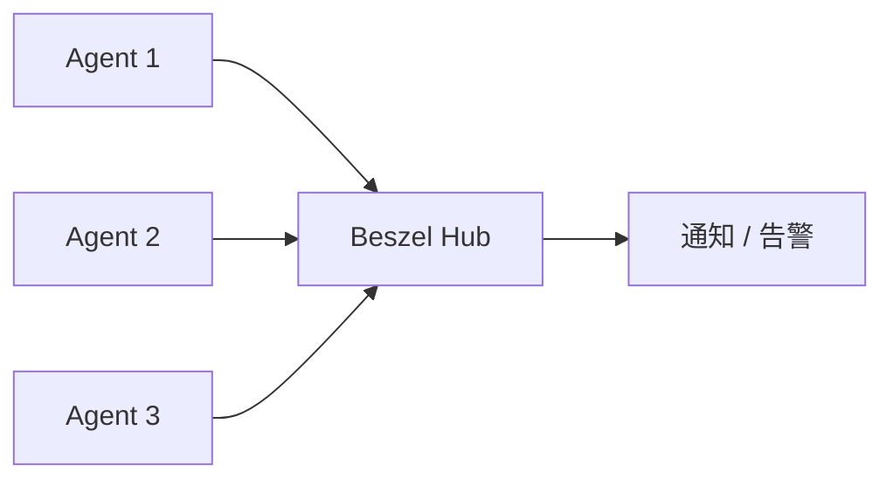

开源仓库：



## Beszel 的两部分结构

Beszel 由两个角色组成：[^beszel-arch]

- `hub`：中心服务，提供 Web 管理界面
- `agent`：部署在被监控主机上，负责上报指标



## 部署中心服务

可以直接用 Docker Compose 部署：

```yaml
services:
  beszel:
    image: henrygd/beszel:0.15.2
    container_name: beszel
    restart: unless-stopped
    volumes:
      - /etc/localtime:/etc/localtime
      - ./beszel/beszel_data:/beszel_data
      - ./beszel/beszel_socket:/beszel_socket
    environment:
      TZ: Asia/Shanghai
    networks:
      - service
    deploy:
      resources:
        limits:
          memory: 256m
          cpus: "0.50"

networks:
  service:
    external: true
```

这套配置比较轻量，适合作为基础部署模板。

## 主动模式和被动模式如何选择

### 主动模式

特点：

- Hub 主动访问客户端
- 适合客户端有固定公网 IP
- 服务器能直接访问客户端 `IP:Port`


### 被动模式

特点：

- 客户端主动把数据送到服务端
- 适合客户端没有固定公网 IP
- 适合客户端处于 NAT 后面


实际选择时可以按下面方式判断：

- **能被直连**：优先主动
- **藏在 NAT 后面**：优先被动

## 被动模式接入步骤

接入顺序可以按下面操作：

1. 打开设置
2. 进入 `指纹与令牌`
3. 开启 `通用令牌`
4. 复制对应部署模式的安装命令

这种设计把接入步骤集中在界面里，部署时更容易对照完成。

## 告警配置

这里可以先明确一个问题：

“我们为什么要监控？只是为了把数据收集起来摆在那儿看吗？”

监控的价值不只是收集数据，还在于指标异常时能够及时通知。

Beszel 支持：

- 邮件
- Webhook

这里以飞书为例。

### 飞书告警配置

1. 在飞书创建机器人
2. 复制 Webhook 最后一段 ID

例如：

```bash
https://open.feishu.cn/open-apis/bot/v2/hook/409963d1-7927-4259-a152-d8590sds8f3a
```

3. 在 Beszel 设置里拼成：

```bash
lark://open.feishu.cn/409963d1-7927-4259-a152-d8590sds8f3a
```

4. 测试发送
5. 再到告警页配置阈值


## 反向代理：可选

如果你想通过域名访问，可以挂 Traefik：

```yaml
labels:
  - "traefik.enable=true"
  - "traefik.docker.network=service"
  - "traefik.http.routers.beszel.rule=Host(`monitor.artoio.com`)"
  - "traefik.http.routers.beszel.entrypoints=websecure"
  - "traefik.http.routers.beszel.tls=true"
  - "traefik.http.routers.beszel.tls.certresolver=letsencrypt"
  - "traefik.http.routers.beszel.service=beszel"
  - "traefik.http.services.beszel.loadbalancer.server.port=8090"
```

## 结语

Beszel 的优势不在于“全家桶式监控大平台”，而在于：

- 部署轻
- 接入快
- 界面直观
- 告警够用

如果你需要的是一套能快速覆盖多台主机、又不想一上来就把监控系统做成一个大型项目的方案，它很值得一试。


[^beszel-arch]: Beszel 官方文档将其核心架构划分为 hub 与 agent 两部分，其中 hub 负责管理界面，agent 负责节点指标采集。

## 参考资料

- [Beszel 官方文档](https://beszel.dev/zh/guide/what-is-beszel)
- [PocketBase 官方文档](https://pocketbase.io/docs/)
- [Beszel GitHub 仓库](https://github.com/henrygd/beszel)
