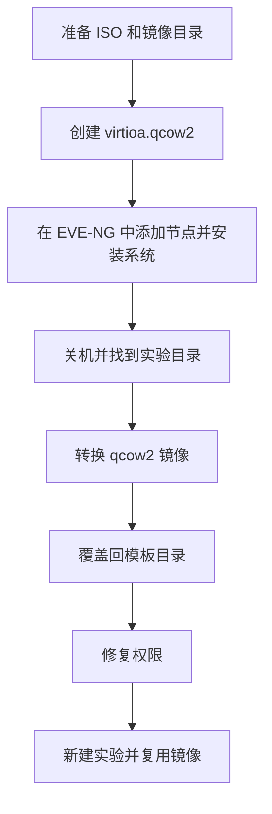

---

## 为什么要自制镜像

`EVE-NG` 很适合做网络与系统联合实验，主要特点包括：

- 不依赖本地客户端
- 浏览器就能管理
- 适合隔离实验环境
- 便于在同一张实验拓扑中同时验证网络与系统配置

不过有一个前提：

你得先把镜像准备好。

如果镜像没有准备好，后续的拓扑、实验和联调都会卡在节点启动这类基础问题上。

## 本文目标

这篇文章用 `Ubuntu 22.04.5` 为例，完整走一遍 EVE-NG 镜像制作流程。  
虽然示例用的是 Ubuntu，但方法对其他发行版也基本通用，比如：

- `Debian`
- `Rocky Linux`
- `CentOS`
- 其他支持 ISO 安装的 Linux 发行版

流程可以概括成这样：



## 准备环境

先准备下面两样东西：

| 说明 | 类型 | 描述 |
| --- | --- | --- |
| `EVE-NG` | 企业版 / 社区版 | 已安装好的 EVE-NG 环境 |
| `ISO` | 安装镜像 | 例如 Ubuntu、Debian、Rocky Linux 等系统 ISO |

可以先这样理解：

- `EVE-NG` 负责跑实验
- `ISO` 负责把系统装进去

## 镜像制作流程

### 第一步：创建镜像目录

先进入 `EVE-NG` 的 QEMU 镜像目录：

```bash
cd /opt/unetlab/addons/qemu
```

然后创建一个符合 EVE-NG 命名规范的目录。以 Ubuntu 22.04.5 为例：

```bash
mkdir linux-ubuntu-22.04.5
```

这里目录名不要随便起。  
在 EVE-NG 里，很多镜像识别逻辑都跟目录命名有关。名字起飞了，后面节点列表里就可能直接查无此镜像。

### 第二步：上传 ISO 并重命名

把安装镜像上传到这个目录里，并重命名为 `cdrom.iso`。

目录内最终大概会长这样：

```bash
root@eve-ng:/opt/unetlab/addons/qemu/linux-ubuntu-22.04.5# ls -ltr
total 5601436
-rw-r--r-- 1 root unl  3598123008 Nov  1 13:27 virtioa.qcow2
-rw-r--r-- 1 root root 2136926208 Nov  3 02:56 cdrom.iso
```

这里的关键点不是 `ls` 看起来多整齐，而是：

- 安装光盘文件名要叫 `cdrom.iso`
- 后续系统盘文件名要叫 `virtioa.qcow2`

这两位属于 EVE-NG 里的“老熟人命名法”。

### 第三步：创建系统磁盘

创建一个空的 `qcow2` 磁盘文件：

```bash
qemu-img create -f qcow2 virtioa.qcow2 50G
```

这块磁盘后面就是你安装系统的目标盘。  
`50G` 只是示例，实验环境按需调整就行，别一上来就给每个节点分配一个“仿佛要跑生产数据库”的容量。

## 安装系统

磁盘和 ISO 都准备好之后，就可以进 `EVE-NG Web UI` 开始装系统了。

### 第一步：创建实验室

浏览器打开 `EVE-NG`，添加一个新的实验室。


### 第二步：添加节点

打开新实验室，添加节点时选择刚才创建的镜像目录名称，然后保存。


### 第三步：启动节点并完成安装

接下来就很像正常装一台 Linux：

1. 启动节点
2. 双击节点打开 console
3. 按照正常引导流程安装系统

安装完成后，建议顺手做一些初始化配置，后面复用起来会更轻松：

1. 开启 `root` SSH 登录
2. 关闭或调整防火墙
3. 根据需要安装常用工具

都配好之后，记得 **正常关机**。  
这一步建议完成后再继续，否则后面转换出的镜像可能会带上未正常落盘的数据。

## 转换为可复用镜像

系统装完，不代表这事结束了。  
在 EVE-NG 里，更实用的做法是把系统整理成可直接复用的模板镜像。

### 第一步：找到实验目录

重新打开实验室，记住实验 `ID`。


然后进入对应节点目录：

```bash
cd /opt/unetlab/tmp/0/{实验ID}/{节点ID}
```

如果一个实验室里有多个节点，要根据实际需求找到正确的 `节点ID` 目录。

### 第二步：转换磁盘镜像

执行转换：

```bash
qemu-img convert -O qcow2 virtioa.qcow2 virtiob.qcow2
```

这一步会把安装过程中使用的系统盘转换成后续可复用的模板镜像。

### 第三步：覆盖回模板目录

先删除原来的空盘镜像：

```bash
rm -rf /opt/unetlab/addons/qemu/linux-ubuntu-22.04.5/virtioa.qcow2
```

再把转换后的镜像拷贝回去：

```bash
cp virtiob.qcow2 /opt/unetlab/addons/qemu/linux-ubuntu-22.04.5/virtioa.qcow2
```

这一步完成后，模板目录里就会变成一个已经安装好系统、可以直接复用的镜像。

### 第四步：修复权限

这一步也建议执行，否则镜像即使处理正确，节点仍然可能无法正常启动。

执行：

```bash
/opt/unetlab/wrappers/unl_wrapper -a fixpermissions
```

如果不做这一步，EVE-NG 有时会用一种很含蓄的方式提醒你：

- 镜像在
- 节点也在
- 但就是不让你好好启动

## 验证镜像是否可用

后面的动作就比较轻松了：

1. 删除原实验室，或者保留作安装过程记录
2. 新建一个实验室
3. 选择刚才做好的镜像
4. 启动节点验证是否正常开机

如果一切顺利，恭喜，你现在已经拥有了一个可重复使用的 Linux 模板镜像。以后再做实验，就不用每次从 ISO 重新安装一遍了。

## 看不到镜像怎么办

有些时候镜像已经放好了，但你在添加节点时还是看不到对应类型。  
这通常不是系统在针对你，而是 **模板定义没有补上**。

可以参考 EVE-NG 的模板目录：

```bash
/opt/unetlab/html/templates/intel
```

如果没有合适的模板，可以复制一个现有模板，再按需求修改。

## 自定义模板示例：iStoreOS

比如 `iStoreOS` 这类镜像，我这里的做法是复制一个 `linux` 模板，然后改两个核心字段：

- `description`
- `name`

示例：

```yml
---
type: qemu
description: iStoreOS
name: iStoreOS
cpulimit: 1
icon: Server-2D-Linux-S.svg
cpu: 1
ram: 1024
ethernet: 1
console: vnc
shutdown: 1
qemu_arch: x86_64
qemu_version: 2.12.0
qemu_nic: virtio-net-pci
qemu_options: -machine type=pc,accel=kvm -vga std -usbdevice tablet -boot order=cd -cpu host
...
```

这类模板的核心作用，是让 EVE-NG 在前端界面里“认识”你的镜像类型。  
不然镜像文件明明在目录里，前端却像完全不认识它，场面会有一点像你带着身份证去办事，窗口说系统里查不到你。

## 实用建议

为了后面省事，做镜像时我建议顺手统一几件事：

1. 目录命名按规范来
2. ISO 文件统一命名为 `cdrom.iso`
3. 系统盘统一命名为 `virtioa.qcow2`
4. 安装完成后再转换，不要半途复制
5. 每次替换镜像后都执行一次 `fixpermissions`

这几条看起来朴素，但每一条都能少踩一个坑。

## 结语

在 `EVE-NG` 里制作镜像，本质上并不神秘。  
你可以把它理解成：先手工装一台系统，再把这台系统“压成模板”，以后所有实验都直接复用它。

整套流程最关键的动作就是：

- 创建规范目录
- 上传 `ISO`
- 创建 `virtioa.qcow2`
- 完成系统安装
- 转换镜像
- 修复权限

只要这几步走顺了，后面不管你是在做 Linux 基础实验、网络联调，还是拿它配合路由器、防火墙、旁路设备一起演练，效率都会高很多。毕竟实验最怕的，不是拓扑复杂，而是你还没开始实验，先在装系统这一步打了三回合。


## 参考资料

- [EVE-NG 官方文档](https://www.eve-ng.net/index.php/documentation/)
- [QEMU 镜像管理文档](https://www.qemu.org/docs/master/tools/qemu-img.html)
