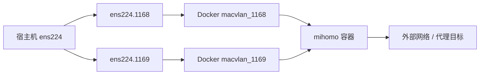

开源仓库：



## 要解决什么问题

本文关注的是一个比较实战的场景：

- Linux 主机上部署 `mihomo`
- 一张 Trunk 网卡承载多个 VLAN
- Docker 通过 `macvlan` 接到不同子网
- 最终让不同网段的主机都能把它当作统一代理出口

## 网络思路

整体结构可以理解成这样：



## 第一步：创建 Linux VLAN 子接口

宿主机上先准备 Trunk 接口，例如 `ens224`。

然后创建两个子接口：

```bash
# ens224.1168
ip link add link ens224 name ens224.1168 type vlan id 1168
ip link set ens224.1168 up
ip -d link show ens224.1168

# ens224.1169
ip link add link ens224 name ens224.1169 type vlan id 1169
ip link set ens224.1169 up
ip -d link show ens224.1169
```

这一步相当于先把不同 VLAN 的门牌号从宿主机侧分出来。

## 第二步：创建 Docker macvlan 网络

分别为两个 VLAN 创建 `macvlan` 网络：

```bash
docker network create -d macvlan --subnet 10.64.68.0/24 --gateway 10.64.68.1 -o parent=ens224.1168 macvlan_1168
docker network create -d macvlan --subnet 10.64.69.0/24 --gateway 10.64.69.1 -o parent=ens224.1169 macvlan_1169
```

这样做的好处是：容器可以像网络里的独立主机一样，直接出现在对应子网中。

## 第三步：编写 Compose 文件

```yaml
services:
  mihomo:
    image: metacubex/mihomo:v1.19.12
    container_name: mihomo
    hostname: mihomo
    restart: unless-stopped
    cap_add:
      - ALL
    security_opt:
      - apparmor=unconfined
    volumes:
      - /etc/timezone:/etc/timezone:ro
      - /etc/localtime:/etc/localtime:ro
      - /dev/net/tun:/dev/net/tun
      - /usr/local/src/mihomo/mihomo:/root/.config/mihomo
    environment:
      - TZ=Asia/Shanghai
    mem_limit: "512m"
    cpus: "0.5"
    networks:
      macvlan_1168:
        ipv4_address: 10.64.68.254
      macvlan_1169:
        ipv4_address: 10.64.69.254

networks:
  macvlan_1168:
    external: true
  macvlan_1169:
    external: true
```

启动：

```bash
docker compose up -d
```

## 配置代理规则

这里有一个常见问题：  
部署完 `mihomo` 后，不是所有网络都能立刻通。很多时候不是容器异常，而是 **代理组没有选好**。

示例配置：

```yaml
proxy-groups:
  - name: 默认
    type: select
    proxies: [自动选择,直连,香港,台湾,日本,新加坡,美国,其它地区,全部节点]

  - name: Google
    type: select
    proxies: [默认,香港,台湾,日本,新加坡,美国,其它地区,全部节点,自动选择,直连]
```

可以直接在 `MetaCube` 面板里调整：


## 连通性验证

可以准备两台测试主机：

- 一台在 `VLAN 1168`
- 一台在 `VLAN 1169`

示例网络配置：

```bash
# 主机1
ip addr add 10.46.68.200/24 dev ens33
ip link set dev ens33 up
ip route add default via 10.46.68.1 dev ens33

# 主机2
ip addr add 10.46.69.200/24 dev ens33
ip link set dev ens33 up
ip route add default via 10.46.69.1 dev ens33
```

测试访问：

```bash
curl -I https://www.baidu.com
curl -I https://github.com
```

如果百度和 GitHub 都能按预期访问，说明从子网到容器再到代理出口这条链路已经通了。

## 策略路由：可选，但值得知道

如果你想更细地控制多网卡容器的出接口，可以参考这套策略路由示例。即使不配置，在不少场景下也能完成基本流量路由：

```bash
VLAN1168_IP="10.64.68.254"
VLAN1168_GW="10.64.68.1"
VLAN1168_DEV="eth1"

VLAN1169_IP="10.64.69.254"
VLAN1169_GW="10.64.69.1"
VLAN1169_DEV="eth0"

ip route del default 2>/dev/null || true

ip rule add from $VLAN1168_IP lookup 100
ip route add default via $VLAN1168_GW dev $VLAN1168_DEV table 100
ip route add 10.64.68.0/24 dev $VLAN1168_DEV scope link table 100

ip rule add from $VLAN1169_IP lookup 200
ip route add default via $VLAN1169_GW dev $VLAN1169_DEV table 200
ip route add 10.64.69.0/24 dev $VLAN1169_DEV scope link table 200

ip route add default via $VLAN1168_GW dev $VLAN1168_DEV
```

## 结语

`mihomo` 部署本身不算难，真正的重点是把：

- VLAN 子接口
- Docker `macvlan`
- 容器 IP
- 代理规则
- 客户端验证

这几层顺起来。

只要网络路径理清楚，后面的体验其实非常丝滑；反过来，如果网络设计没想明白，容器再健康，也很容易变成一个“看起来在线、实际上不干活”的摆设。


## 参考资料

- [mihomo GitHub 仓库](https://github.com/MetaCubeX/mihomo)
- [Docker macvlan 网络文档](https://docs.docker.com/engine/network/drivers/macvlan/)
