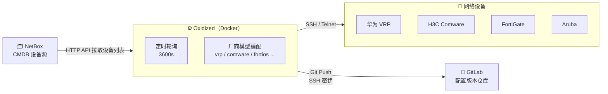

开源仓库：



---

## 为什么用 Oxidized

网络设备配置丢失是运维事故的高频原因之一。手动备份既费时又容易遗漏，而 **Oxidized** 是目前开源生态中最成熟的自动化配置备份方案：

- **多厂商覆盖**：Cisco、华为、H3C、FortiGate、Aruba、锐捷等主流设备开箱即用
- **数据源灵活**：CSV、SQLite、MySQL、HTTP API（NetBox）均支持
- **Git 原生集成**：配置变更自动提交，天然具备版本历史和 diff 能力
- **RESTful API**：可与 CMDB、告警系统进一步联动

---

## 部署架构

整套方案分三层：NetBox 提供设备清单，Oxidized 主动 SSH 采集配置，结果推送到 GitLab 归档。



> **架构要点：** Oxidized 是主动拉取模式，设备不需要做任何改造，只需开放 SSH 访问即可。

---

## 核心配置详解

Oxidized 只有一个主配置文件，但内容较多，下面按模块拆解说明。

### 全局参数

```yaml
# ~/.config/oxidized/config.yml

username: admin
password: admin
model: comware          # 默认厂商模型（无法识别时的兜底）
interval: 3600          # 备份轮询间隔（秒）
threads: 30             # 并发 SSH 线程数
timeout: 60             # 单设备连接超时（秒）
retries: 3              # 失败重试次数
resolve_dns: true
debug: false

vars:
  remove_secret: true   # 自动脱敏：移除 enable secret 等敏感行

pid: "/home/oxidized/.config/oxidized/pid"
rest: 0.0.0.0:8888      # REST API + Web UI 监听地址

extensions:
  oxidized-web:
    load: true
```

### SSH 输入配置

老旧设备往往只支持过时的加密算法，需要显式降级兼容：

```yaml
input:
  default: ssh
  debug: false
  ssh:
    secure: false
    auth_methods:
      - password
    # 兼容老旧设备的算法套件（按需精简）
    kex: diffie-hellman-group1-sha1,diffie-hellman-group14-sha1,diffie-hellman-group-exchange-sha256
    encryption: aes128-cbc,aes256-cbc,3des-cbc
    hmac: hmac-sha1,hmac-sha2-256
  utf8_encoded: true
```

> ⚠️ **安全提示：** `diffie-hellman-group1-sha1` 已被认为不安全，仅对无法升级固件的遗留设备开启，建议在防火墙层面限制 Oxidized 的 SSH 访问来源。

### Git 本地仓库输出

```yaml
output:
  default: git
  clean_obsolete_nodes: true  # 自动清理已下线设备的备份
  git:
    user: Oxidized
    email: it@example.com
    repo: /home/oxidized/.config/oxidized/network.git
    single_repo: true         # 所有设备配置存入同一个 Git 仓库
```

### GitLab 同步 Hook

```yaml
hooks:
  gitlabrepo:
    type: githubrepo          # 注意：GitLab 复用 githubrepo 类型[^oxidized-hook]
    events: [post_store]      # 每次成功备份后触发
    remote_repo: "git@gitlab.example.com:it/network.git"
    privatekey: "/home/oxidized/.ssh/id_rsa"
    publickey: "/home/oxidized/.ssh/id_rsa.pub"
    no_verify_host_key: true
```

### NetBox 数据源

```yaml
source:
  default: http
  http:
    url: https://netbox.example.com/api/dcim/devices/?status=active&tag=oxidized&limit=500
    secure: true
    hosts_location: results
    map:
      name: name
      ip: primary_ip.address
      model: platform.slug    # NetBox platform slug → Oxidized model
      group: platform.slug
    headers:
      Authorization: "Bearer <YOUR_NETBOX_TOKEN>"
```

### 厂商模型映射与分组认证

```yaml
# NetBox platform slug → Oxidized 内置模型名称
model_map:
  huawei: vrp
  h3c: comware
  aruba-aosw: aosw
  aruba-aoscx: aoscx
  fortinet: fortios
  ruijie: rgos

# 按厂商分组配置独立认证（覆盖全局默认值）
groups:
  huawei:
    username: admin
    password: admin
  h3c:
    username: admin
    password: admin
  fortinet:
    username: admin
    password: admin
  ruijie:
    username: admin
    password: admin
  aruba-aosw:
    username: admin
    password: admin
  aruba-aoscx:
    username: admin
    password: admin

# 模型级特殊参数
models:
  fortios:
    vars:
      fullconfig: true          # 拉取完整配置（含子 VDOM）
      fortios_autoupdate: false
  vrp:
    vars:
      remove_secret: true
  comware:
    vars:
      remove_secret: true
```

---

## SSH 密钥配置

Oxidized 通过 SSH 密钥向 GitLab 推送配置，需要提前生成并注册。

```bash
# 在宿主机上操作（挂载到容器的目录内）
mkdir -p /usr/local/src/oxidized/.ssh && cd /usr/local/src/oxidized/.ssh

# 生成 RSA 4096 密钥（PEM 格式，无密码短语）
ssh-keygen -t rsa -b 4096 -m PEM -f id_rsa -C "oxidized@example.com" -N ""

# 预扫描 GitLab 服务器指纹，避免首次连接交互确认
ssh-keyscan -t rsa,ecdsa,ed25519 gitlab.example.com > known_hosts

# 设置权限（容器内 oxidized 用户 UID 为 30000）
chown -R 30000:30000 .
chmod 700 .
chmod 600 id_rsa known_hosts
chmod 644 id_rsa.pub
```

> **下一步：** 将 `id_rsa.pub` 内容添加到 GitLab 项目的 **Settings → Repository → Deploy Keys**，并勾选"允许写入"。

---

## Docker Compose 部署

```yaml
# compose.yml
services:
  oxidized:
    image: oxidized/oxidized:latest
    container_name: oxidized
    restart: unless-stopped
    ports:
      - "8888:8888"             # Web UI + REST API
    environment:
      CONFIG_RELOAD_INTERVAL: 600   # 配置文件热重载间隔（秒）
    volumes:
      - /usr/local/src/oxidized/oxidized:/home/oxidized/.config/oxidized
      - /usr/local/src/oxidized/.ssh:/home/oxidized/.ssh
```

```bash
# 启动服务
docker compose up -d

# 查看实时日志
docker compose logs -f oxidized
```

部署成功后，访问 `http://<your-host>:8888` 即可看到 Web UI，显示每台设备的备份状态和最后成功时间：


---

## 厂商设备适配要点

### FortiGate（FortiOS）

FortiGate 默认启用 SSH 分页（`--More--`），Oxidized 会一直等待 `#` 提示符直到超时，导致只备份到部分配置。

**必须在设备上禁用分页：**

```
config global
  config system console
    set output standard
  end
end
```

### 华为 VRP / H3C Comware

确保设备已启用 SSHv2 服务，并且与配置中的加密算法套件兼容。部分较老的 VRP 版本（V100R005 之前）需要在配置中额外降级 `kex` 算法。

---

## NetBox 集成：设备标签配置

Oxidized 通过 NetBox API 过滤 `tag=oxidized` 的设备，只需在 NetBox 中完成以下配置即可纳管新设备：

1. 进入设备详情页 → **Tags** → 添加标签 `oxidized`
2. 确认设备状态为 **Active**
3. 确认已配置 **Platform**（slug 值用于 `model_map` 映射）
4. 确认已设置 **Primary IP**（Oxidized 通过此 IP 连接设备）

---

## 常见问题排查

| 现象 | 可能原因 | 排查方向 |
|------|----------|----------|
| 连接超时 | SSH 未启用或防火墙拦截 | 从 Oxidized 容器内 `ssh admin@<device-ip>` 验证连通性 |
| 认证失败 | 密码错误或用户权限不足 | 检查 `groups` 配置中的凭据；确认设备用户有 `display` 权限 |
| 配置截断 / 一直等待 | 分页未禁用 | 参考 FortiGate 禁用 `--More--` 的方法 |
| Git 推送失败 | SSH 密钥权限或 Deploy Key 未配置写权限 | 检查文件权限（`600`）；GitLab Deploy Key 是否勾选写入 |
| NetBox 设备未出现 | 标签或状态不匹配 | 确认设备有 `oxidized` 标签且状态为 `Active` |

---

## 总结

**Oxidized 最小化部署清单：**

1. 准备 NetBox 设备标签（`oxidized`）和 API Token
2. 生成 SSH 密钥，添加到 GitLab Deploy Keys（允许写入）
3. 编写 `config.yml`，重点配置 `source`、`hooks`、`groups`、`model_map`
4. `docker compose up -d` 启动，Web UI 确认设备备份状态
5. FortiGate 等分页设备单独禁用 `--More--`

**结论：** Oxidized 通过 NetBox HTTP API 获取设备清单，SSH 登录采集配置后，经 Git Hook 自动推送到 GitLab，实现网络设备配置的版本化管理，全程无需在设备侧做任何代理部署。

---

[^oxidized-hook]: 这是 Oxidized Hook 的历史命名方式，GitLab 推送在配置层仍沿用 `githubrepo` 类型，但 remote 可以指向 GitLab。

## 参考资料

- [Oxidized GitHub 主仓库](https://github.com/ytti/oxidized)
- [Oxidized Web UI](https://github.com/ytti/oxidized-web)
- [支持的设备型号完整列表](https://github.com/ytti/oxidized/blob/master/docs/Supported-OS-Types.md)
- [NetBox HTTP Source 配置文档](https://github.com/ytti/oxidized/blob/master/docs/Configuration.md#http-source)
- [NetBox 官方文档](https://netbox.readthedocs.io/en/stable/)
