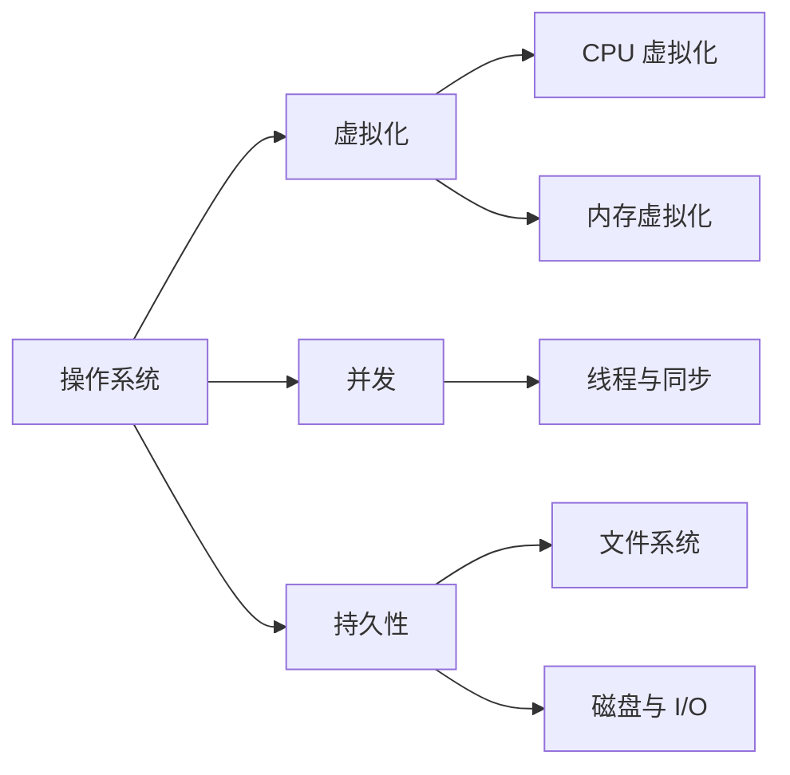

这是一组按《操作系统导论》拆出来的学习文章。它不是逐章摘要，而是把书里的主线重新整理成更适合连续阅读和复习的结构。

第一篇先不急着进入进程、线程、页表和文件系统。先把一个更大的问题放在前面：

**操作系统到底在解决什么问题？**

如果这个问题没有想清楚，后面的概念会很容易散掉。`进程`、`地址空间`、`锁`、`inode`、`日志` 看起来像一堆独立知识点，但它们其实都在回答同一类问题：如何把复杂、不可靠、有限的硬件，整理成程序员可以使用的稳定抽象。

## 这组文章怎么定位

这组文章更像一份学习路线，而不是原书摘要。

原书的好处是细节足、例子多、节奏完整；这组文章的目标，是先把每个主题背后的设计问题拎出来，让后续回到原书时不迷路。

可以按下面这张表来读：

| 阶段 | 文章 | 先抓的问题 |
| --- | --- | --- |
| 全局地图 | 1 | 操作系统为什么要存在 |
| CPU 虚拟化 | 2-4 | 多个程序如何共享 CPU |
| 内存虚拟化 | 5-6 | 每个程序为什么像拥有自己的内存 |
| 并发 | 7-9 | 多个执行流共享状态时如何保持正确 |
| 持久性 | 10-11 | 数据如何安全、高效地留在磁盘上 |
| 分布式 | 12 | 跨机器共享文件时会多出哪些问题 |

读的时候不需要急着记住所有名词。每一部分先抓住“它在解决什么问题”，再回头看机制和细节。

## 三条主线

《操作系统导论》的结构很清楚，基本可以拆成三条线：

1. **虚拟化**：让有限的硬件资源看起来更好用。
2. **并发**：让多个执行流同时推进时仍然得到正确结果。
3. **持久性**：让数据在进程结束、机器重启甚至系统崩溃后仍然存在。

这三条线分别对应 CPU、内存、线程、磁盘和文件系统等主题。

## 操作系统是资源抽象器

硬件本身并不好直接使用。

CPU 只是执行指令的处理器，内存只是可读写的字节数组，磁盘只是块设备。直接面对这些东西写程序，既困难，也危险。

操作系统先做了一件事：提供抽象。

- 把正在运行的程序抽象成 `进程`
- 把进程看到的内存抽象成 `地址空间`
- 把磁盘上的块抽象成 `文件` 和 `目录`
- 把设备差异抽象到 `驱动程序` 后面

抽象的意义不是遮住细节，而是让上层程序可以在一个更稳定的模型上工作。

## 操作系统是资源管理器

只提供抽象还不够。多个程序同时运行时，资源会发生竞争。

例如：

- 多个进程都 ready 时，CPU 给谁？
- 物理内存不够时，哪些页留在内存，哪些页换出？
- 多个线程都要修改共享变量时，谁先进入临界区？
- 文件系统要写多个磁盘结构时，如何安排顺序才能崩溃后可恢复？

这些问题不是“能不能做”，而是“该怎么做”。所以操作系统内部有大量策略。

学习操作系统时，一个很好用的区分是：

| 问题 | 对应概念 |
| --- | --- |
| 如何做到某件事 | 机制 |
| 选择谁、何时、怎样取舍 | 策略 |

上下文切换是机制，调度算法是策略。页表提供地址转换机制，页替换算法是策略。日志提供崩溃恢复机制，何时落盘、如何分组写入则是策略。

## 操作系统是保护边界

如果用户程序可以随意访问物理内存、随意操作磁盘、随意发设备命令，系统很快就会变得不可用。

所以操作系统还必须建立边界：

- 普通程序运行在用户模式
- 内核运行在内核模式
- 敏感操作通过系统调用进入内核
- 内存访问要经过地址转换和权限检查
- 文件访问要经过权限模型和文件系统接口

保护不是额外功能，而是操作系统能同时运行多个程序的前提。

## 一条贯穿全书的判断方式

后面看到任何机制，都可以用同一个模板检查：

1. 它藏住了哪部分硬件复杂度？
2. 它保护了谁不被谁影响？
3. 它提升了什么，又引入了什么成本？

比如进程隐藏了 CPU 数量有限这件事，但引入了上下文切换和调度问题。虚拟内存隐藏了物理内存布局，但引入了地址转换和页表问题。文件系统隐藏了磁盘块细节，但引入了缓存、崩溃一致性和布局策略问题。

这就是操作系统学习里最有用的线索：每一个好抽象背后，都有一组额外的维护成本。

## 本系列怎么读

后面的文章会按主题继续拆：

- 先看进程和 CPU 调度，理解“多个程序同时运行”的假象。
- 再看地址空间、分页、TLB 和换页，理解“每个程序都有自己内存”的假象。
- 然后进入线程、锁、条件变量、信号量，理解并发程序为什么容易错。
- 最后看 I/O、磁盘、文件系统和分布式文件访问，理解数据如何被可靠保存和共享。

每篇文章都会尽量回答三个问题：

1. 这个抽象解决了什么问题？
2. 操作系统靠什么机制实现它？
3. 这里的核心取舍是什么？

## 复盘问题

读完这一篇，可以先确认自己能回答这几个问题：

1. 为什么操作系统既像虚拟机，又像资源管理器？
2. 为什么“抽象”不是单纯隐藏细节？
3. 为什么保护机制和易用性通常要一起设计？
4. 如果没有操作系统，普通程序直接面对 CPU、内存和磁盘，会遇到哪些麻烦？

## 小结

操作系统不是一堆 API 和术语的集合。它更像一组持续出现的设计问题：

- 如何让有限资源看起来更多？
- 如何让共享资源使用起来安全？
- 如何在性能、可靠性、公平性和复杂度之间取舍？

抓住这三个问题，再回头看进程、页表、锁和文件系统，很多概念会自然连起来。
