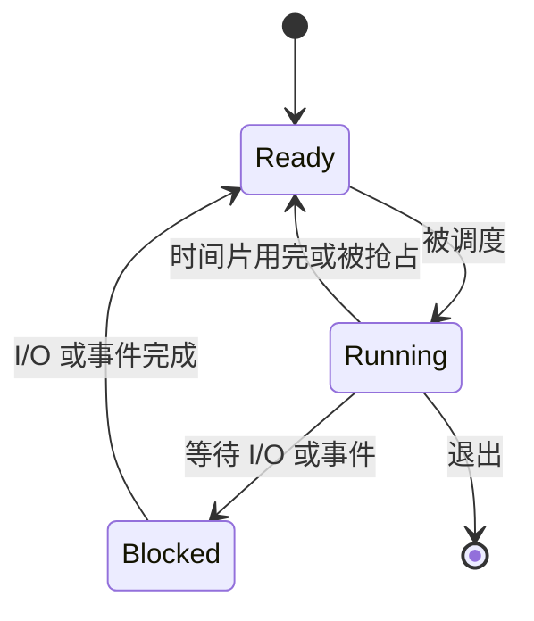

本篇对应原书第 4 章和第 6 章。

第一篇把操作系统的主线定下来：虚拟化、并发、持久性。现在进入第一条主线，也就是 CPU 虚拟化。

CPU 虚拟化最先要回答的问题是：

**机器上明明只有有限数量的 CPU，为什么系统里可以同时有那么多程序在运行？**

操作系统给出的核心抽象就是 `进程`。

## 先抓住一个问题

进程最容易被误解成“程序的 ID”或者“任务管理器里的一行”。这太表面了。

进程真正解决的问题是：**如何让一个正在运行的程序拥有一套可暂停、可恢复、可保护的执行环境。**

有了这个视角，进程里的很多字段就不再零散。寄存器是为了恢复执行位置，地址空间是为了隔离内存，打开文件表是为了记录 I/O 上下文，进程状态是为了让调度器知道它现在能不能运行。

## 程序和进程不是一回事

程序是磁盘上的文件。它包含代码、静态数据和可执行格式信息，但它自己不会动。

进程是运行中的程序。操作系统把程序加载进内存，准备好栈、堆、文件描述符等运行环境，再把 CPU 控制权交给它，程序才真正开始执行。

所以可以这样理解：

| 概念 | 含义 |
| --- | --- |
| 程序 | 静态文件 |
| 进程 | 程序的一次运行 |
| 线程 | 进程内部的一条执行流 |

同一个程序可以启动多次，形成多个进程。它们执行相同代码，但拥有各自的运行状态。

一个简单例子是你在两个终端里分别运行同一个命令。磁盘上的可执行文件只有一份，但系统里会出现两个进程。它们的代码来自同一个程序文件，但 PID、寄存器、栈、堆、打开文件和调度状态都可以不同。

## 进程包含哪些状态

进程不是只有一段代码。操作系统要想暂停它、恢复它，就必须知道它当前运行到了哪里。

一个进程至少包含这些状态：

- 地址空间：代码、数据、堆、栈。
- 寄存器：通用寄存器、程序计数器、栈指针。
- 打开的文件和 I/O 状态。
- 操作系统维护的进程元数据，例如 PID、父子关系、状态、调度信息。

这也是上下文切换的基础。暂停一个进程时，操作系统要保存这些状态；恢复它时，再把这些状态装回 CPU 和内核数据结构里。

## 进程的三种基本状态

进程运行时，通常在几种状态之间切换：

最重要的是这三个状态：

| 状态 | 含义 |
| --- | --- |
| running | 正在 CPU 上执行 |
| ready | 可以运行，但暂时没拿到 CPU |
| blocked | 正在等待 I/O 或其他事件，暂时不能运行 |

这个模型解释了为什么 I/O 操作不会一直占着 CPU。一个进程发起磁盘读取后会阻塞，操作系统可以趁这段时间运行另一个 ready 进程。

## 时分共享制造多个 CPU 的假象

CPU 虚拟化的基本技巧是 `时分共享`。

操作系统让一个进程运行一小段时间，再切到另一个进程。只要切换足够快，用户就会感觉很多程序在同时运行。

这里有两个层次：

- 机制：怎样暂停当前进程，保存状态，再恢复另一个进程。
- 策略：下一次应该运行哪个进程。

上下文切换属于机制。调度算法属于策略。把这两件事分开，是理解操作系统的关键习惯。

## 受限直接执行

如果每条用户程序指令都由操作系统解释执行，系统会慢得不可接受。现代操作系统采用的是 `受限直接执行`。

大多数时候，用户程序直接在 CPU 上运行。只有发生系统调用、异常、中断或时间片到期时，控制权才回到内核。

这背后有一个取舍：

- 直接执行带来性能。
- 受限执行带来保护。

硬件通过用户模式、内核模式、陷阱指令和时钟中断帮助操作系统维持这个边界。

这里最重要的不是“用户模式”和“内核模式”这两个名词，而是控制权的来回切换：

| 场景 | 控制权在哪里 | 为什么 |
| --- | --- | --- |
| 普通计算 | 用户程序 | 避免每条指令都进内核，保证性能 |
| 系统调用 | 内核 | 访问文件、设备、进程管理等受保护资源 |
| 异常 | 内核 | 处理非法访问、除零、页错误等情况 |
| 时钟中断 | 内核 | 让调度器重新获得决策机会 |

操作系统不是一直盯着用户程序执行，而是在关键边界重新介入。

## 为什么时钟中断重要

如果用户程序不主动交还 CPU，操作系统仍然必须能重新获得控制权。否则一个死循环就可以占住整个系统。

时钟中断提供了这个能力。硬件定期打断当前执行，进入内核，操作系统就有机会决定：

- 继续运行当前进程
- 切换到另一个进程
- 处理等待中的事件

没有时钟中断，抢占式调度很难成立。

## 常见误解

**误解一：进程切换只是换一个 PID。**

真正切换的是执行上下文。CPU 寄存器、程序计数器、栈位置、地址空间相关寄存器都要切到另一个进程对应的状态。

**误解二：进程 blocked 就是变慢了。**

blocked 不是慢，而是暂时没有继续运行的条件。比如等待磁盘 I/O 时，把 CPU 让给其他 ready 进程，反而提高系统利用率。

**误解三：用户程序主动调用系统调用，操作系统才有机会运行。**

时钟中断和异常也会让内核获得控制权。否则恶意或错误程序可以一直不交还 CPU。

## 复盘问题

1. 如果要恢复一个被暂停的进程，至少需要保存哪些状态？
2. running、ready、blocked 三种状态分别对应什么条件？
3. 为什么受限直接执行比解释执行更适合真实操作系统？
4. 时钟中断在 CPU 虚拟化里扮演什么角色？

## 小结

进程是 CPU 虚拟化的核心抽象。它让程序以为自己独占 CPU，而操作系统实际上在多个进程之间快速切换。

理解进程时，不要只记 PID 和状态名。更重要的是理解三件事：

1. 进程是程序运行时的完整状态。
2. 上下文切换让多个进程共享 CPU。
3. 受限直接执行让性能和保护同时成立。
