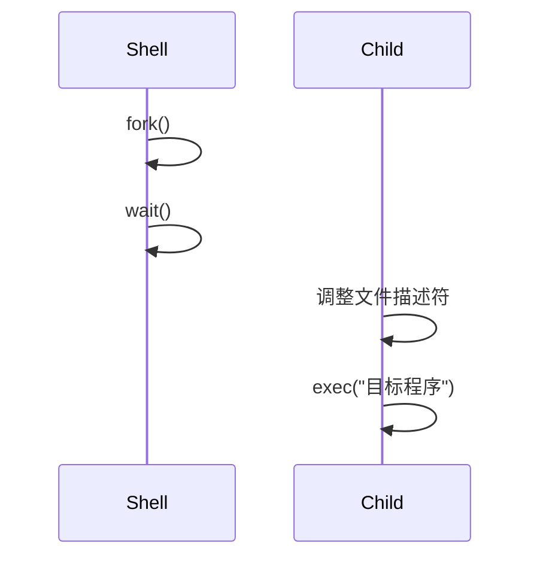

本篇对应原书第 5 章。

理解了进程模型之后，下一步是看操作系统给用户程序提供了哪些进程接口。

UNIX 的进程 API 很有代表性，核心是三个调用：

- `fork()`
- `exec()`
- `wait()`

这三个接口看起来有点奇怪，尤其是 `fork()`。但它们组合起来，刚好解释了 shell、重定向、管道这些常见能力为什么可以被做得很简洁。

## 先看 shell 的工作

在终端里输入一条命令时，shell 自己也是一个普通用户进程。它不会“凭空”让程序运行，而是调用操作系统提供的进程 API。

典型流程是：

1. shell 读到用户输入。
2. shell 调用 `fork()` 创建子进程。
3. 子进程在必要时调整文件描述符。
4. 子进程调用 `exec()` 变成目标程序。
5. 父进程调用 `wait()` 等待前台命令结束。

所以这一篇不是在记三个系统调用，而是在理解 shell 为什么能成为程序组合器。

## fork：复制当前进程

`fork()` 用来创建子进程。它的特殊之处在于，调用后父子进程都会从 `fork()` 返回。

区别在返回值：

- 父进程得到子进程的 PID。
- 子进程得到 0。
- 如果创建失败，返回负数。

这让同一份代码可以在 `fork()` 之后分成两条路径。

```c
int rc = fork();
if (rc == 0) {
    // child
} else {
    // parent
}
```

这不是普通函数调用的直觉。普通函数调用只有一个调用者继续执行，而 `fork()` 会让两个进程从同一个位置继续执行。

## fork 后谁先运行

`fork()` 之后，父进程和子进程谁先运行是不确定的。这取决于调度器。

因此，如果父子进程都打印内容，你不应该依赖某个固定顺序。这个不确定性是操作系统调度带来的自然结果，也是后面并发问题的提前预告。

只要执行顺序会影响结果，就需要显式同步。

这个不确定性也解释了为什么示例程序的输出顺序不能作为程序逻辑的一部分。只要没有 `wait()` 或其他同步手段，父子进程谁先打印都合理。

## wait：等待子进程结束

`wait()` 让父进程等待子进程结束。

没有 `wait()` 时，父子进程的输出顺序可能变化。有了 `wait()`，父进程可以明确地等子进程先完成，再继续执行。

所以 `wait()` 不只是“回收子进程资源”。它还建立了一种执行顺序。

这点很重要。很多系统 API 的价值不只是完成动作，还在于让程序能表达顺序、依赖和边界。

## exec：替换当前进程

`exec()` 不创建新进程。它会把当前进程的程序内容替换成另一个可执行文件。

调用成功后，原来的代码不会继续执行。因为当前进程已经变成了另一个程序。

这个设计常和 `fork()` 配合：



shell 先 `fork()` 出子进程，然后让子进程在 `exec()` 前做准备。准备完成后，子进程再替换成用户真正要运行的命令。

## 为什么 fork 和 exec 要拆开

如果只有一个“创建进程并运行新程序”的接口，shell 就很难在新程序启动前修改环境。

拆成 `fork()` 和 `exec()` 后，中间多了一个窗口：

1. 子进程刚从父进程复制出来。
2. 子进程还没有运行目标程序。
3. shell 可以在子进程中关闭、打开、替换文件描述符。
4. 然后再执行 `exec()`。

这就是重定向和管道能自然实现的原因。

## 重定向的本质

例如：

```bash
wc file.txt > out.txt
```

shell 可以在子进程中先关闭标准输出，再打开 `out.txt`。由于 UNIX 会使用最小可用文件描述符，新打开的文件会占据标准输出的位置。随后 `exec()` 运行 `wc`，`wc` 并不知道发生了什么，只是正常向标准输出写数据，而数据实际进入了文件。

这个设计很漂亮，因为目标程序不需要为重定向写特殊逻辑。

可以把它理解成：shell 不是告诉 `wc` “请你写到文件里”，而是在 `wc` 启动前，把它眼里的标准输出换成了文件。

这也是 UNIX 接口设计里很有代表性的一点。通用机制放在操作系统和 shell 里，普通程序只按标准输入输出工作，就能参与更大的组合。

## 管道的本质

管道也是类似思路。

shell 创建一个内核管道，让前一个进程的标准输出连接到管道写端，让后一个进程的标准输入连接到管道读端。之后两个程序各自正常读写标准输入输出即可。

这就是 UNIX 小程序能组合成复杂工作流的基础。

## 这组接口的设计取舍

`fork()` 的代价并不小。复制进程听起来很重，现代系统通常会用写时复制等机制降低成本。但从接口表达能力看，`fork()` 和 `exec()` 分离非常强。

它把“创建一个可修改的执行环境”和“运行目标程序”拆开了。

| 设计 | 好处 | 代价 |
| --- | --- | --- |
| `fork()` + `exec()` 分离 | shell 可以在中间设置重定向、管道、环境变量 | 接口理解成本高，实现需要优化 |
| 合并成 spawn 类接口 | 语义直接，可能更高效 | 中间定制窗口较弱或需要更多参数 |

这类取舍在操作系统里很常见：接口简单并不一定等于语义简单，接口奇怪也不一定是坏设计。

## 复盘问题

1. 为什么 `fork()` 后父子进程会从同一个位置继续执行？
2. `wait()` 除了回收子进程信息，还改变了什么执行关系？
3. 为什么 `exec()` 成功后不会回到原来的代码？
4. shell 实现输出重定向时，为什么目标程序通常不需要配合？

## 小结

`fork()`、`exec()`、`wait()` 的设计价值不在于单个接口多强，而在于它们的组合能力。

- `fork()` 创建一个可定制的执行分支。
- `exec()` 把这个分支替换成目标程序。
- `wait()` 让父进程和子进程重新建立顺序。

理解这组接口，也就理解了 UNIX shell 很多能力的底层形状。
