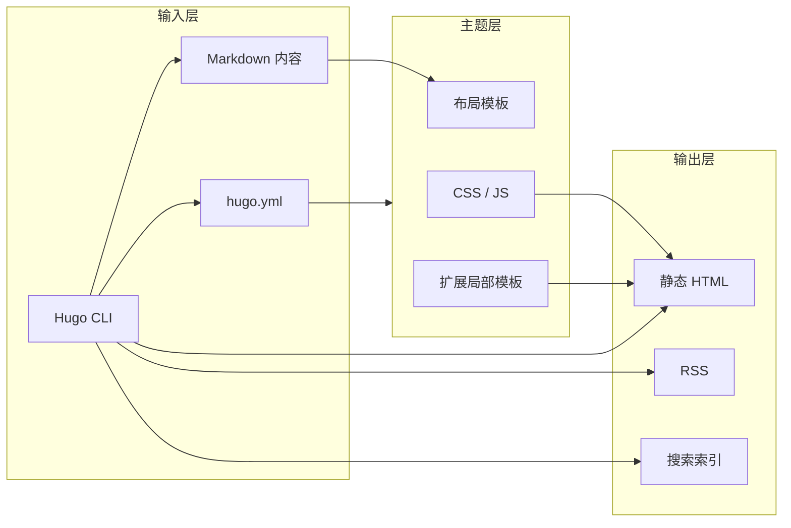

如果你想搭一个维护成本低、发布速度快、内容结构清晰的个人站点，`Hugo + PaperMod` 依然是非常稳妥的组合。它的价值不在于“功能最多”，而在于你可以很快把写作、发布、归档和搜索这几件事同时跑起来。

本文按“先跑通，再细化”的顺序整理一套入门流程，适合第一次接触 Hugo 的读者直接照着搭建。

项目地址：

- [PaperMod GitHub 仓库](https://github.com/adityatelange/hugo-PaperMod)

## 核心结论

- `Hugo` 负责把 Markdown 内容编译成静态页面。
- `PaperMod` 提供一套成熟的博客主题、搜索页和文章元信息展示能力。
- 对个人博客而言，最重要的不是先把主题改得多花，而是先把内容生产、预览和部署流程跑顺。

## 先理解这套组合在做什么



可以把它理解为三层：

- 内容层：你维护 Markdown 文章和站点配置。
- 主题层：PaperMod 负责文章页、列表页、目录、导航和样式。
- 输出层：Hugo 统一生成可部署的静态文件。

理解这一点以后，后面的配置就不会显得零散。

## 环境准备

### 为什么要装 Hugo Extended

PaperMod 依赖 Hugo Extended 处理 SCSS 资源[^papermod-extended]。如果安装的是普通版本，站点不一定会直接报错，但样式链路通常会不完整，后续排查也很浪费时间。

### 安装 Hugo

```bash
# macOS
brew install hugo

# Ubuntu / Debian
sudo apt install hugo

# 检查版本
hugo version
```

如果输出里没有 `extended` 字样，再安装 Extended 版本：

```bash
# macOS
brew install hugo-extended
```

建议同时确认两件事：

- Hugo 版本尽量不要过旧。
- 团队内或多台设备最好统一版本，避免本地和部署环境构建结果不一致。

## 从零创建站点

### Step 1：初始化项目目录

```bash
hugo new site marisme.com
cd marisme.com
git init
```

执行完后，你会得到一个 Hugo 站点骨架。此时能看到目录，但还没有主题，也没有真正可用的页面结构。

### Step 2：安装 PaperMod 主题

最常见的三种方式如下。

#### 方式一：Git Submodule

适合希望跟踪主题版本、后续继续更新的人，通常也是更稳妥的方式。

```bash
git submodule add --depth=1 https://github.com/adityatelange/hugo-PaperMod.git themes/PaperMod
git submodule update --init --recursive
```

#### 方式二：直接 Clone

适合先验证效果、快速试跑的场景。

```bash
git clone https://github.com/adityatelange/hugo-PaperMod.git themes/PaperMod --depth=1
```

#### 方式三：Hugo Module

适合已经在用 Go 模块化工作流，或者想让主题依赖管理更规范的场景。

```bash
hugo mod init github.com/airsmon/marisme.com
```

如果你只是第一次搭站，建议优先用 `Git Submodule`，简单且后续可维护性更好。

## 最小可用配置

### Step 3：先写一份能工作的 `hugo.yml`

下面这份配置不追求“全部功能都打开”，而是优先覆盖个人博客最常见的需要：基础 SEO、目录、搜索、导航和文章元信息。

```yaml
baseURL: "https://marisme.com/"
title: "Marisme - 技术笔记与知识管理"
theme: "PaperMod"
paginate: 5

enableRobotsTXT: true
buildDrafts: false
buildFuture: false
buildExpired: false

minify:
  disableXML: true
  minifyOutput: true

params:
  env: production
  description: "Marisme - 技术笔记、知识管理与实践分享"
  keywords: [Hugo, PaperMod, 博客, 技术笔记, 知识管理, marisme]
  author: "airsmon"
  defaultTheme: auto
  disableThemeToggle: false

  ShowReadingTime: true
  ShowPostNavLinks: true
  ShowBreadCrumbs: true
  ShowCodeCopyButtons: true
  ShowWordCount: true
  ShowRssButtonInSectionTermList: true
  UseHugoToc: true
  comments: false
  hidemeta: false
  showtoc: true
  tocopen: false

  homeInfoParams:
    Title: "欢迎来到 Marisme"
    Content: "技术笔记、知识管理与实践分享"

  socialIcons:
    - name: github
      url: "https://github.com/airsmon"
    - name: rss
      url: "/index.xml"

  fuseOpts:
    isCaseSensitive: false
    shouldSort: true
    location: 0
    distance: 1000
    threshold: 0.4
    minMatchCharLength: 0
    keys: ["title", "permalink", "summary", "content"]

menu:
  main:
    - identifier: categories
      name: 分类
      url: /categories/
      weight: 10
    - identifier: tags
      name: 标签
      url: /tags/
      weight: 20
    - identifier: search
      name: 搜索
      url: /search/
      weight: 30
    - identifier: archives
      name: 归档
      url: /archives/
      weight: 40

outputs:
  home:
    - HTML
    - RSS
    - JSON

rss:
  fullContent: true
```

这份配置的重点是：

- `theme: "PaperMod"` 让主题真正生效。
- `outputs.home` 里保留 `JSON`，为搜索功能提供索引。
- `menu.main` 先把分类、标签、搜索和归档这些高频入口补齐。

如果你后面想继续做 Mermaid、页脚扩展和代码高亮增强，可以在现有基础上逐步加，不需要一开始全部堆进去。

## 创建第一篇文章并验证链路

### Step 4：生成首篇内容

```bash
hugo new articles/my-first-article.zh-cn.md
```

然后编辑 `content/articles/my-first-article.zh-cn.md`：

```markdown
---
title: "我的第一篇文章"
date: 2026-04-21
tags: ["测试"]
categories: ["随笔"]
summary: "这是我的第一篇博客文章"
cover:
  image: "https://example.com/cover.jpg"
---

## 首篇文章

这是文章内容，支持标准 Markdown 语法。

- 列表项 1
- 列表项 2

```bash
echo "Hello Hugo + PaperMod!"
```
```

这一步的目的不是写出一篇完整文章，而是验证三件事：

- front matter 能否正确解析；
- Markdown 与代码块是否能正常渲染；
- 列表页和文章页是否都能顺利生成。

### Step 5：本地预览

```bash
hugo server -D
```

默认访问地址是 `http://localhost:1313`。其中：

- `-D` 表示把草稿也一起渲染出来；
- 在局域网调试时，可以再加 `--bind 0.0.0.0`。

如果这一步能顺利打开，你的本地站点就已经具备继续写内容的基础了。

### Step 6：构建静态文件

```bash
hugo --minify
```

执行后会生成 `public/` 目录。后续无论是部署到 GitHub Pages、Vercel、Cloudflare Pages，还是同步到自己的服务器，最终交付的基本都是这里面的静态文件。

## 这时建议顺手补齐的三个能力

### 1. 搜索页

```bash
hugo new search.zh-cn.md
```

`content/search.zh-cn.md` 可以先写成这样：

```markdown
---
title: "搜索"
layout: "search"
summary: "搜索"
placeholder: "搜索文章..."
---
```

### 2. 文章目录与上一篇下一篇

如果你希望长文更好读，建议在站点参数里保留：

```yaml
params:
  showPostNavLinks: true
  showBreadCrumbs: true
  showtoc: true
```

这三个能力对技术文章特别有帮助，能明显改善系列内容的可导航性。

### 3. 封面图和摘要

虽然不是必须，但建议在文章 front matter 中逐步统一这些字段：

```yaml
---
title: "文章标题"
summary: "用于列表页和 SEO 的摘要"
cover:
  image: "images/cover.jpg"
  alt: "封面描述"
  caption: "图片说明"
  relative: false
---
```

统一元信息以后，站点列表页、分享卡片和搜索结果的整体体验会稳定很多。

## 推荐的目录结构

```text
marisme.com/
├── hugo.yml
├── content/
│   ├── articles/
│   ├── search.zh-cn.md
│   └── archives.zh-cn.md
├── layouts/
│   └── partials/
├── static/
│   └── images/
├── themes/
│   └── PaperMod/
└── public/
```

这个结构的关键不是“好看”，而是方便你区分：

- 内容写在 `content/`
- 覆盖主题的模板写在 `layouts/`
- 图片等静态资源放在 `static/`
- 构建产物统一输出到 `public/`

## 常见误区

- 一开始就大量改主题源码，后续升级会很痛。
- 本地能跑就以为部署也能跑，结果 Hugo 版本不一致。
- 配置项一次性堆太多，最后自己也说不清哪一项在生效。

更稳妥的节奏是：先让站点上线，再逐步优化搜索、图表、代码高亮和视觉细节。

## 下一步建议

如果你已经把站点在本地跑起来，下一篇最值得看的就是部署选型。不同托管方式决定了你后面的维护成本、自动发布流程和访问体验。

可以继续阅读：

- [Hugo【PaperMod】部署方案：GitHub Pages、Vercel、Cloudflare 与自托管对比](/articles/ops/papermod/series%2002/)

[^papermod-extended]: PaperMod 依赖 Hugo Extended 处理 SCSS / SASS 资源；如果安装的是普通版 Hugo，部分样式链路会失效。

## 参考资料

- [Hugo 官方文档](https://gohugo.io/documentation/)
- [PaperMod 官方文档](https://adityatelange.github.io/hugo-PaperMod/)
- [PaperMod GitHub 仓库](https://github.com/adityatelange/hugo-PaperMod)
- [Hugo 主题库](https://themes.gohugo.io/)
