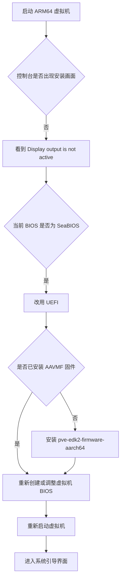

---

## 问题现象

在国产 ARM 服务器或者 `aarch64` 平台上部署 `Proxmox VE` 后，创建虚拟机并启动，结果控制台里不是安装界面，而是一句很冷酷的话：

```text
Display output is not active
```

这时候的虚拟机状态很有迷惑性：

- 看起来已经启动
- 资源也在占用
- 控制台却像在跟你玩“薛定谔的显示输出”

如果这是第一次碰到，很容易怀疑：

- ISO 镜像是不是坏了？
- 显卡配置是不是有问题？
- Proxmox 是不是今天心情不好？

但这类场景里，问题通常不在 ISO，而在 **ARM64 虚拟机的固件与引导方式**。


## 我的环境

这次出问题的环境大致如下：

- 虚拟化平台：`Proxmox VE 8.x`
- CPU 架构：`aarch64 / ARM64`
- 虚拟机初始配置：
  - BIOS：`SeaBIOS`
  - SCSI 控制器：`VirtIO SCSI`
  - 网卡：`virtio`

如果你也是在 ARM 平台上用默认配置一路点点点创建虚拟机，那么踩中这个坑的概率并不低。默认配置在 x86 世界里很常见，但到了 ARM64，这套组合有时候就会变成“理论上能开机，实际上不给你画面”。

## 原因分析

简单理解就是一句话：

`SeaBIOS` 在这里不一定是合适的引导方式，而 ARM64 虚拟机往往更依赖 `UEFI` 固件来完成正常启动。

可以把它理解成：

- 你请了客人来家里吃饭
- 门牌号写对了
- 电梯也正常
- 但单元门禁系统根本不是给这位客人准备的

于是客人并没有真正走到你家门口，只是你以为他已经上楼了。

下面这个流程图，可以快速说明问题落点：



## 处理思路

修复这类问题，不需要十八般武艺，核心就两步：

1. 确认 ARM64 的 UEFI 固件是否存在
2. 将虚拟机引导方式改为 `UEFI`

## 步骤一：检查 UEFI 固件是否已经安装

先看看 Proxmox 主机上有没有 ARM64 对应的固件文件：

```bash
ls -l /usr/share/pve-edk2-firmware
```

如果你看到 ARM64 相关的 `AAVMF` 文件，说明固件大概率已经在了。  
如果没有，别急，这不是世界末日，只是包还没装。

## 步骤二：安装 ARM64 UEFI 固件

在 Proxmox 宿主机执行：

```bash
apt update
apt install pve-edk2-firmware-aarch64
```

安装完成后，再检查一次：

```bash
ls -l /usr/share/pve-edk2-firmware
```

这一步的目的很明确：让 `Proxmox` 拥有 ARM64 虚拟机所需的 `AAVMF` 固件。没有它，后面的 `UEFI` 配置就像给空房子配门牌，看着挺完整，实际上没人住。


## 步骤三：创建虚拟机时改用 UEFI

重点来了。

在创建虚拟机或者修改已有虚拟机配置时，将 BIOS 从默认的 `SeaBIOS` 改为 `UEFI`。  
如果界面里还有 EFI Disk 相关选项，也建议一并按默认推荐方式配置好。

建议关注这些参数：

- BIOS：`OVMF (UEFI)` 或对应的 `UEFI`
- 磁盘控制器：保持 `VirtIO SCSI` 一般没问题
- 网卡：`virtio`


改完之后，再启动虚拟机，通常就能正常进入系统引导或安装界面。

## 排查清单

如果你不想每次都从怀疑人生开始，可以按这个顺序检查：

1. 确认宿主机架构是不是 `ARM64`
2. 确认虚拟机 BIOS 不是 `SeaBIOS`
3. 确认 `pve-edk2-firmware-aarch64` 已安装
4. 确认虚拟机使用了可启动的 ISO
5. 重新开机验证控制台是否恢复

如果前 3 项都没问题，基本就已经绕开最常见的坑了。

## 补充说明

在 `Proxmox VE 8.x` 里，ARM64 虚拟化支持本身就不是最“傻瓜式”的那一档，因此一些在 x86 平台上默认成立的经验，到了 ARM64 不一定还能直接套用。

尤其需要注意下面这一点：

- 虚拟机能启动
- 不代表图形输出链路就一定正常

也就是说，虚拟机已经启动，并不代表图形输出链路已经恢复正常。

## 结语

`Display output is not active` 这个报错看起来像显示问题，实际往往是 **ARM64 虚拟机固件与引导方式不匹配**。

真正有效的修复思路通常是：

- 安装 `pve-edk2-firmware-aarch64`
- 将虚拟机 BIOS 改为 `UEFI`

如果你正在 Proxmox 上折腾 ARM64 虚拟化，这个坑大概率早晚会来敲门。好消息是，它虽然吓人，但不算难修；坏消息是，它非常擅长让人先白忙半小时。


## 参考资料

- [Proxmox VE 官方文档](https://pve.proxmox.com/pve-docs/)
- [Proxmox VE Wiki](https://pve.proxmox.com/wiki/Main_Page)
- [UEFI 启动相关说明](https://pve.proxmox.com/wiki/OVMF/UEFI_Boot_Entries)
