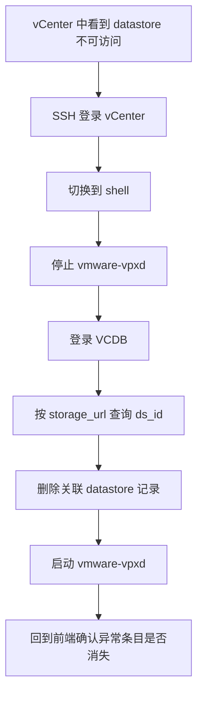

---

## 问题现象

在 `vCenter` 里查看数据存储时，某个 datastore 状态显示为 `不可访问`，同时还会伴随一个很让人头大的特征：

- 前端能看到这个存储
- 但无法正常删除
- 即使底层物理磁盘已经掉盘，或者你已经重新创建了新存储，旧条目依然赖着不走

这类问题最烦的地方在于，它不像“彻底消失”，而是以一种半死不活的状态一直挂在那儿，特别像系统在说：

“我知道它不对，但我先保留意见。”


## 我的环境

这次碰到问题的环境包括：

- `VMware vSphere 6.7.x`
- `VMware vSphere ESXi 7.0.x`
- `VMware vSphere ESXi 6.5`
- `VMware vSphere ESXi 7.0.0`

这说明它不是某个少见小版本的个别现象，在常见版本里都有可能遇到。

## 根因分析

如果底层磁盘已经异常、存储也已经变更，但 `vCenter` 里还是保留着一个删不掉的 datastore 记录，那么一个很常见的原因是：

`VCDB` 里对应数据存储的 `UUID` 条目重复，或者旧条目已经残留。

也就是说，问题不一定还在存储层本身，而是 **vCenter 数据库中的元数据没有清理干净**。

可以把它理解成：

- 仓库已经拆了
- 新仓库也建好了
- 但系统台账里还留着旧仓库编号

于是前端界面每次看到这条记录，都会努力装作它还“有点存在感”。

## 处理思路

这一类问题的核心处理路径很直接：

1. 登录 `vCenter`
2. 停掉 `vpxd`
3. 进入 `VCDB`
4. 查出异常 datastore 对应的 `ds_id`
5. 删除关联表中的残留记录
6. 启动 `vpxd`

流程图如下：



## 操作步骤

下面这套步骤建议在明确业务窗口、做好快照或备份评估后再执行。毕竟我们接下来碰的是 `vCenter` 的数据库，不是“点错了还能撤销”的那种按钮。

### 步骤一：通过 SSH 登录 vCenter

先通过 SSH 连接到 `vCenter Server`。

登录后如果还在受限命令环境，输入：

```bash
shell
```

把它切到 `Bash` 环境。


### 步骤二：停止 `vpxd` 服务

在修改数据库前，先停止 `vpxd`：

```bash
service-control --stop vmware-vpxd
```

这样做是为了避免服务在运行期间继续读写相关数据，影响后续清理结果。

### 步骤三：登录 Postgres 数据库

执行：

```bash
/opt/vmware/vpostgres/current/bin/psql -d VCDB -U postgres
```

这一步会进入 `vCenter` 使用的 `VCDB` 数据库。

### 步骤四：查询异常数据存储的 `ds_id`

根据对应存储的 `storage_url` 查询记录：

```sql
select * from vpx_datastore where storage_url='ds:///vmfs/volumes/66715cf0-b2d0a56f-adad-3c7c3ff0efca/';
```

这里的重点是 **确认 `storage_url` 必须对应到你真正要处理的异常存储**。

通常你需要从存储摘要或 datastore 信息里拿到这个 `storage_url`，然后查出对应的 `ds_id`。

### 步骤五：删除残留条目

确认 `ds_id` 后，删除相关记录：

```sql
delete from vpx_ds_assignment where ds_id=461;
delete from vpx_vm_ds_space where ds_id=461;
delete from vpx_datastore where id=461;
delete from vpx_entity where id=461;
```

这里一定要格外小心：

- 先确认 `ds_id` 没查错
- 再确认 `storage_url` 没对错对象
- 不要因为手感顺了，就把生产环境当练习环境

如果删错条目，后续麻烦通常会比“不可访问”四个字更有教育意义。

### 步骤六：启动 `vpxd` 服务

清理完成后，重新启动服务：

```bash
service-control --start vmware-vpxd
```

然后回到 `vCenter` 前端刷新确认，异常 datastore 条目通常就会消失，或者至少不再维持那种“又坏又删不掉”的尴尬状态。

## 实用排查建议

如果你后面还会遇到类似问题，可以先按这个顺序判断：

1. 底层磁盘或 LUN 是否已经发生变化
2. 前端 datastore 是否显示不可访问且无法删除
3. `storage_url` 是否能唯一定位到异常条目
4. `VCDB` 中是否存在对应残留记录
5. 是否已经在停掉 `vpxd` 的前提下处理

如果前端删不掉、底层又已经确认变化完成，那么数据库残留这个方向就很值得优先排查。

## 风险提示

这类方案本质上属于 **数据库层清理**，适合用于处理已经确认的异常残留条目，不适合在信息不充分时直接“先删了再说”。

建议至少做到这几件事：

- 记录原始 `storage_url`
- 记录查出来的 `ds_id`
- 确认目标 datastore 确实是异常残留
- 在维护窗口内执行

一句不夸张的话：  
你面对的是 `vCenter` 的数据库，不是浏览器缓存。

## 结语

`vCenter` 数据存储显示 `不可访问` 且无法删除，很多时候不是前端界面抽风，也不完全是底层存储还没收尾，而是 **VCDB 中残留了重复或失效的 datastore UUID / 条目**。

处理这类问题的关键动作就是：

- 停止 `vmware-vpxd`
- 查询异常 datastore 的 `ds_id`
- 清理相关表记录
- 重启 `vmware-vpxd`

这类故障容易让人先把注意力放在界面操作上，但问题根源往往是数据库里的旧记录没有清理干净。


## 参考资料

- [VMware vSphere 文档](https://docs.vmware.com/en/VMware-vSphere/index.html)
- [PostgreSQL 官方文档](https://www.postgresql.org/docs/)
