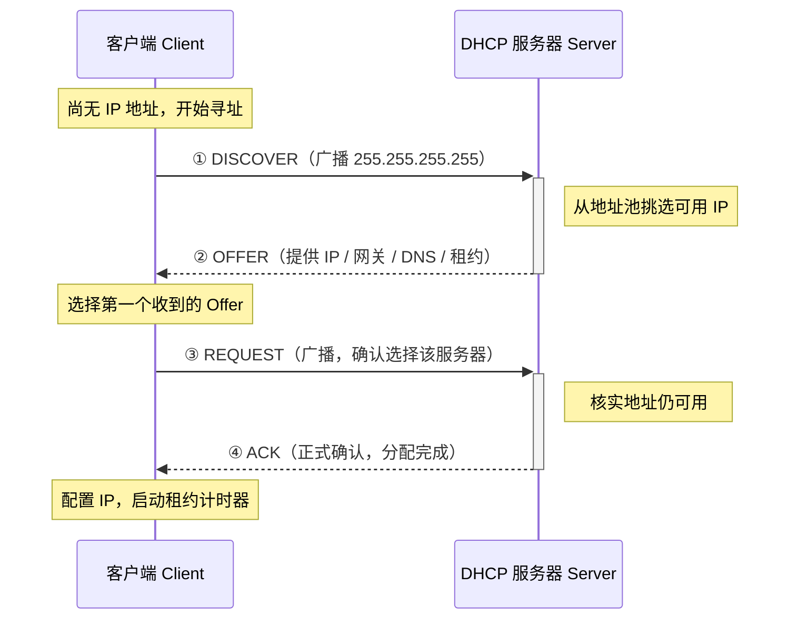

`DHCP` 全称是 `Dynamic Host Configuration Protocol`，中文一般叫“动态主机配置协议”。名字听起来很像一位中年网络管理员，但它干的事其实非常接地气：自动给终端分配 IP 地址、子网掩码、默认网关、DNS 服务器，顺手再告诉你“租期多久，别住太久”。

如果没有 DHCP，办公室里每来一台新电脑、手机、打印机、摄像头，网管都要手动填 IP。那画面并不叫运维自动化，那叫《局域网手抄本》。

按照 [RFC 2131](https://datatracker.ietf.org/doc/html/rfc2131) 和 [Wikipedia DHCP](https://en.wikipedia.org/wiki/Dynamic_Host_Configuration_Protocol) 的描述，DHCP 是建立在 UDP 之上的应用层协议，典型端口如下：[^dhcp-rfc]

- 服务器监听 `UDP 67`
- 客户端监听 `UDP 68`

它最经典的工作流程，就是大家常说的 `DORA` 四步：

- `Discover`
- `Offer`
- `Request`
- `ACK`



## DHCP 到底解决了什么问题

DHCP 的核心价值不是“分配一个 IP”这么简单，而是把一整套主机初始化参数自动发下去。

常见下发内容包括：

- IP 地址
- 子网掩码
- 默认网关
- DNS 服务器
- 租约时间
- 域名后缀
- NTP、PXE、TFTP 等扩展选项

这也是为什么很多人第一次接触 DHCP 时会觉得它像个“网络新员工入职系统”。

新设备刚接入网络时，往往什么都没有：

- 不知道自己是谁
- 不知道网关是谁
- 不知道 DNS 在哪
- 甚至连“我该用哪个网段”都不知道

这时候 DHCP 服务器就像行政同事，递给它一张表：

“工位在这，门卡在这，打印机在那，DNS 别填错，租期先给你八小时。”

## DHCP 报文交互过程

最常见的 DHCPv4 申请流程如下：

### 1. DHCPDISCOVER

客户端刚上线时，没有 IP 地址，因此通常会以广播方式发送 `DHCPDISCOVER`，目标地址常见是 `255.255.255.255`，用于寻找网络中的 DHCP 服务器。

这个阶段的关键词很朴素：

“有人吗？谁能给我一个能上网的身份？”

### 2. DHCPOFFER

DHCP 服务器收到请求后，会从地址池中挑一个可用地址，并返回 `DHCPOFFER`，告诉客户端：

- 我准备给你哪个 IP
- 子网掩码是什么
- 网关是谁
- DNS 是谁
- 租约多久

如果网络里不止一台 DHCP 服务器，客户端甚至可能会同时收到多个 `Offer`。这就有点像校招现场，多个公司都发了意向书，但你最后只能签一家。

### 3. DHCPREQUEST

客户端从多个 `Offer` 中选择一个，然后发送 `DHCPREQUEST`，广播告诉全网：

- 我决定接受哪台服务器的配置
- 其他服务器先别激动

### 4. DHCPACK

最终，目标 DHCP 服务器返回 `DHCPACK`，正式确认租约，客户端据此完成网络配置并开始使用这个 IP。

如果服务器发现地址不可用、策略不匹配，或者请求非法，也可能返回 `DHCPNAK`。这类报文的潜台词通常是：

“不行，这个地址不是你的，重新来。”

## DHCP 常见报文类型

除了最出名的 `DORA` 四件套，DHCP 里还有一些很常见的报文类型：

| 报文类型 | 作用 | 常见场景 |
| --- | --- | --- |
| `DHCPDISCOVER` | 客户端寻找 DHCP 服务器 | 设备首次接入网络 |
| `DHCPOFFER` | 服务器提供候选配置 | 地址池中选出可用 IP |
| `DHCPREQUEST` | 客户端请求使用某个配置 | 选择某台服务器提供的租约 |
| `DHCPACK` | 服务器确认租约生效 | 客户端正式拿到配置 |
| `DHCPNAK` | 服务器拒绝请求 | 地址失效、策略错误、租约不匹配 |
| `DHCPDECLINE` | 客户端声明该地址不可用 | 客户端检测到地址冲突 |
| `DHCPRELEASE` | 客户端主动释放地址 | 主机关机、网络服务退出 |
| `DHCPINFORM` | 客户端仅请求附加配置 | 客户端已有静态 IP，只想拿 DNS/域名等参数 |

## DHCP 报文结构

很多教材提 DHCP 时，只画四步握手，不讲报文本体。结果读者最后记住了流程，却不知道抓包时该看什么。这种感觉就像知道快递会到，但不知道箱子长什么样。

DHCPv4 报文继承自 BOOTP 格式，常见字段如下：

| 字段 | 含义 | 说明 |
| --- | --- | --- |
| `op` | 报文类型 | `1` 表示请求，`2` 表示应答 |
| `htype` | 硬件类型 | 以太网里常见为 `1` |
| `hlen` | 硬件地址长度 | MAC 地址通常是 `6` |
| `hops` | 中继跳数 | Relay Agent 场景会用到 |
| `xid` | 事务 ID | 客户端与服务器用来匹配一次会话 |
| `secs` | 已经过秒数 | 客户端发起请求后的时间 |
| `flags` | 标志位 | 常见是广播标志 |
| `ciaddr` | Client IP Address | 客户端当前 IP，续租时常见 |
| `yiaddr` | Your IP Address | 服务器准备分配给客户端的 IP |
| `siaddr` | Server IP Address | 服务器地址或下一跳服务器地址 |
| `giaddr` | Gateway IP Address | DHCP Relay 地址 |
| `chaddr` | Client Hardware Address | 客户端 MAC 地址 |
| `sname` | Server Host Name | 可选服务器名 |
| `file` | Boot File Name | PXE/网络启动场景常见 |
| `options` | DHCP 选项区 | 真正放网关、DNS、租期、消息类型等信息 |

### 一个简化版 DHCP 报文示意

```text
+--------------------------------------------------+
| op | htype | hlen | hops                         |
+--------------------------------------------------+
| xid (Transaction ID)                             |
+--------------------------------------------------+
| secs                    | flags                  |
+--------------------------------------------------+
| ciaddr                                            |
+--------------------------------------------------+
| yiaddr                                            |
+--------------------------------------------------+
| siaddr                                            |
+--------------------------------------------------+
| giaddr                                            |
+--------------------------------------------------+
| chaddr (Client MAC)                               |
+--------------------------------------------------+
| sname                                             |
+--------------------------------------------------+
| file                                              |
+--------------------------------------------------+
| options (message type / gateway / dns / lease...) |
+--------------------------------------------------+
```

## 抓包时最值得看的 DHCP 选项

真正让 DHCP “有灵魂”的，不是固定报文头，而是 `options`。

在实际排障里，最常见也最值得关注的选项有：

| 选项号 | 名称 | 用途 |
| --- | --- | --- |
| `1` | Subnet Mask | 下发子网掩码 |
| `3` | Router | 下发默认网关 |
| `6` | Domain Name Server | 下发 DNS 服务器 |
| `15` | Domain Name | 下发域名后缀 |
| `28` | Broadcast Address | 广播地址 |
| `51` | IP Address Lease Time | 租约时间 |
| `53` | DHCP Message Type | 指示 Discover / Offer / Request / ACK 等类型 |
| `54` | Server Identifier | 标识具体 DHCP 服务器 |
| `58` | Renewal Time Value (T1) | 续租时间 |
| `59` | Rebinding Time Value (T2) | 重新绑定时间 |

如果你在 `Wireshark` 里只想快速判断 DHCP 是否正常，优先看三件事：

1. 有没有收到 `Offer`
2. `Option 53` 的消息类型对不对
3. `Option 3`、`6`、`51` 是否符合预期

很多网络问题表面上像“IP 拿到了”，实际上是：

- 网关错了
- DNS 错了
- 租约离谱地短

这时候 DHCP 就不是“没工作”，而是“工作了，但没完全往正确方向工作”。

## 开源 DHCP 软件举例

说到 DHCP 服务，实验环境、企业内网、路由器设备里最常见的几类实现，通常绕不开这些名字：

- `ISC dhcpd`
- `dnsmasq`
- `Kea DHCP`

它们不是谁绝对更强，而是谁更适合你的场景。

### 常见开源实现对比

| 软件 | 定位 | 优点 | 局限 | 适合场景 |
| --- | --- | --- | --- | --- |
| `ISC dhcpd` | 经典 DHCP 服务器 | 历史悠久、文档多、很多老系统熟悉它 | 老牌但偏传统，项目生命周期已进入迁移阶段 | 教学实验、传统服务器环境、维护旧系统 |
| `dnsmasq` | 轻量级 DNS + DHCP 一体化服务 | 体积小、配置简单、常见于路由器和小型网络 | 大规模复杂场景下功能和管理能力有限 | 家庭网络、小型办公室、实验室、虚拟化宿主机 |
| `Kea DHCP` | ISC 新一代 DHCP 方案 | 模块化更强、现代化、API/扩展性更好 | 学习和部署复杂度高于 `dnsmasq` | 中大型网络、云环境、自动化平台 |

### 再看一眼：`dhcpd` 和 `dnsmasq` 怎么选

| 维度 | `ISC dhcpd` | `dnsmasq` |
| --- | --- | --- |
| 上手难度 | 中等 | 低 |
| 配置风格 | 传统、偏“服务器味” | 简洁、偏“工具味” |
| 功能覆盖 | 经典 DHCP 能力完整 | 对小型网络足够好用 |
| DNS 集成 | 需要配合其他服务 | 自带 DNS 缓存能力 |
| 资源占用 | 相对更重 | 更轻量 |
| 常见部署位置 | Linux 服务器、老牌网络环境 | 家用路由器、边缘设备、小型主机 |

可以很粗暴地理解为：

- `dhcpd` 像一位资深老工程师，经验足，但文档和配置里自带年代感。
- `dnsmasq` 像一把瑞士军刀，小巧顺手，开箱就能解决很多小网络问题。

## 企业和实验环境里的典型用法

### 小型网络

如果你只是：

- 一个实验室网段
- 一台开发宿主机
- 一组虚拟机
- 一个小办公室

那 `dnsmasq` 往往是很舒服的选择。配置少、启动快、连 DNS 缓存都一起带上了，不用一上来就摆出“我要管理一个省级运营商”的姿势。

### 传统数据中心或教学环境

如果你维护的是：

- 老旧服务器网络
- 教学实验环境
- 既有系统里已经大量使用 `dhcpd`

那继续使用 `ISC dhcpd` 也完全合理。很多时候，稳定运行多年的配置，比“最新架构图”更有说服力。

### 中大型或平台化环境

如果你追求：

- 更强的扩展能力
- 更现代的接口
- 更适合自动化和平台治理的架构

那通常会进一步考虑 `Kea DHCP` 这类更现代的实现。

## DHCP 的常见排障点

实际网络里，DHCP 故障经常并不是“服务器没开”，而是一些更隐蔽的问题：

1. 地址池耗尽，服务器已经无 IP 可分。
2. VLAN 或中继配置错误，广播根本到不了 DHCP 服务器。
3. 网络中存在“野生 DHCP 服务器”，客户端拿到了错误配置。
4. 租约时间不合理，导致频繁续租。
5. 网关、DNS、PXE 选项配置错误，客户端虽然拿到 IP，但业务仍然不通。

所以判断 DHCP 是否正常，不要只看“客户端有没有地址”，还要看：

- 地址是不是正确网段
- 网关是不是预期值
- DNS 是否可用
- 租约行为是否合理

[^dhcp-rfc]: RFC 2131 定义了 DHCP 的基本工作流程与端口角色；维基与厂商文档则更适合作为补充阅读。

## 参考资料

本文整理时主要参考以下资料：

1. [RFC 2131: Dynamic Host Configuration Protocol](https://datatracker.ietf.org/doc/html/rfc2131)
2. [Wikipedia: Dynamic Host Configuration Protocol](https://en.wikipedia.org/wiki/Dynamic_Host_Configuration_Protocol)
3. [ISC DHCP 4.4 Manual Pages - dhcpd](https://kb.isc.org/docs/isc-dhcp-44-manual-pages-dhcpd)
4. [dnsmasq Documentation](https://dnsmasq.org/doc.html)

如果你后面准备继续写这一组协议文章，我会很建议把下一篇接在：

- DHCP Relay
- DHCP Snooping
- DHCP Option 82
- PXE 与 DHCP 联动

因为到这里为止，DHCP 还是“看上去很简单”；真正开始有网络工程味道，通常是从中继、选项和安全控制开始的。
