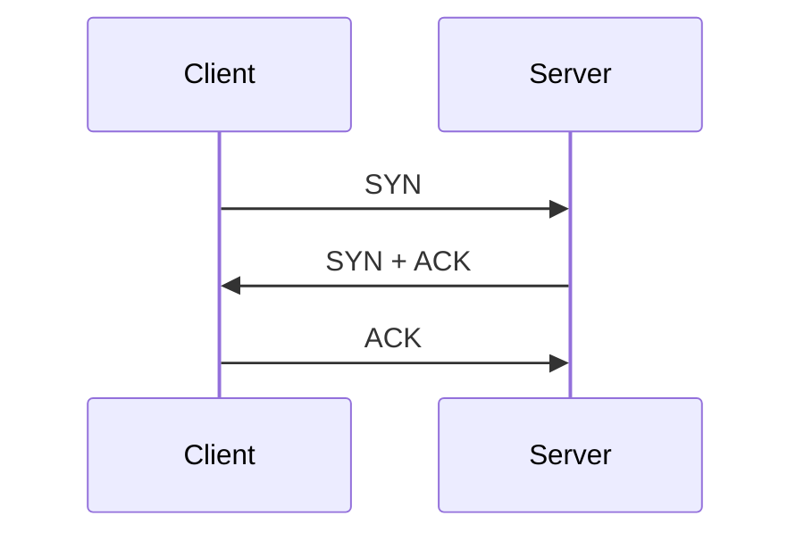

## 三次握手到底在握什么

TCP 建立连接时通常经历三步：

1. 客户端发 `SYN`
2. 服务端回 `SYN, ACK`
3. 客户端再回 `ACK`



## 第一阶段：客户端发送 SYN

这一包的关键是：

- `Src: 192.168.1.12`
- `Dst: 192.168.1.10`
- `Src Port: 47284`
- `Dst Port: 80`
- `Flags: SYN`

抓包里最值得看的部分：

```json
Transmission Control Protocol, Src Port: 47284, Dst Port: 80, Seq: 0, Len: 0
Flags: 0x002 (SYN)
Window: 64240
Options: (20 bytes), Maximum segment size, SACK permitted, Timestamps, No-Operation (NOP), Window scale
```

这一包表示：

“你好，我想跟你建立 TCP 连接。  
这是我的初始序列号，顺便告诉你我支持哪些 TCP 选项。”

注意这里还没传业务数据，`Len: 0` 很正常。它的目标不是传内容，而是先敲门。

## 第二阶段：服务端返回 SYN, ACK

服务端看到请求后，会回一个 `SYN + ACK`：

```json
Transmission Control Protocol, Src Port: 80, Dst Port: 47284, Seq: 0, Ack: 1, Len: 0
Flags: 0x012 (SYN, ACK)
Window: 65160
```

这一步的意思是：

- `SYN`：我也愿意建立连接
- `ACK`：我已经收到你刚才那一个 SYN 了

这一步表示：

“门我听见了，你的信息我也收到了。  
这是我的起始序列号，现在轮到你确认一下我这边也没问题。”

## 第三阶段：客户端发送 ACK

最后客户端再回一个 `ACK`：

```json
Transmission Control Protocol, Src Port: 47284, Dst Port: 80, Seq: 1, Ack: 1, Len: 0
Flags: 0x010 (ACK)
Window: 502
```

这一步代表：

“好的，我确认收到你的响应。连接可以正式建立了。”

握手完成后，双方就能进入数据传输阶段。

## 为什么必须三次握手

最核心的原因是：双方都要确认彼此的收发能力正常。

如果只有两次：

- 客户端确认自己能发
- 服务端确认自己能收

但客户端并不能百分百确认服务端的发送能力，也无法确认自己对服务端响应的接收是否正常。

第三次 `ACK` 的存在，就是把这件事补齐。

## 抓包时应该先看哪些字段

如果你刚开始看 `Wireshark`，别一头扎进整屏字段里游泳。  
先抓住这几个：

- 源 IP / 目标 IP
- 源端口 / 目标端口
- `Seq`
- `Ack`
- `Flags`
- `Window`
- `Options`

其中最关键的是 `Flags`：

- `SYN`：发起连接
- `SYN, ACK`：响应建立连接请求
- `ACK`：确认收到

看到这三步，基本就能判断一次 TCP 建连是否正常。

## 结语

TCP 三次握手看起来像“先来回客套三句”，但它本质上是在正式通信前确认双方的状态、序列号和协商参数。

很多网络问题在业务层看起来像“应用突然不通”，往下抓一层才会发现，问题甚至连握手都没完整走完。  
所以学会读懂 `SYN`、`SYN-ACK`、`ACK`，就像给自己配了一把排障起手式的小扳手。


## 参考资料

- [RFC 793 - TCP](https://datatracker.ietf.org/doc/html/rfc793)
- [Wireshark TCP 分析指南](https://www.wireshark.org/docs/wsug_html_chunked/ChAdvTCPAnalysis.html)
