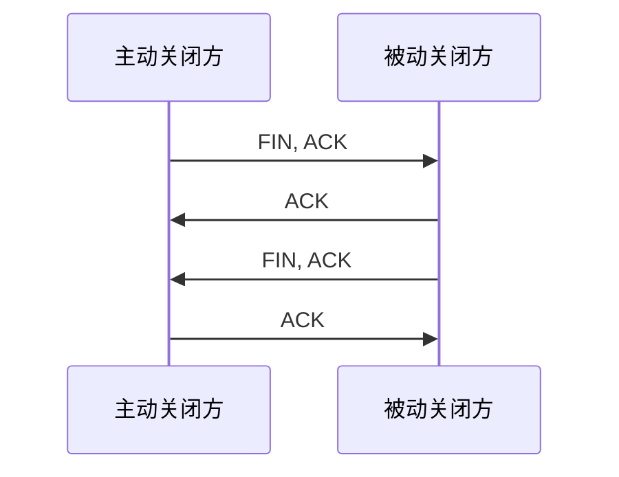

## 四次挥手的标准流程



跟三次握手不一样，关闭连接时经常会拆成四步，因为：

- 一方先表示“我这边不再发送数据了”
- 另一方先确认收到
- 等另一方也准备好关闭时，再单独发自己的 `FIN`

## 第一步：主动关闭方发送 FIN, ACK

抓包示例：

```json
Transmission Control Protocol, Src Port: 80, Dst Port: 49706, Seq: 1, Ack: 2, Len: 0
Flags: 0x011 (FIN, ACK)
```

这一步的含义是：

“我这边已经没有更多数据要发了，准备关闭发送方向。”

注意它并不一定意味着整条连接瞬间消失，只是先表明自己要收摊了。

## 第二步：对端返回 ACK

抓包示例：

```json
Transmission Control Protocol, Src Port: 49706, Dst Port: 80, Seq: 2, Ack: 2, Len: 0
Flags: 0x010 (ACK)
```

这一包表示：

“我知道你要关闭了，这件事我收到了。”

这里很多人容易误解成“连接已经彻底断开”，其实还没有。  
这一步只是确认对端收到了你的关闭请求。

## 第三步：对端再发送自己的 FIN, ACK

抓包示例：

```json
Transmission Control Protocol, Src Port: 80, Dst Port: 49705, Seq: 306, Ack: 455, Len: 0
Flags: 0x011 (FIN, ACK)
```

这一包代表对端也处理完自己的事情，正式告诉你：

“现在轮到我也不发了，我这边也准备关。”

也就是说，TCP 是全双工的。[^tcp-halfclose]  
你不发了，不等于我立刻也不发；我可能还要把手头最后一点内容传完，再优雅下班。

## 第四步：最终 ACK

抓包示例：

```json
Transmission Control Protocol, Src Port: 49705, Dst Port: 80, Seq: 455, Ack: 307, Len: 0
Flags: 0x010 (ACK)
```

这个包的作用很纯粹：

“收到，你也可以关了。”

到这里，一次标准的 TCP 连接关闭流程才算完整结束。

## 为什么通常是四次挥手

因为 TCP 是双向独立的。

连接建立时，双方通常可以在一个包里同时完成“确认”和“发起”动作，所以会压缩成三次。  
但连接关闭时，一方收到 `FIN` 后，未必能立刻关闭自己的发送通道，它可能还需要：

- 把剩余数据发完
- 完成应用层处理
- 再发送自己的 `FIN`

于是关闭动作通常要拆成四步。

## 抓包排障怎么快速判断

如果你看到：

- `FIN, ACK`
- `ACK`
- `FIN, ACK`
- `ACK`

基本就能判断这是一次比较标准的挥手流程。

如果挥手卡住，常见现象包括：

- 只有一侧发 `FIN`，另一侧长时间不回
- 一直停在 `FIN_WAIT`
- 应用层已经退出，但连接迟迟不释放

这类问题往往就不只是协议课本题了，而是应用、内核状态、网络链路一起上场的综合题。

## 结语

TCP 四次挥手的本质，是把“我不发了”和“我知道你不发了”分别确认清楚。  
它看起来比三次握手更麻烦，但这份麻烦换来的是连接关闭过程的清晰与可靠。

网络协议很多时候像职场沟通：  
开会前互相打招呼要三句，散会时礼貌确认一下，往往还得再多说一句。


[^tcp-halfclose]: 连接关闭时常见的“四次挥手”本质上依赖 TCP 的双向独立关闭能力，一侧停止发送并不意味着另一侧也立刻结束发送。

## 参考资料

- [RFC 793 - TCP](https://datatracker.ietf.org/doc/html/rfc793)
- [RFC 9293 - TCP Updated Specification](https://datatracker.ietf.org/doc/html/rfc9293)
- [Wireshark TCP 分析指南](https://www.wireshark.org/docs/wsug_html_chunked/ChAdvTCPAnalysis.html)
