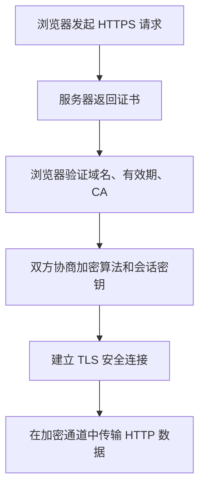

上一篇讲的是“域名怎么把人带到网站”。  
这一篇往前再走一步，聊聊网站传输安全里最容易混在一起的几个词：`HTTP`、`HTTPS`、`SSL`、`TLS`。

这几个概念很多人都听过，但一放到一起就容易乱。真要把“网站为什么需要 HTTPS”和“证书到底在干什么”说清楚，我觉得按下面这个顺序最顺：

1. `HTTP` 和 `HTTPS` 分别是什么
2. `HTTPS` 里的 `S` 到底指什么
3. `SSL` 和 `TLS` 是什么关系
4. 它们到底解决了哪些真实安全问题

先记一句最核心的话：

**HTTP 负责传输网页内容，HTTPS 负责更安全地传输网页内容。**

## HTTP 和 HTTPS 是什么

`HTTP` 全称是 `HyperText Transfer Protocol`，中文通常叫“超文本传输协议”。  
浏览器打开网页、加载图片、提交表单、请求接口，这些动作背后很多都在走 HTTP。

问题也出在这里。

**它默认是明文传输。**

也就是说，浏览器和服务器之间传的数据，如果没有额外保护，中间链路理论上是能看到的，也可能被改，甚至被人冒充。

而 `HTTPS` 可以理解为：

**HTTP + TLS 安全层**

它不是把 HTTP 推翻重来，而是在 HTTP 外面再包一层安全机制。

## HTTP 和 HTTPS 有什么区别

直接看表会更直观：

| 对比项 | HTTP | HTTPS |
| --- | --- | --- |
| 全称 | HyperText Transfer Protocol | HyperText Transfer Protocol Secure |
| 默认端口 | `80` | `443` |
| 传输方式 | 明文传输 | 加密传输 |
| 是否校验服务器身份 | 通常不校验 | 通过证书校验 |
| 数据是否易被窃听 | 风险较高 | 风险显著降低 |
| 数据是否易被篡改 | 风险较高 | 可进行完整性校验 |
| 浏览器提示 | 可能标记为“不安全” | 通常显示安全连接标识 |
| 典型适用场景 | 内部测试、低风险临时环境 | 正式网站、登录、支付、后台、API |

如果只抓重点，可以记三件事：

- `HTTP` 主要解决“能传”
- `HTTPS` 进一步解决“安全地传”
- `HTTPS` 的安全能力主要来自后面的 `SSL/TLS`

## HTTPS 中的 S 是什么

`HTTPS` 末尾这个 `S`，一般就理解成 `Secure`，也就是“更安全”。  
但它不是贴了个安全标签就算完事，背后靠的是一整套机制，核心就是 `SSL/TLS`。

换句话说：

**HTTPS 之所以比 HTTP 更安全，不是因为名字里多了一个 S，而是因为通信过程引入了 SSL/TLS。**

这套机制主要做三件事：

- 加密：让第三方即使截获数据，也难以直接读懂内容
- 身份认证：让浏览器确认正在通信的对象是不是目标网站
- 完整性校验：让数据在传输过程中不容易被悄悄篡改

### HTTPS 里会用到哪些加密算法

一说到 HTTPS，很多人会先想到某一个算法，比如 `RSA` 或 `AES`。  
但实际不是这么回事。HTTPS 不是靠单个算法撑起来的，而是几类算法一起配合，各做各的事。

按 Wikipedia 常见的整理方式，可以先按“职责”来看：

| 算法类别 | 常见算法/机制 | 在 HTTPS 中主要负责什么 | 说明 |
| --- | --- | --- | --- |
| 密钥交换 / 密钥协商 | `RSA`、`DHE`、`ECDHE`、`PSK` | 协商本次连接的会话密钥 | 现代 HTTPS 更常见的是 `DHE` / `ECDHE`，因为它们可以提供前向保密 |
| 身份认证 / 签名 | `RSA`、`ECDSA`、`EdDSA` | 证明服务器身份、验证证书和握手消息 | 浏览器通过证书、公钥和签名链确认“正在连接的就是这个域名对应的服务器” |
| 对称加密 | `AES-GCM`、`AES-CCM`、`ChaCha20-Poly1305` | 加密实际传输的网页、接口、Cookie、表单内容 | 对称加密速度快，适合大规模数据传输 |
| 完整性保护 | `HMAC-SHA256`、`HMAC-SHA384`、`AEAD` | 防止传输内容被静默篡改 | 在较新的 TLS 中，很多完整性保护已集成到 `AEAD` 方案里 |
| 哈希 / 摘要 | `SHA-256`、`SHA-384` | 参与握手、签名和校验过程 | 它们通常不直接负责“加密正文”，而是参与校验与认证 |

换成更好记的话：

- 非对称算法更偏向“协商密钥、证明身份”
- 对称算法更偏向“高效传输正文数据”
- 哈希、HMAC、AEAD 更偏向“防篡改和完整性校验”

#### 从实际部署角度，哪些算法最常见

如果只看现在网站上最常见的组合，大概就是下面这样：

| 目标 | 常见选择 |
| --- | --- |
| 密钥协商 | `ECDHE` |
| 服务器证书签名 | `RSA` 或 `ECDSA` |
| 传输加密 | `AES-GCM` 或 `ChaCha20-Poly1305` |
| 完整性保护 | `AEAD` 内建校验，或较早版本中的 `HMAC-SHA256/384` |

这里有个特别容易搞混的点：

**HTTPS 不等于“只用 RSA”或“只用 AES”，而是多种算法分工配合。**

## SSL 和 TLS 是什么关系

很多文章会把 `SSL/TLS` 写在一起，这么写没错，因为它们本来就在同一条演进线上。

- `SSL`：`Secure Sockets Layer`
- `TLS`：`Transport Layer Security`

先给一个最省事的理解：

**TLS 是 SSL 的后续升级版本。**

现在大家嘴上说“SSL 证书”“装个 SSL”，很多时候实际跑起来的已经是 `TLS` 了。

也就是说：

- 历史上先有 SSL
- 后来 TLS 逐步替代 SSL
- 现在主流网站实际使用的是 TLS 协议
- “SSL 证书”更多是一种沿用下来的习惯说法

如果把版本摆出来，这个关系就更清楚了：

| 协议版本 | 发布时间 | 关系 / 定位 | 典型变化或特点 | 当前状态 |
| --- | --- | --- | --- | --- |
| `SSL 1.0` | 未公开发布 | 早期设计版本 | 存在严重安全问题，未正式公开 | 未发布 |
| `SSL 2.0` | 1995-02 | 早期可用版本 | 设计和安全缺陷明显，容易受到中间人等攻击 | 已废弃 |
| `SSL 3.0` | 1996 | SSL 体系最后一个主要版本 | 相比 2.0 有明显改进，但后续被证明存在严重漏洞，如 `POODLE` | 已废弃 |
| `TLS 1.0` | 1999-01 | 可视为 `SSL 3.0` 的升级继任者 | 协议更规范，成为 TLS 起点 | 已废弃 |
| `TLS 1.1` | 2006-04 | `TLS 1.0` 更新版 | 增加对部分 `CBC` 攻击的防护，显式 `IV`，改进填充错误处理 | 已废弃 |
| `TLS 1.2` | 2008-08 | 长期主力版本 | 引入更灵活的哈希与签名协商，增强 `AES-GCM/CCM` 等 AEAD 支持 | 仍广泛使用 |
| `TLS 1.3` | 2018-08 | 当前主流现代版本 | 移除大量过时和不安全特性，强制前向保密，握手更快，支持 `ChaCha20-Poly1305` 等现代算法 | 当前推荐 |

压成一句话就是：

**TLS 不是和 SSL 并列的另一套东西，而是 SSL 演进、修复和标准化之后的结果。**

## SSL/TLS 在 HTTPS 里做了什么

从浏览器访问网站这个过程看，SSL/TLS 主要干四件事：

### 1. 建立安全握手

浏览器和服务器先握手，先把规则谈好：

- 使用哪一套加密算法
- 使用哪一个协议版本
- 如何生成本次通信的会话密钥

### 2. 验证服务器身份

服务器会把自己的证书发给浏览器，浏览器接着检查：

- 证书对应的域名是否匹配
- 证书是否过期
- 证书链是否完整
- 证书是否由受信任的 CA 签发

### 3. 协商会话密钥

身份确认没问题之后，双方再协商出这次连接专用的会话密钥。  
后面大量数据传输，基本就靠这把密钥做对称加密。

### 4. 保护后续数据传输

TLS 通道一旦建好，后面的网页内容、登录信息、Cookie、接口返回值这些东西，才算真正进了受保护的传输过程。

## 延伸：SSL/TLS 在其他方面的应用

很多人第一次接触 TLS，基本都是因为 `HTTPS`，所以很容易觉得 TLS 就是给网页准备的。  
其实远不止。

TLS 说白了就是：

**给上层应用协议提供加密、认证和完整性保护的通用安全层。**

所以只要一个协议要在网络上传数据，又不想明文裸奔，就很可能跟 TLS 搭在一起用。

常见场景其实不少：

| 应用场景 | 常见协议或形式 | TLS 在这里的作用 |
| --- | --- | --- |
| 邮件传输 | `SMTP`、`IMAP`、`POP3` over TLS | 保护邮件登录凭据和邮件内容的传输过程 |
| 文件传输 | `FTPS` | 为传统文件传输增加加密与身份校验 |
| 即时通信 | `XMPP` over TLS | 保护聊天内容和账号认证过程 |
| API 与微服务 | `HTTPS`、内部 `TLS` 连接 | 保护服务之间的调用数据，避免内部网络被默认视为绝对可信 |
| VPN / 隧道 | 基于 TLS 的安全隧道 | 为远程访问或网络穿透建立受保护通道 |
| UDP 场景 | `DTLS` | 把 TLS 的核心能力扩展到基于数据报的传输中 |

### 为什么这很重要

这也是为什么 SSL/TLS 不只是“地址栏多个小锁”这么简单，它实际代表的是：

- 它是现代网络协议常见的安全基础设施
- 它可以复用于不同应用层协议
- 它让“原本只会传数据的协议”获得了加密、认证和完整性校验能力

换个角度看，`HTTPS` 只是 TLS 最有名的一种用法，不是全部。

## 安全模块：HTTP 网站可能遇到哪些问题

如果一个网站只用 `HTTP`，最大的问题不是“能不能打开”，而是：

**虽然能访问，但传输过程缺少足够的安全保护。**

下面这些，都是 HTTP 网站里很常见的坑。

### 1. 数据被窃听

登录账号、密码、手机号、表单内容如果直接走 HTTP 明文发出去，中间链路上的监听者理论上就能直接看到。

典型风险包括：

- 账号密码泄露
- 用户隐私泄露
- 会话信息被窃取

### 2. 数据被篡改

HTTP 明文传输时，返回页面在半路上是可能被改的。

典型风险包括：

- 页面被注入广告
- 下载链接被替换
- 接口返回值被改写
- 网页中插入恶意脚本

### 3. 身份被冒充

只靠域名这个字符串，用户没法自动确认自己连到的一定就是真站。

典型风险包括：

- 钓鱼网站伪装
- 中间人攻击
- DNS 劫持后的假页面投递

### 4. 浏览器直接提示不安全

对正式网站来说，这已经不只是技术细节了，业务上也会直接受影响。

典型影响包括：

- 用户不愿提交表单
- 登录转化率下降
- 品牌信任感下降

## HTTPS 解决或降低了哪些安全隐患

HTTPS 当然不是装上就天下太平。  
但它确实把 HTTP 在传输层上最常见的那些坑，挡掉了一大半，或者至少把风险压下去了。

先看一张总表：

| HTTP 中的常见风险 | 问题表现 | HTTPS 的应对方式 |
| --- | --- | --- |
| 明文传输 | 用户名、密码、表单内容可能被窃听 | 通过 TLS 加密传输，降低内容泄露风险 |
| 内容可被篡改 | 页面、脚本、下载链接可能被中途替换 | 通过完整性保护，降低被静默修改的风险 |
| 无法可靠确认身份 | 用户可能连到假站点或被中间人冒充 | 通过证书和 CA 信任链校验服务器身份 |
| 浏览器标记不安全 | 用户不愿输入信息，影响转化 | 建立安全连接，减少“不安全”提示带来的信任损耗 |

### 1. 降低被窃听的风险

有了加密，攻击者就算把数据截下来，也没法像看明文那样直接读出来。

### 2. 降低被篡改的风险

有了完整性保护，数据如果在传输途中被动过手脚，被发现的概率会高很多。

### 3. 帮助确认服务器身份

通过证书和 CA 信任链，浏览器可以检查当前这个站点是不是和目标域名对得上，这样假站点和中间人攻击就没那么容易得手。

### 4. 提升用户和浏览器的信任

现在浏览器、搜索引擎，还有很多平台能力，本身就更偏向 HTTPS。  
所以 HTTPS 早就不是加分项了，基本就是正式网站的标配。

## 结语

把这篇压成一句话：

**HTTP 解决的是网页如何传输，HTTPS 解决的是网页如何更安全地传输，而这套安全能力的核心实现来自 SSL/TLS。**

把 `HTTP`、`HTTPS`、`SSL`、`TLS` 这几个词捋顺，其实就是在搞明白一件事：

**现代网站为什么不仅要能访问，还要让访问过程可信、可验证、可防窃听与防篡改。**

如果回到最开始那个问题：“网站为什么要用 HTTPS？”  
答案其实就四个词：

- 防窃听
- 防篡改
- 验身份
- 建信任

下一篇再继续往里拆：证书怎么申请，CA 怎么签发，TLS 握手到底怎么走，还有 `RSA`、`ECC`、`AES` 这些词，放到一次 HTTPS 连接里分别在干什么。

## 参考资料

- [Mozilla Web Security Guidelines](https://infosec.mozilla.org/guidelines/web_security)
- [Cloudflare Learning Center: What is HTTPS?](https://www.cloudflare.com/learning/ssl/what-is-https/)
- [DigiCert: What are TLS/SSL certificates?](https://www.digicert.com/tls-ssl/tls-ssl-certificates)
- [Wikipedia: Transport Layer Security](https://en.wikipedia.org/wiki/Transport_Layer_Security)
- [OpenSSL Wiki: SSL and TLS Protocols](https://wiki.openssl.org/index.php/SSL_and_TLS_Protocols)
