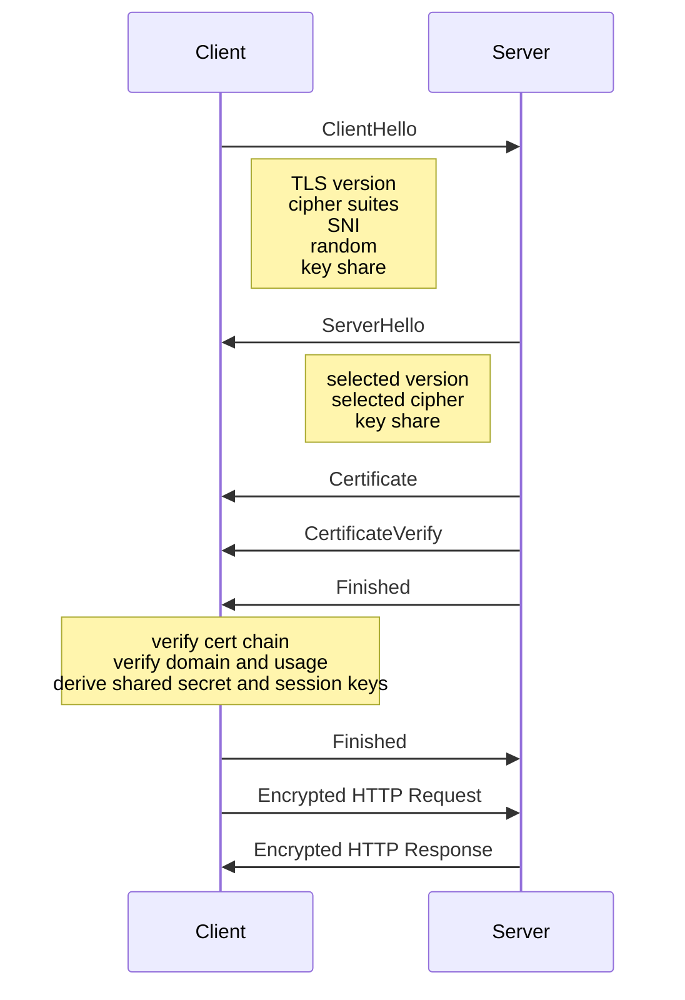

很多人第一次认真看 TLS，不是在学密码学，而是在看网站为什么从 `HTTP` 换成了 `HTTPS`。

浏览器地址栏里的小锁、证书详情页里的签发机构、`TLS 1.2` 和 `TLS 1.3` 这些词，平时都能看见，但很容易停留在“知道有这么个东西”。真要往下问一句“TLS 到底是怎么保护网站的”，就会发现这些概念虽然都听过，却不一定连得起来。

这篇文章只做一件事：把一次 HTTPS 连接里真正发生的事拆开。重点不是背算法名，而是弄清楚三件事。

- 服务器怎么证明“我是我要访问的那个站点”
- 浏览器和服务器怎么协商出这次连接的密钥
- 后面的 HTTP 数据为什么既能加密，又不会慢到不可用

## 为什么“开了 HTTPS”不等于问题已经解决

HTTPS 解决的是网站访问过程里的传输安全，不是所有安全问题的总开关。这个结论得先摆在最前面，不然后面很容易把 TLS 的能力想大。

一个站点从 HTTP 切到 HTTPS，最直接的变化是浏览器和网站之间的内容不再明文裸奔。登录表单、Cookie、页面内容、接口返回值，在传输途中更难被窃听或篡改。可这不等于网站本身已经没有安全问题。账号体系、权限控制、业务漏洞、数据存储，这些仍然是另外一层事。

### 业务里最常见的误判：证书一装就算安全

最常见的误判，不是完全不懂 TLS，而是把几件不同层次的事混成一件。

| 事情 | 解决的问题 | 没解决的问题 |
| --- | --- | --- |
| 启用 HTTPS | 浏览器到网站之间的链路加密 | 账号体系、权限设计、业务漏洞 |
| 证书合法 | 网站身份能被浏览器校验 | 网站代码本身是否安全 |
| TLS 机制正常 | 连接能安全协商并保护传输 | 页面逻辑和后端业务缺陷 |
| 应用本身安全 | 降低越权、注入、滥用风险 | 不能替代传输加密 |

把这张表记住，后面很多问题就不容易混。

### 这篇文章要回答的问题

这篇文章聚焦的是 TLS 本身，不展开讲整个 Web 安全全景。我们就沿着一次真实连接往下看：浏览器先发什么，网站回什么，证书为什么能证明身份，`ECDHE` 到底协商了什么，会话密钥什么时候出现，后面的 HTTP 请求又为什么改成了对称加密。

## HTTPS、SSL、TLS 到底是什么关系

先把术语摆正。后面你会看到证书、公钥、签名、密钥交换、会话密钥这些词，如果这一步不理顺，读起来很容易“每个词都认识，连起来就糊了”。

### HTTPS 不是新协议，而是 HTTP 跑在 TLS 之上

HTTPS 本质上是 `HTTP over TLS`。HTTP 的请求方法、状态码、Header、Body 这些语义没有变，变化的是它不再直接跑在明文 TCP 之上，而是先通过 TLS 建一条受保护的通道，再在这条通道里传 HTTP 数据。

所以看到 `https://api.example.com/users`，不要把它理解成“另一套不同的 Web 协议”。HTTP 还是那个 HTTP，只是外面包了一层负责身份认证、机密性和完整性保护的 TLS。

### SSL 是历史名词，今天线上实际跑的是 TLS

很多文档、控制台和日常口语里还在说“SSL 证书”，这更多是历史习惯。现代浏览器和主流网站实际使用的是 TLS，重点通常是 `TLS 1.2` 和 `TLS 1.3`。

也就是说，大家嘴上说“SSL”很多时候没错，但如果你想理解今天的网站安全连接，真正要看的还是 TLS 版本、握手流程、证书链和密钥协商方式，而不是把 SSL 当成和 TLS 并列的两套现役协议。

### 一个容易混淆的点：证书、握手协议、加密算法不是同一层东西

证书不是协议，`RSA` 也不是整场会话唯一在用的算法，`SHA-256` 更不是“把网页内容加密起来”的那个主角。

可以先压成一张分工表：

| 组件 | 典型例子 | 主要职责 |
| --- | --- | --- |
| 协议 | `TLS 1.2`、`TLS 1.3` | 规定握手流程、消息格式、协商规则 |
| 证书体系 | `X.509`、CA、证书链 | 把域名、公钥和签发关系绑定起来 |
| 身份签名 | `RSA`、`ECDSA` | 证明服务器持有对应私钥，验证签名 |
| 密钥协商 | `ECDHE` | 协商本次连接的共享秘密 |
| 对称加密 | `AES-GCM`、`ChaCha20-Poly1305` | 加密后续应用数据 |
| 哈希/完整性 | `SHA-256`、HKDF、AEAD 校验 | 派生密钥、校验握手和数据完整性 |

把这些层次拆开，TLS 的结构就清楚了。它从来不是“某一个算法很强”，而是多种机制配合得很严密。

## TLS 到底在保护什么

TLS 主要保护三件事：机密性、身份认证、完整性。少一个都不够。

### 机密性：中间人看到了流量，也不能直接还原内容

机密性的意思很具体，数据在传输途中被别人截获，别人也不该直接读懂内容。这个“别人”可能是同一网络里的监听者、代理节点上的旁观者，或者链路中的某个被攻破设备。

这里有个常被忽略的边界：TLS 保护的是传输中的内容，不是让数据从此变成“谁也碰不到”。内容一旦到了网站服务器，应用还是会解密和处理。链路安全和数据全生命周期安全不是一回事。

### 身份认证：浏览器确认自己连到的是谁

加密本身不够，浏览器还得知道自己在和谁说话。

如果没有身份认证，中间人完全可以自己生成一把密钥，和客户端谈加密，再和真正的服务器再谈一层加密，双方都觉得链路是加密的，但中间人其实能看见全部明文。这就是为什么 TLS 必须把“服务器身份”放进握手流程里。

### 完整性：内容没被悄悄改过

TLS 不只防窃听，也防静默篡改。

浏览器发出的请求、服务器回的响应、握手过程里的关键消息，都要带完整性保护。否则攻击者即使看不懂内容，也可能尝试修改消息，让双方协商到更弱的参数，或者篡改应用数据。这部分在现代 TLS 里大量依赖 AEAD 和握手 transcript 校验完成。

## 对称加密、非对称加密、哈希在 TLS 里的分工

理解 TLS 最省力的办法，不是把算法一个个背下来，而是看分工。

### 非对称加密和签名：负责建立信任，不负责全程搬运正文

`RSA`、`ECDSA` 这一类机制最重要的职责，是把“身份证明”这件事做成可验证的过程。服务器通过证书告诉客户端“这是我的公钥”，再通过握手中的签名证明“我确实持有对应私钥”。

反过来说，现代 HTTPS 并不是拿服务器公钥去直接加密所有响应体。那样性能太差，也不符合 TLS 的实际设计。非对称机制在 TLS 里很关键，但它更像开场时的身份证明和安全协商工具，不是后面搬运每一个 HTTP 包的主力。

### 密钥协商：负责生成本次连接的会话密钥

后续真正拿来加密业务数据的，是会话密钥。这个密钥不是长期写死在证书里，也不是客户端提前知道的，而是在握手时临时协商出来的。

现代主流做法是 `ECDHE`。这里的重点是那个 `E` 和 `DHE`，也就是椭圆曲线上的临时 Diffie-Hellman 密钥交换。临时，意味着它服务于“这一次连接”；交换，意味着客户端和服务端各自贡献一部分材料，最后推导出同一份共享秘密。

### 对称加密：负责后续大流量数据传输

一旦会话密钥协商完成，后面的 HTTP Header、Body、Cookie、JSON 响应、上传文件，基本都交给对称加密处理。

原因很简单，对称加密快得多。`AES-GCM`、`ChaCha20-Poly1305` 这种方案既能加密，也能提供完整性保护，适合长连接、接口流量和大响应体。TLS 之所以兼顾安全和性能，核心就在这里：身份建立和密钥协商用非对称机制，数据搬运交给对称机制。

### 哈希与消息认证：负责完整性，不是拿来“解密”的

`SHA-256` 这类哈希算法最常见的误解，就是被笼统叫成“加密算法”。

更准确地说，哈希在 TLS 里主要参与这些工作：

- 计算摘要
- 参与数字签名
- 派生握手阶段和应用阶段的密钥材料
- 校验握手 transcript 或消息完整性

它不是拿来双向加解密正文的，所以不能把“站点用了 `SHA-256`”理解成“网页内容是靠 `SHA-256` 加密的”。

## TLS 握手全流程：从 ClientHello 到加密 HTTP 数据

把概念串起来，最好的方式还是顺着一次握手看。

### ClientHello：客户端先报能力和偏好

浏览器发起 HTTPS 连接时，第一步通常是 `ClientHello`。这条消息会告诉服务器：

- 我支持哪些 TLS 版本
- 我支持哪些 cipher suites
- 我支持哪些扩展能力
- 我这边的随机数是什么
- 我正在访问哪个域名

如果是 TLS 1.3，还会带上密钥共享相关信息，方便减少一次额外往返。

### ServerHello：服务器选定协议参数并返回证书

服务器收到 `ClientHello` 后，不是机械地“把自己所有能力都打开”，而是在双方交集里选出一套参数，然后回 `ServerHello`。

这一步通常会确定：

- 本次连接用哪个 TLS 版本
- 用哪组对称加密能力
- 用哪份密钥共享参数
- 接下来用于身份验证的证书链

随后服务器会把自己的证书链发给客户端，客户端才有材料去验证“我正在连的到底是谁”。

### 证书验证：域名、有效期、用途、签名链逐项成立

浏览器验证证书，不是只看“有没有小锁图标对应的那张证书”，而是同时检查一组条件。

常见检查包括：

- 访问的域名是否在证书的 `SAN` 列表里
- 证书是否还在有效期内
- 证书用途是否允许做服务器身份认证
- 证书链是否能一路验证到受信任根
- 链上每一级签名是否都能校验通过

只要其中一项不成立，浏览器就会给出警告，严重时直接拦截连接。

#### 反直觉细节：CA 在握手时并不在线参与通信

很多人第一次接触证书时，会自然地想象成“浏览器拿到证书后，现场去问 CA 这张证书真不真”。实际不是这样。

CA 的主要职责发生在握手之前：审核、签发、建立信任链。真正握手时，浏览器依赖的是本地内置的受信任根证书，以及服务器发送过来的中间证书和站点证书。也就是说，**CA 不在这次实时通信的消息路径里**。这是理解证书链验证时一个很关键的反直觉点。

### ECDHE 密钥协商：双方各出一部分材料，导出同一份会话密钥

证书验证通过之后，还没有进入“应用数据加密完成态”。双方还要完成本次连接真正要用的密钥协商。

以 `ECDHE` 为例，可以把过程粗略理解成这样：

1. 客户端生成一份临时密钥材料
2. 服务器也生成一份临时密钥材料
3. 双方交换各自可公开的那一部分参数
4. 双方基于自己的私有部分和对方公开部分，独立推导出同一份共享秘密
5. 再从共享秘密和握手上下文里派生出会话密钥

这个过程的妙处在于，双方最后拿到的是同一份结果，但私有部分并没有在网络上传输。

#### 反直觉细节：服务器私钥不会离开服务器，也不会直接加密整段业务数据

这是另一个特别容易想错的点。

很多人脑子里的模型是：服务器把证书发出去，客户端拿公钥加密，服务器用私钥一路解密后面的全部流量。这个模型更接近很早期、也更简化的想象，不适合拿来理解现代主流 TLS。

更准确的描述是：服务器私钥主要用于证明身份，或者在特定握手模式里参与关键步骤；**它不会发给客户端，也不会负责加密整段 HTTP 正文**。真正承担数据加密压力的，是握手后导出的对称会话密钥。

### Finished：握手完整性校验通过，连接才正式切到加密态

握手最后还有一个常被忽略的步骤，就是双方会对前面整段握手 transcript 做校验，并通过 `Finished` 消息确认“我们看到的是同一份握手历史，而且密钥派生结果一致”。

这一步很重要。因为 TLS 不只是想让双方“差不多谈好了”，而是要让双方确认，整个协商过程没有被中途篡改，也没有被悄悄降级。

### 一张握手时序图：把链路串成一眼能看懂的过程

`CertificateVerify` 在这里表示服务器使用证书对应私钥证明自己身份。不同 TLS 版本和握手模式，具体消息细节会有差异，但整体顺序可以这样理解。

## 证书到底是什么，谁签发，浏览器又怎么验证

证书不是“一个加密后的文件”，而是一份身份声明。它把域名、公钥、签发者、有效期和用途这些信息打包起来，再由上一级机构签名。

### 证书里通常包含什么

日常最值得关心的字段，通常是这些：

| 字段 | 作用 |
| --- | --- |
| Subject / SAN | 这张证书对哪些域名有效 |
| Public Key | 服务器公开的那把公钥 |
| Issuer | 由谁签发 |
| Validity | 有效起止时间 |
| Key Usage / Extended Key Usage | 允许用于哪些场景 |
| Signature Algorithm | 上一级如何对它签名 |

看懂这些字段，基本就能读懂浏览器证书详情页里最核心的信息。

### CA、根证书、中间证书分别扮演什么角色

CA 是证书颁发机构，但 CA 不是只有一层。

- 根证书是信任锚，通常预置在操作系统或浏览器信任库里
- 中间证书负责承上启下，减少根私钥直接暴露风险
- 站点证书是最终装在网站上的那张证书

因此线上服务发给客户端的，通常不是只有一张站点证书，而是一条从站点证书到中间证书的链。根证书通常不需要服务端发，因为客户端本地早就有了。

### 证书链为什么不能断

浏览器验证站点证书时，不会凭空相信“这张证书长得像真的”。它要顺着证书里的签发关系一级一级往上验，直到走到本地信任库里的根证书。

如果中间证书没配全，浏览器就可能出现“证书不受信任”之类的报错。这里的本质不是站点证书内容错了，而是验证路径走不通。

### 域名校验到底在校验什么

证书证明的不是“这台机器挺安全”，而是“这张证书绑定的域名和你现在访问的域名一致”。

现代浏览器主要看 `SAN`，也就是 Subject Alternative Name。`CN` 不是完全没意义，但已经不是主判断依据。比如访问的是 `api.example.com`，证书如果只覆盖 `www.example.com`，即使是同一家公司签的，也照样不能通过域名校验。

通配符证书也有边界。`*.example.com` 能覆盖 `api.example.com`，但不能覆盖 `a.b.example.com`，更不能覆盖裸域 `example.com`。这类细节在多子域名场景里很容易踩坑。

### 吊销为什么存在感很弱，但又不能当作不存在

理论上，证书被盗用或错误签发之后，CA 可以通过吊销机制宣布“这张证书不该再被信任”。

现实里这件事没你想的那么丝滑。`CRL` 是吊销列表，`OCSP` 是在线状态查询，`OCSP Stapling` 是服务端预先带上 OCSP 结果，减少客户端实时查询负担。问题在于，浏览器对这些机制的依赖和失败策略并不完全一致，所以你会感觉“吊销机制存在，但又不像有效期那样有强存在感”。

这不是它不重要，而是它在工程现实里有延迟、可用性和隐私层面的折中。

## TLS 1.2 和 TLS 1.3 的关键差别，理解到什么程度就够了

这部分不需要把 RFC 背下来，但至少要知道 TLS 1.3 到底比 1.2 改了什么。这样再看现代网站的安全连接时，很多现象就不会显得突兀。

### TLS 1.3 删掉了很多历史包袱

TLS 1.3 最大的变化，不是“多了一个新版本号”，而是它主动砍掉了大量历史兼容包袱。过时的密钥交换方式、容易出问题的组合和一大堆不再推荐的能力，被协议层面直接清理掉了。

这会带来一个很直接的结果：默认安全基线更高，能协商的东西变少，但出错空间也更小。

### 为什么 TLS 1.3 的握手更短

TLS 1.3 在常见场景下减少了握手往返次数，所以首包延迟更低，尤其对高延迟网络更有感。

这不是“加密变简单了”，而是很多步骤被重新组织了。客户端更早提供密钥共享信息，服务端也能更早完成关键响应，整个建链过程更紧凑。

### 看到 cipher suites 变少，不代表可控性变差

不少人第一次看 TLS 1.3 会觉得奇怪，怎么 cipher suites 名字少了，参数看起来也没过去那样“花哨”。

其实这是协议分层更清晰了。TLS 1.2 里很多东西都挤在 cipher suite 的名字里，TLS 1.3 把一部分能力拆开处理，让协商项更少、组合更稳。表面上可选项少了，实际是协议在减少危险自由度。

## 常见误解和安全边界：TLS 能做什么，不能做什么

理解边界，比背流程更重要。很多关于 HTTPS 的误解，说到底都不是概念太难，而是一开始就把 TLS 的职责想宽了。

### HTTPS 保护的是传输链路，不是数据本身永远安全

TLS 能保证“传输途中”不容易被偷看和改包，但它不负责你解密后的世界。

页面或表单数据到了网站服务器，应用仍然会拿到明文。你如果把 HTTPS 理解成“数据从浏览器发出去后就永久安全”，那对 TLS 的期待就已经超过了它本来负责的范围。

### TLS 不能替代登录鉴权、权限控制和输入校验

这个边界说得再直接一点：TLS 保护的是“你和服务器之间的通道”，不负责“服务器收到请求后应不应该信这个人”。

所以 HTTPS 不会替你解决这些问题：

- 用户是不是已经登录
- 当前用户能不能访问这条数据
- 表单内容是不是恶意输入
- 请求是不是伪造的

这是应用安全，不是传输安全。

### 浏览器地址栏有小锁，不代表网站里所有内容都一样安全

浏览器地址栏出现小锁，说明当前这段浏览器到网站的连接受 TLS 保护。可这不等于页面里所有资源都一定安全，也不等于网站里每一段后续处理都自动符合相同标准。

对普通网站访问来说，至少要记住一点：**小锁说明的是当前连接状态，不是对整套网站安全性的总认证。**

## 常见问题与安全隐患

TLS 相关问题大多并不复杂，很多时候就是几个基础环节没有对上。

### 还在使用过旧协议或历史兼容思路

很多问题不是今天新产生的，而是过去为了兼容老环境留下的能力一直没清干净。

继续保留过旧协议、长期沿用历史兼容思路、只把“能连上”当成唯一目标，都会让站点的实际安全基线低于表面印象。哪怕不去背具体漏洞名字，也该知道一个方向：历史包袱通常不是中性的，它往往意味着更大攻击面。

### 证书过期、证书链不完整、域名不匹配

这三类问题非常常见，而且一出就是直接可见故障。

- 证书过期，浏览器通常直接给警告
- 证书链不完整，客户端可能无法建立信任路径
- 域名不匹配，说明你访问的目标和证书声明的身份对不上

它们看起来都像“证书报错”，根因却完全不同。排查时先分层，不要一上来就笼统说“SSL 出问题了”。

### HTTPS 开着，但证书链、页面资源或跳转细节还有问题

这类问题麻烦在于，网站表面上看起来已经是 HTTPS 了，用户却还是可能遇到报错、警告，或者看到“连接并不完全安全”。

常见原因包括证书链不完整、页面里混入明文资源、跳转过程不一致，或者某些访问路径没有正确走到 HTTPS。结果就是，站点看上去已经切到 HTTPS，实际体验却没有完全稳定下来。

### 把 TLS 安全和应用层安全混为一谈

最后这个坑最基础，也最容易反复出现。

只要系统还存在弱鉴权、越权访问、敏感数据暴露、错误的 Cookie 策略或不必要的数据下发，HTTPS 只能减少链路风险，不能替代应用层治理。说白了，TLS 保证的是“路上别被偷和改”，不是“到了目的地就一定被正确处理”。

## 收束：理解 TLS，重点不在背算法名

如果只留一个最核心的理解，我建议记这句：

**证书负责把身份和公钥绑定起来，握手负责协商会话密钥，对称加密负责搬运后续数据。**

真正需要分清的，不是 `RSA`、`ECDSA`、`ECDHE` 这些名字谁更高级，而是：

- 谁在证明身份
- 谁在协商共享秘密
- 谁在加密业务流量
- 谁在保证握手和数据没被篡改

把这个分工模型建立起来，TLS 基本就不会再是一团术语。

### 真正该记住的是“谁负责建立信任，谁负责搬运数据”

建立信任靠证书链和签名验证，搬运数据靠会话密钥和对称加密。这两件事必须分开理解。前者回答“你是谁”，后者回答“我们后面怎么安全高效地说话”。

一旦把这两个问题混在一起，就会出现各种典型误解：把证书当成“加密文件”，把私钥当成“全程加密工具”，把 `SHA-256` 当成“正文加密算法”。

### 看 TLS 时，先按哪几个层次理解最省力

如果以后再看 HTTPS 或证书相关问题，按这个顺序理解通常最清楚：

1. 先看证书本身：域名、有效期、用途、证书链是否正确。
2. 再看握手层：TLS 版本、密钥协商和身份验证是怎么完成的。
3. 再看传输层：后续数据为什么能被加密并校验完整性。
4. 最后再看边界：TLS 解决了什么，没有解决什么。

这样拆层，TLS 就不会再显得像一堆分散的名词，而会变成一条能顺着讲清楚的安全链路。
