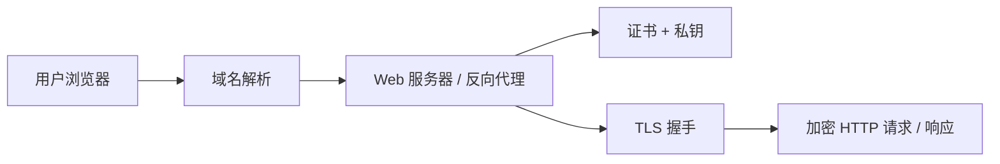

很多团队在证书选型这一步会聊很久：

- 用免费还是付费
- 用 Let’s Encrypt 还是商业 CA
- 要不要泛域名

但真出事故的地方，反而经常在后半程：

**证书拿到了，怎么让它在 Web 服务器上真正生效？**

因为证书不是放进某个目录就结束了。  
浏览器访问 `https://your-domain` 时，真正参与 TLS 握手的是：

- `NGINX`
- `Apache`
- `Caddy`
- `Traefik`
- 或其他反向代理 / 网关

这篇文章就换个角度，从部署这边把事情讲清楚。

## 先理解：证书为什么一定要配置到服务器上

我们前面已经讲过：

- 域名负责把流量带到服务器
- 证书负责证明身份和建立加密连接

而浏览器访问 HTTPS 时，并不是在“和域名对话”，而是在和服务器建立 TLS 会话。

所以证书最终必须落在真正处理流量的那一层：

- Web 服务器
- 反向代理
- Ingress 网关
- 负载均衡器

如果压成一句话：

**证书是身份证，Web 服务器是出示身份证并完成握手的人。**

## 一个最小的 HTTPS 部署逻辑

不管你用的是哪种 Web 服务器，HTTPS 能否正常工作，底层都离不开几件事：

1. 域名正确解析到服务器
2. 服务器监听 `443`
3. 服务器加载证书文件
4. 服务器加载对应私钥
5. 证书链完整
6. `HTTP` 是否跳转到 `HTTPS`
7. 证书到期前能否自动续期



## 证书文件通常包含什么

不同服务商、不同工具产出的文件名会不一样，但常见角色基本就是这些：

- `server certificate`：服务器证书
- `private key`：私钥
- `full chain`：完整证书链
- `ca bundle / intermediate`：中间证书链

以很多 ACME 客户端常见命名举例，大家经常会看到：

- `cert.pem`
- `privkey.pem`
- `chain.pem`
- `fullchain.pem`

这里最容易踩坑的，通常是这几件事：

- 把私钥和证书搞反
- 没配完整证书链
- 文件权限过宽

## NGINX：最常见的 HTTPS 落地方式

在传统运维和反向代理场景里，`NGINX` 基本就是最常见的 HTTPS 入口。

### 为什么很多团队喜欢用 NGINX

因为它往往一口气把几件事都接住了：

- 反向代理
- 静态资源服务
- 负载均衡
- TLS 终止

### 一个最小 HTTPS 配置思路

通常你至少会有两段配置：

- `80` 端口负责跳转
- `443` 端口负责真正的 HTTPS 服务

示例：

```nginx
server {
    listen 80;
    server_name example.com www.example.com;
    return 301 https://$host$request_uri;
}

server {
    listen 443 ssl http2;
    server_name example.com www.example.com;

    ssl_certificate     /etc/letsencrypt/live/example.com/fullchain.pem;
    ssl_certificate_key /etc/letsencrypt/live/example.com/privkey.pem;

    location / {
        proxy_pass http://127.0.0.1:8080;
        proxy_set_header Host $host;
        proxy_set_header X-Real-IP $remote_addr;
        proxy_set_header X-Forwarded-For $proxy_add_x_forwarded_for;
        proxy_set_header X-Forwarded-Proto https;
    }
}
```

### NGINX 部署时最值得检查的点

- 是否使用 `fullchain.pem`
- 私钥路径是否正确
- 改配置后是否重新加载
- 后端应用是否正确识别 `X-Forwarded-Proto`

很多“明明已经上了 HTTPS，应用里却还在报 http 回调地址”的问题，根源其实就在这里: 反向代理头没带好。

## Apache：传统企业站点里依然很常见

`Apache HTTP Server` 在很多历史系统和传统企业环境里还是很常见，尤其是：

- 老牌 CMS
- LAMP 项目
- 共享主机
- 历史业务系统

### 常见 HTTPS 配置思路

Apache 一般通过 `VirtualHost *:443` 来定义 HTTPS 站点。

示例：

```apache
<VirtualHost *:80>
    ServerName example.com
    ServerAlias www.example.com
    Redirect permanent / https://example.com/
</VirtualHost>

<VirtualHost *:443>
    ServerName example.com
    ServerAlias www.example.com

    SSLEngine on
    SSLCertificateFile /etc/letsencrypt/live/example.com/cert.pem
    SSLCertificateKeyFile /etc/letsencrypt/live/example.com/privkey.pem
    SSLCertificateChainFile /etc/letsencrypt/live/example.com/chain.pem

    DocumentRoot /var/www/html
</VirtualHost>
```

### Apache 场景下的几个注意点

- 有些版本和模块组合对证书链的处理方式略有差异
- `mod_ssl` 是否已启用
- 虚拟主机是否被正确加载
- 重载后是否生效

如果你接手的是历史环境，Apache 的难点通常不在“证书不会配”，而在：

- 配置文件分散
- 旧模块遗留较多
- 多站点虚拟主机彼此影响

## Caddy：自动 HTTPS 体验非常友好

如果你想找一类“尽量少折腾证书”的 Web 服务器，`Caddy` 基本绕不开。

它最大的特点是：

- 自动申请证书
- 自动续期
- 默认把 HTTPS 这件事做得很顺手

### 为什么 Caddy 适合中小团队

对很多中小站点来说，最麻烦的往往不是 TLS 参数不够极致，而是：

- 忘记续期
- 证书放错路径
- reload 没生效

而 Caddy 的优势，正好就在于尽量把这些重复劳动收掉。

### 一个常见的 Caddyfile 示例

```caddy
example.com, www.example.com {
    reverse_proxy 127.0.0.1:8080
}
```

如果 DNS、网络入口和权限条件都没问题，Caddy 往往会自动帮你完成：

- 证书申请
- HTTPS 配置
- 续期管理

这也是为什么它非常适合：

- 个人站
- 内容站
- 小团队服务
- 想快速上线 HTTPS 的场景

## Traefik：更适合容器和云原生入口

`Traefik` 的强项不在传统单机站点，它更像是为这些场景准备的：

- Docker
- Kubernetes
- 动态服务发现
- 微服务网关

### 为什么很多容器平台会选 Traefik

因为它特别适合下面这类环境：

- 服务实例经常变化
- 路由规则是动态的
- 希望根据标签或 Ingress 自动生成入口
- TLS 证书申请与路由配置一起自动化

### 典型使用思路

Traefik 经常和下面这些东西一起出现：

- Docker labels
- Kubernetes Ingress / CRD
- ACME 自动证书

一起出现。

对这类场景来说，证书配置通常不是一份静态文件，而更像是“声明一条入口规则”，再由 Traefik 统一接住 TLS。

例如在 Docker Compose 场景中，你经常会看到类似配置：

```yaml
labels:
  - "traefik.http.routers.app.rule=Host(`example.com`)"
  - "traefik.http.routers.app.entrypoints=websecure"
  - "traefik.http.routers.app.tls.certresolver=letsencrypt"
```

它的价值在于：

- 应用和入口解耦
- 证书与路由自动关联
- 更适合服务频繁变动的环境

## 四类服务器分别适合什么场景

如果不想一开始就陷进细节里，先按场景选通常更省事。

| 组件 | 更适合的场景 |
| --- | --- |
| `NGINX` | 传统站点、反向代理、负载均衡、稳定业务入口 |
| `Apache` | 历史企业站点、LAMP、共享主机、已有 Apache 体系 |
| `Caddy` | 小团队、内容站、快速上线、低运维成本 |
| `Traefik` | Docker、Kubernetes、微服务、动态服务发现 |

## 证书部署之后，至少做这 5 个检查

证书部署“看上去成功”不等于真的没问题。  
上线后至少建议做这些检查：

### 1. 检查 443 是否可正常访问

直接访问：

```text
https://your-domain
```

确认不是回退到旧站点，也不是握手失败。

### 2. 检查证书链是否完整

如果浏览器、扫描器或部分客户端提示链不完整，通常是：

- 没有正确使用 `fullchain`
- 中间证书未正确下发

### 3. 检查 HTTP 是否跳转到 HTTPS

这一步很基础，但就是容易漏。

### 4. 检查证书到期时间

别把“签发成功”当成一劳永逸。  
现代证书生命周期普遍不长，自动续期能力才是长期稳定的关键。

### 5. 检查续期后服务是否自动 reload

有些环境里证书文件已经更新了，但服务没有重新加载，最终线上仍然在用旧证书。

这种问题很隐蔽，也很常见。

## 自动续期为什么比“手工上传证书”更重要

如果一个站点只有一年更新一次证书，手工处理看上去也不是不行。  
但今天大量证书都偏向短周期，90 天已经很常见。

这就意味着，你不能只会“装证书”，还得会：

- 自动续期
- 自动 reload
- 到期监控

说白了，现代 HTTPS 的重点已经不只是“部署成功一次”，而是：

**能不能稳定、低成本、持续地把它跑下去。**

## 结语

证书这件事，一半是安全，一半是运维。

前半段你在选：

- 什么 CA
- 什么验证级别
- 什么证书类型

后半段你在管：

- 配到哪层服务器
- 如何自动续期
- 如何避免证书过期事故

所以真正完整的问题不是“我要一张证书”，而是：

**我要用哪一层入口，把这张证书稳定地交付给线上流量。**

下一篇，我们就把整个系列收束成一份决策清单：

**不同业务场景下，到底该怎么选证书、怎么部署、怎么管？**

## 参考资料

- [NGINX Admin Guide: Securing HTTP Traffic to Upstream Servers](https://docs.nginx.com/nginx/admin-guide/security-controls/securing-http-traffic-upstream/)
- [Apache HTTP Server SSL/TLS Encryption](https://httpd.apache.org/docs/current/ssl/)
- [Caddy Documentation](https://caddyserver.com/docs/)
- [Traefik HTTPS and TLS Documentation](https://doc.traefik.io/traefik/https/tls/)
